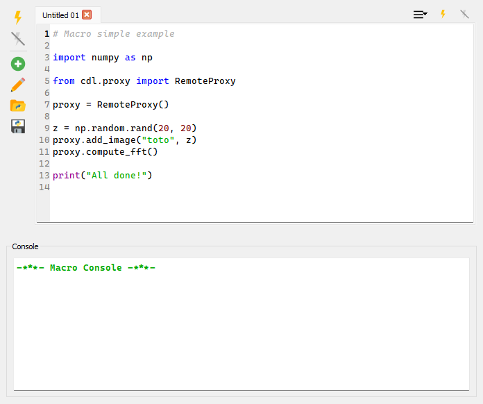

.. _about_macros:

Macros
======

.. meta::
    :description: How to use macros in DataLab, the open-source data analysis and visualization platform
    :keywords: DataLab, data analysis, data visualization, open-source, Python, macros

Overview
--------

There are many ways to extend DataLab with new functionality (see :ref:`about_plugins`
or :ref:`ref-to-remote-control`). The easiest way to do so is by using macros. Macros
are small Python scripts that can be executed from the "Macro Panel" in DataLab.

   The Macro Panel in DataLab.

Macros can be used to automate repetitive tasks, or to create new functionality.
As the plugin and remote control system, macros rely on the DataLab high-level API
to interact with the application. This means that you can reuse the same code snippets
in macros, plugins, and remote control scripts.

.. warning::

   DataLab handles macros as Python scripts. This means that you can use the full
   power of Python to create your macros. Even though this is a powerful feature,
   it also means that you should be careful when running macros from unknown sources,
   as they can potentially harm your system.

.. seealso::

   The DataLab high-level API is documented in the :ref:`api` section.
   The plugin system is documented in the :ref:`about_plugins` section, and the
   remote control system is documented in the :ref:`ref-to-remote-control` section.

Main features
-------------

The Macro Panel is a simple interface to:

- Create new macros, using the "New macro" |libre-gui-add| button. The button
  also exposes a dropdown menu offering a blank macro and the bundled
  *templates* (see :ref:`macro_templates`).
- Rename existing macros, using the "Rename macro" |libre-gui-pencil| button
  (or by double-clicking on a tab).
- Duplicate the current macro, using the "Duplicate macro" |duplicate| button.
- Import/export macros from/to files, using the "Import macro" |fileopen_py|
  and "Export macro" |filesave_py| buttons.
- Reopen a macro from previous sessions, using the "Recent macros..."
  |history| button (the recent list is persisted across DataLab sessions).
- Execute macros, using the "Run macro" |libre-camera-flash-on| button.
- Stop the execution of a macro, using the "Stop macro" |libre-camera-flash-off| button.

.. |duplicate| image:: ../../../datalab/data/icons/edit/duplicate.svg
    :width: 24px
    :height: 24px
    :class: dark-light no-scaled-link

Macros are embedded in the DataLab workspace, so they are saved together with the rest
of the data (i.e. with signals and images) when exporting the workspace to a HDF5 file.
This means that you can share your macros with other users simply by sharing the
workspace file.

.. note::

   Macro are executed in a separate process, so they won't block the main DataLab
   application. This means that you can continue working with DataLab while a macro
   is running and that *you can stop a macro at any time* using the
   |libre-camera-flash-off| button.

Editor features
---------------

The macro editor offers a few features that make script writing more
comfortable:

- **Autosave**: every keystroke is debounced and persisted into the current
  workspace, so unsaved edits survive an unexpected shutdown. A recovery
  prompt is offered at startup when an autosaved revision is detected.
- **Tab persistence**: the set of open macros and the active tab are restored
  the next time DataLab starts, so you pick up exactly where you left off.
- **Find / Replace** (``Ctrl+F`` / ``Ctrl+H``): an inline bar at the bottom
  of the editor supports case-sensitive search, whole-word matching, regular
  expressions, and replace (or replace-all) inside the active macro.
- **Python autocompletion** is enabled out of the box (``Ctrl+Space`` to
  trigger it manually), backed by the embedded code editor.

Console
-------

The bottom *Console* panel captures the standard output and standard error
streams produced by the running macro. Right-clicking inside the console
exposes:

- **Clear console** — wipe the current contents.
- **Save history log...** — export the console history to a text file.

The maximum number of lines retained by the console can be tuned via the
``Conf.macro.console_max_lines`` setting (defaults to ``5000``).

.. _macro_templates:

Templates
---------

The "New macro" dropdown lists a set of ready-to-use *templates* covering
common patterns (signal creation, image processing, batch loops, etc.).
You can ship your own templates by dropping ``*.py`` files into the user
templates directory — by default ``~/.DataLab/macro_templates/``, configurable
via ``Conf.macro.templates_path``. The first non-empty docstring line of each
template is used as its menu entry title. Bundled templates take precedence
over user templates when names collide.

Example
-------

For a detailed example of how to create a macro, see the :ref:`tutorial_custom_func`
tutorial.
