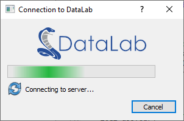

.. _ref-to-remote-control:

Remote controlling (XML-RPC)
============================

.. meta::
    :description: How to remote control DataLab using XML-RPC
    :keywords: DataLab, remote control, XML-RPC, Python, IDE, Spyder, Jupyter, third-party application, signal, image, HDF5, calculation, processor

.. note::

    **For new projects, we recommend using the** :ref:`Web API <ref-to-webapi>` **instead
    of XML-RPC.** The Web API provides better performance for large arrays, token-based
    authentication, and compatibility with browser environments (WASM/Pyodide).

    XML-RPC remains available for backward compatibility with existing integrations.

DataLab may be controlled remotely using the `XML-RPC`_ protocol which is
natively supported by Python (and many other languages). Remote controlling
allows to access DataLab main features from a separate process.

.. note::

    If you are looking for a lightweight alternative to remote control DataLab
    (i.e. without installing the whole DataLab package and its dependencies in
    your environment), use the :py:class:`sigima.client.SimpleRemoteProxy` class
    provided by the `Sigima`_ package (``pip install sigima``). It exposes the
    same XML-RPC entry points as the ``RemoteProxy`` class described below, with
    a minimal set of dependencies.

    This class supersedes ``cdlclient.SimpleRemoteProxy``: the ``cdlclient``
    package is deprecated and archived since DataLab 1.3. Its connection dialog
    is now provided by SigimaX (see `Connection dialog`_ below).

.. _Sigima: https://github.com/DataLab-Platform/Sigima

From an IDE
^^^^^^^^^^^

DataLab may be controlled remotely from an IDE (e.g. `Spyder`_ or any other
IDE, or even a Jupyter Notebook) that runs a Python script. It allows to
connect to a running DataLab instance, adds a signal and an image, and then
runs calculations. This feature is exposed by the `RemoteProxy` class that
is provided in module ``datalab.control.proxy``.

From a third-party application
^^^^^^^^^^^^^^^^^^^^^^^^^^^^^^

DataLab may also be controlled remotely from a third-party application, for the
same purpose.

If the third-party application is written in Python 3, it may directly use the
`RemoteProxy` class as mentioned above. From another language, it is also
achievable, but it requires to implement a XML-RPC client in this language
using the same methods of proxy server as in the `RemoteProxy` class.

Data (signals and images) may also be exchanged between DataLab and the remote
client application, in both directions.

The remote client application may be written in any language that supports
XML-RPC. For example, it is possible to write a remote client application in
Python, Java, C++, C#, etc. The remote client application may be a graphical
application or a command line application.

The remote client application may be run on the same computer as DataLab or on
a different computer. In the latter case, the remote client application must
know the IP address of the computer running DataLab.

The remote client application may be run before or after DataLab. In the latter
case, the remote client application must try to connect to DataLab until it
succeeds.

Supported features
^^^^^^^^^^^^^^^^^^

Supported features are the following:

- Switch to signal or image panel
- Remove all signals and images
- Save current session to a HDF5 file
- Open HDF5 files into current session
- Browse HDF5 file
- Open a signal or an image from file
- Add a signal
- Add an image
- Get object list
- Run calculation with parameters

.. note::

    The signal and image objects are described on this section: :ref:`ref-to-model`.

Some examples are provided to help implementing such a communication
between your application and DataLab:

- See module: ``datalab.tests.features.control.remoteclient_app_test``
- See module: ``datalab.tests.features.control.remoteclient_unit``

.. figure:: /images/shots/remote_control_test.png

    Screenshot of remote client application test (``datalab.tests.features.control.remoteclient_app_test``)

Examples
^^^^^^^^

When using Python 3, you may directly use the `RemoteProxy` class as in
examples cited above or below.

Here is an example in Python 3 of a script that connects to a running DataLab
instance, adds a signal and an image, and then runs calculations (the cell
structure of the script make it convenient to be used in `Spyder`_ IDE):

.. literalinclude:: ../../remote_example.py

Here is a Python 2.7 reimplementation of this class:

.. literalinclude:: ../../remotecontrol_py27.py

Connection dialog
^^^^^^^^^^^^^^^^^

A connection dialog may be used to connect to a running DataLab instance.
It is exposed by the :py:class:`sigimax.widgets.connection.ConnectionDialog`
class, and takes optional ``icon`` and ``banner`` arguments to carry the
branding of the client application. It works with any proxy exposing a
blocking ``connect()`` method, i.e. both ``RemoteProxy`` and
:py:class:`sigima.client.SimpleRemoteProxy`.

    Screenshot of connection dialog (``sigimax.widgets.connection.ConnectionDialog``)

Example of use:

.. literalinclude:: ../../../datalab/tests/features/control/connect_dialog.py

Public API
^^^^^^^^^^

.. autoclass:: datalab.control.remote.RemoteClient
    :inherited-members:

.. _XML-RPC: https://docs.python.org/3/library/xmlrpc.html

.. _Spyder: https://www.spyder-ide.org/