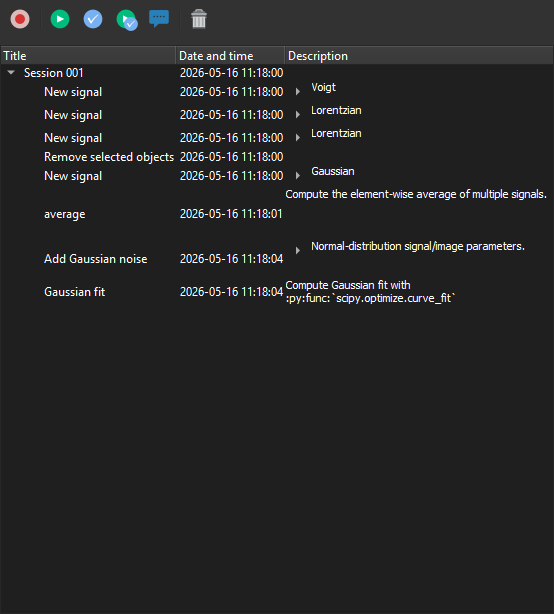

.. _historypanel:

History Panel
=============

.. meta::
    :description: History Panel in DataLab, the open-source scientific data analysis and visualization platform
    :keywords: DataLab, history, record, replay, session, scientific, data, analysis, visualization, platform

Overview
--------

The "History Panel" records the sequence of actions performed by the user on
signals and images, organized into **sessions**. Each session is a chronological
list of either:

- **UI actions** (creating a new signal, removing selected objects, saving the
  workspace to HDF5, ...), or
- **computations** (FFT, average, Gaussian fit, ...) dispatched through the
  Sigima processor.

A recorded session can be:

- **Replayed**, either entirely or starting from a selected action, to
  reproduce the exact same sequence on the current workspace;
- **Restored to a given selection state** without re-executing anything, to
  quickly jump back to a previous working context;
- **Saved to a standalone history file** (``.dlhist``) or **embedded in the
  workspace** when saving to HDF5, so that the full processing chain travels
  with the data.

   The History Panel after recording a representative session: create three
   signals (Voigt, Lorentzian, Lorentzian), remove one of them, create a
   Gaussian signal, compute the average, add Gaussian noise to the result
   and run a Gaussian fit.

Toolbar
-------

The toolbar at the top of the panel exposes the following actions:

- |record| **Record mode**: toggle the recording of new actions. When off, no
  new entry is added to the history (existing sessions are preserved).
- |replay| **Replay**: replay the selected action (or the whole session if a
  session row is selected) without changing the current workspace selection
  beforehand.
- |restore_selection| **Restore selection**: only re-select the objects that
  were selected when the action was originally executed; no computation is
  re-run.
- |restore_and_replay| **Restore selection and replay**: combine the two
  previous actions -- restore the selection first, then replay.
- |edit_mode| **Edit mode**: when on, replaying a computation opens the
  parameters dialog so the user can tweak the parameters before re-running.
- |delete| **Delete**: remove the selected actions or sessions from the
  history.

.. note::

   Double-clicking on an action row in the tree is equivalent to "Restore
   selection and replay".

Tree view
---------

The tree view organizes recorded actions into expandable sessions:

- Each top-level row is a **session**, automatically created when recording is
  enabled and a new application context is started.
- Each child row is an **action**, with its title, date/time and a description
  summarising the parameters (for computations) or the call (for UI actions).

The selection of one or several rows drives which actions are targeted by the
toolbar buttons.

Session replay across workspaces
--------------------------------

A full session can be replayed on a workspace that no longer contains the
objects originally referenced by the recorded actions -- typically after
loading a saved session into a fresh workspace. In that case, the panel
**remaps the recorded object identifiers** to the newly-created ones on the
fly:

- UI actions creating new objects (e.g. *New signal*) enqueue the freshly
  created identifiers;
- subsequent computations claim the identifiers they need from that queue,
  in the same order as the original recording;
- UI actions removing objects keep the queue in sync with the live workspace
  contents, so chained creation/removal sequences replay correctly.

This makes it possible, for instance, to record a full processing chain on
one dataset, save it, then re-apply the exact same chain on a different but
structurally identical input.

Persistence
-----------

The history can be persisted in two complementary ways:

- **Embedded in the workspace**: when the workspace is saved to HDF5
  (``File > Save to HDF5 file``), the History Panel content is automatically
  saved alongside the signals and images. Reloading the workspace restores
  the recorded sessions.
- **Standalone history file**: the panel can also be serialised to a
  dedicated ``.dlhist`` file, which is convenient to share or version a
  processing chain independently of the data it was applied to.

.. warning::

   Replaying a session that depends on external files (e.g. opening a
   dataset from disk) will only succeed if those files are still available at
   the same locations as when the session was recorded.
