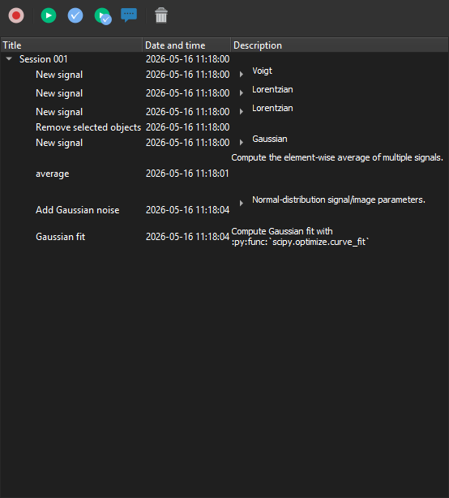

.. _historypanel:

History Panel
=============

.. meta::
    :description: History Panel in DataLab, the open-source scientific data analysis and visualization platform
    :keywords: DataLab, history, record, replay, session, scientific, data, analysis, visualization, platform

Overview
--------

The "History Panel" records the sequence of actions performed by the user on
signals and images, organized into **sessions**. Each session is a chronological
list of either:

- **UI actions** (creating a new signal, removing selected objects, saving the
  workspace to HDF5, ...),
- **computations** (FFT, average, Gaussian fit, ...) dispatched by the DataLab
  processors to Sigima, or
- **mutations** (in-place modifications of existing objects, such as editing
  regions of interest). See :ref:`history-object-mutations`.

A recorded session can be:

- **Replayed** silently or **step by step**. Replaying recomputes each
  computation action in place with its recorded parameters: existing output
  objects are updated, and deleted outputs whose action is still part of the
  history are re-created under their original identifiers, keeping the
  downstream processing chain valid. In step-by-step mode, parameters may be
  reviewed and edited before each step is recomputed. Recorded UI actions are
  invoked through their own methods and may reproduce their side effects,
  including creating, importing, or duplicating objects;
- **Duplicated** as independent processing chains in new history sessions,
  with the required signal/image objects cloned as part of the operation;
- **Saved to a standalone history file** (``.dlhist``) or **embedded in the
  workspace** when saving to HDF5, so that the full processing chain travels
  with the data.

   The History Panel after recording a representative session: create three
   signals (Voigt, Lorentzian, Lorentzian), remove one of them, create a
   Gaussian signal, compute the average, add Gaussian noise to the result
   and run a Gaussian fit.

.. _history-object-mutations:

Object mutations
----------------

Besides UI actions and computations, the panel records **mutations**:
in-place modifications of existing objects that do not create new ones.
Mutations currently cover regions of interest (ROI): defining or editing
ROIs graphically or numerically, deleting one or all ROIs, and pasting ROIs
each record a single generic mutation entry holding the affected objects
and the resulting ROI state.

Replaying a mutation re-applies the recorded ROI state to its target
objects (an empty state removes the ROIs). In step-by-step mode, the ROI
parameters can be reviewed and edited in a dialog before being re-applied;
editing them triggers a recompute of the downstream dependent computations.

When a recomputed action re-creates or updates an object, the mutations
recorded on that object are re-applied in order, and analyses depending on
the mutated object are recomputed. User ROIs present on an output object
are preserved by in-place recomputes, unless the recompute itself produces
a ROI.

Mutation entries are saved with sessions (standalone ``.dlhist`` files and
HDF5 workspaces) like any other action; history files created with earlier
versions of DataLab load unchanged.

Recording and session lifecycle
-------------------------------

Actions are recorded only while **Record mode** is enabled. Turning record
mode off preserves existing sessions but does not add new entries.

There is a single active recording session, shared by the Signals and Images
panels. New actions from both panels are chained into that session (one is
created on first use), so mixed signal/image pipelines are recorded together
and recording resumes in the user-selected session. Each session remains
associated with the Signals or Images panel for display purposes, through the
actions it contains.

When a new object is created or a file is loaded into a populated active
session, a configurable policy determines whether DataLab asks, starts a new
session, or continues the current one. Plugin-created objects use separate
policies. An explicit plugin multi-load scope supplies one durable session
policy for the whole batch. With ordinary **Ask** behavior, repeated prompts
for synchronous additions to the same panel are debounced during the current
Qt event-loop turn.

These options are available under
``File > Settings > Processing > History sessions``. See
:ref:`history-session-settings` for the complete labels and default values.

Toolbar
-------

The toolbar at the top of the panel exposes the following actions:

- |record| **Record mode**: toggle the recording of new actions. When off, no
  new entry is added to the history (existing sessions are preserved).
- |new_session| **New session**: start a new history session and make it the
  active recording session.
- |open_history| **Open history file**: load recorded sessions from a standalone
  ``.dlhist`` file.
- |save_history| **Save history file**: save the current recorded sessions to a
  standalone ``.dlhist`` file.
- |step_prev| **Previous step**: select the preceding action in the current
  session (keyboard shortcut: :kbd:`Ctrl+Left`).
- |step_next| **Next step**: select the following action in the current
  session (keyboard shortcut: :kbd:`Ctrl+Right`).
- |replay| **Replay**: recompute the selection in place, silently (no
  parameter dialogs). Selecting an action replays that action; selecting a
  session replays all of its actions. A selection spanning several actions or
  sessions is merged, deduplicated and executed in session order. Each
  computation action re-runs with its recorded parameters and updates its
  existing output object(s), keeping the same identifiers so that downstream
  steps remain valid. Outputs that were deleted from the data panel are
  re-created under their original identifiers (a typical workflow: delete a
  bad result, edit its parameters, then replay to regenerate it). Actions
  whose source objects no longer exist are skipped with a warning, and a
  failed action blocks its downstream branch. Actions whose parameters were
  changed (in step-by-step mode or from the **Processing** tab) are marked as
  outdated; replaying recomputes them and, when parameters were edited, their
  downstream dependent actions as well. Analysis actions replay by
  recomputing their results on the source objects: each analysis records
  which results it stored on the object (its *effects*), so replaying
  updates exactly those results — previous values are replaced, and if the
  recompute fails the previous results are restored. Analyses recorded with
  earlier versions of DataLab replay using their saved state. UI actions
  are replayed by invoking their recorded method and may reproduce side
  effects, including creating, importing, or duplicating objects; load
  actions reload their objects even if these were deleted after being
  recorded. Recorded destructive actions (e.g. object removals) are skipped
  with a warning whenever replaying them would be unsafe: when their
  captured state no longer matches the current workspace, when their targets
  were re-created earlier in the same replay, or when their targets belong
  to another session. As a consequence, a replayed session may intentionally
  not reproduce a recorded end state that included such deletions.
- |step_by_step| **Step-by-step**: replay the same selection one step at a
  time, opening the parameter dialog for each supported action (object
  creation, computation, ROI extraction) before recomputing it. Accepted
  edits propagate to the downstream dependent actions, which are recomputed
  as well. Cancelling a dialog stops the replay, restores the parameter
  edits made during that run, and silently recomputes any actions left
  outdated so the chain stays up to date.
- |duplicate| **Duplicate**: duplicate the processing chain containing each
  selected action, or the processing chains in each selected session. DataLab
  clones the required objects and creates independent history sessions. The
  duplicate is a standalone deep copy of the chain — as if the recorded
  operations had been redone by hand on the cloned objects — so replaying
  either the original or the duplicated session only affects its own objects.
- |remove_incompatible| **Remove incompatible**: remove all actions whose
  workspace state is no longer compatible with the current workspace. A
  confirmation dialog shows how many actions will be removed.
- |delete| **Delete**: remove the selected actions or sessions from the
  history (keyboard shortcut: :kbd:`Del`, active only while the history tree
  has focus, so it never deletes signal or image objects instead). Removing
  an intermediate action splices it out and preserves its downstream steps
  as an independent chain.

.. note::

  Double-clicking a tree item invokes **Replay** for the current selection,
  with the same in-place recompute semantics documented above.

.. note::

  While a replay or recompute is in progress, History Panel commands are
  unavailable: the toolbar actions are disabled, and tree interactions
  (context menu, double-click, :kbd:`Del` key) are ignored until the run
  completes.

Tree view
---------

The tree view organizes recorded actions into expandable sessions:

- Each top-level row is a **session**; the panel(s) it relates to are
  determined by the actions it contains. Sessions may be started when
  recording is enabled, with **New session**, or according to the configured
  session policy.
- Each child row is an **action**, with its title, date/time and a description
  summarising its parameters or resolved call when available. A UI action whose
  call cannot be resolved may have an empty description.

The selection of one or several rows determines which entries are targeted by
the toolbar and context-menu commands. The context menu exposes the same
commands as the toolbar.

When an action row is selected, its result object is selected in the
corresponding data panel when available; otherwise, its existing input objects
are selected. DataLab then switches to that data panel.

While Record mode is enabled, selecting a session row (or one of its actions)
makes that session the active recording session.

Actions that are not compatible with the current workspace state (for example
because a referenced object identifier no longer exists, or because its data
array shape changed) are shown with a disabled foreground and an explanatory
tooltip.
Attempting to replay them opens the broken chain resolution dialog described
below.

Actions left **outdated** by a failed or interrupted recompute, or by
parameter edits whose propagation to downstream steps is still pending, are
highlighted with an amber background and carry an explanatory tooltip.
Replaying them refreshes their result and clears the marker.

Broken chain resolution
-----------------------

Starting **Replay** or **Step-by-step** (or double-clicking a tree item) on a
selection containing actions that are incompatible with the current workspace
— typically because the objects they rely on were deleted — opens a
resolution dialog. Two choices are offered:

- **Repair and continue**: the broken actions and all their downstream
  descendants are removed from the history, then the remaining valid actions
  of the selection are replayed.
- **Cancel**: nothing is modified, neither the history nor the workspace. The
  dialog is shown again on the next replay attempt until the chain is
  repaired.

Workspace state display
-----------------------

Below the action tree, a split-view widget shows the **workspace state**
captured at the time of the selected action:

- **Left table**: lists the signals that were selected, with their array shape.
- **Right table**: lists the images that were selected, with their dimensions.

This information helps the user understand the context in which each action
was originally executed and diagnose compatibility issues when replaying
the current selection.

Persistence
-----------

The history can be persisted in two complementary ways:

- **Embedded in the workspace**: when the workspace is saved to HDF5
  (``File > Save to HDF5 file``), the History Panel content is automatically
  saved alongside the signals and images. Reloading the workspace restores
  the recorded sessions.
- **Standalone history file** (``.dlhist``): the file embeds both the
  recorded sessions **and** all objects currently present in both the Signals
  and Images panels, whether or not an action references them. This makes the
  file fully self-contained:

  - Opening a ``.dlhist`` into a **pristine workspace** (with no data objects
    and no existing history sessions) restores the saved objects and sessions
    directly.
  - If the workspace is **already in use** (it contains any data object or
    history session), DataLab imports the objects into new signal/image groups,
    remaps their identifiers to avoid collisions, and appends imported history
    sessions that reference those fresh identifiers.

.. note::

   A history entry whose saved parameters can no longer be decoded (for
   example a ROI payload written by an incompatible version of DataLab) does
   not prevent the rest of the file from loading: the affected action is
   loaded as incompatible — shown as a disabled row with an explanatory
   tooltip, and never replayed — while all other sessions and actions load
   normally. Such entries can be cleaned up with **Remove incompatible**.

.. warning::

   Replaying a session that depends on external files (e.g. opening a
   dataset from disk) will only succeed if those files are still available at
   the same locations as when the session was recorded.

Chain reconnection on deletion
-------------------------------

When a result object is deleted from the **signal or image panel** (not
from the History Panel tree), and that object was produced by a recorded
processing step, the History Panel automatically reconnects the processing
chain:

- All downstream steps that consumed the deleted object are rewired to use
  the source of the deleted step as their new input.
- For ``2_to_1`` operations (e.g. *difference*), the first source is used
  for reconnection.
- If no valid source can be determined (e.g. the source itself was already
  deleted), a warning is displayed listing the unreconnectable operations,
  but the deletion is allowed to proceed.

This behaviour mirrors removing a link from a chain: the adjacent links
reconnect to preserve the processing flow.

.. note::

  Reconnection is only triggered by deletions initiated from the signal/image
  panels. Deleting an action directly from the History Panel tree behaves
  differently: the selected action is spliced out instead of truncating the
  session. If downstream steps depend on it, DataLab preserves them as an
  independent chain by cloning the required intermediate object and reconnecting
  those steps to the clone. Deleting a session removes that complete session.

Auto-recompute
--------------

.. note::

   When a result object is selected in the signal/image panel and it has
   processing parameters (i.e. was produced by a 1-to-1 computation), a
   **Processing** tab appears in the Properties panel. Checking
   **Auto-recompute on edit** in that tab will re-run the computation
   automatically 300 ms after any parameter modification.
