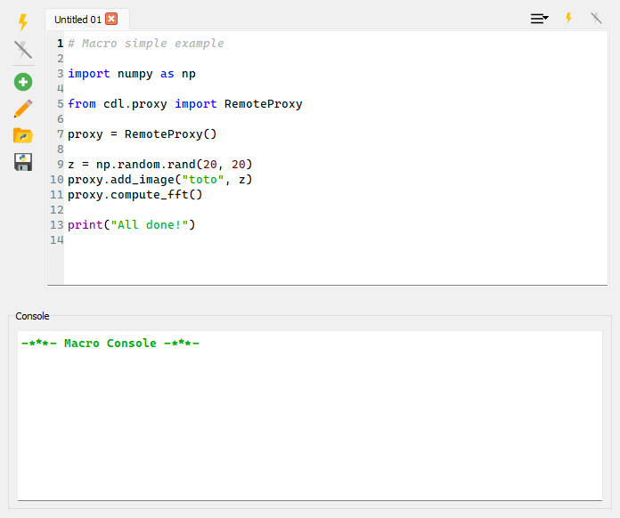

.. _about_macros:

Macros
======

Overview
--------

There are many ways to extend DataLab with new functionality (see :ref:`about_plugins`
or :ref:`ref-to-remote-control`). The easiest way to do so is by using macros. Macros
are small Python scripts that can be executed from the "Macro Panel" in DataLab.

   The Macro Panel in DataLab.

Macros can be used to automate repetitive tasks, or to create new functionality.
As the plugin and remote control system, macros rely on the DataLab high-level API
to interact with the application. This means that you can reuse the same code snippets
in macros, plugins, and remote control scripts.

.. warning::

   DataLab handles macros as Python scripts. This means that you can use the full
   power of Python to create your macros. Even though this is a powerful feature,
   it also means that you should be careful when running macros from unknown sources,
   as they can potentially harm your system.

.. seealso::

   The DataLab high-level API is documented in the :ref:`api` section.
   The plugin system is documented in the :ref:`about_plugins` section, and the
   remote control system is documented in the :ref:`ref-to-remote-control` section.

Main features
-------------

The Macro Panel is a simple interface to:

- Create new macros, using the "New macro" |libre-gui-add| button.
- Rename existing macros, using the "Rename macro" |libre-gui-pencil| button.
- Import/export macros from/to files, using the "Import macro" |fileopen_py|
  and "Export macro" |filesave_py| buttons.
- Execute macros, using the "Run macro" |libre-camera-flash-on| button.
- Stop the execution of a macro, using the "Stop macro" |libre-camera-flash-off| button.

.. |libre-gui-add| image:: ../../../cdl/data/icons/libre-gui-add.svg
    :width: 24px
    :height: 24px

.. |libre-gui-pencil| image:: ../../../cdl/data/icons/libre-gui-pencil.svg
    :width: 24px
    :height: 24px

.. |fileopen_py| image:: ../../../cdl/data/icons/fileopen_py.svg
    :width: 24px
    :height: 24px

.. |libre-camera-flash-on| image:: ../../../cdl/data/icons/libre-camera-flash-on.svg
    :width: 24px
    :height: 24px

.. |libre-camera-flash-off| image:: ../../../cdl/data/icons/libre-camera-flash-off.svg
    :width: 24px
    :height: 24px

Macros are embedded in the DataLab workspace, so they are saved together with the rest
of the data (i.e. with signals and images) when exporting the workspace to a HDF5 file.
This means that you can share your macros with other users simply by sharing the
workspace file.

.. note::

   Macro are executed in a separate process, so they won't block the main DataLab
   application. This means that you can continue working with DataLab while a macro
   is running and that *you can stop a macro at any time* using the
   |libre-camera-flash-off| button.

Example
-------

For a detailed example of how to create a macro, see the :ref:`tutorial_custom_func`
tutorial.
