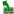
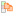
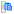
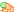
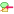
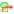
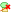

.. _ima-menu-edit:

Manipulate metadata and annotations
===================================

This section describes how to manipulate metadata and annotations in DataLab.

Image metadata contains various information about the image or its representation,
such as view settings, Regions Of Interest (ROIs), processing chain history,
analysis results, and any other information that you may have added to the metadata
of an image (or that comes from the image file itself).

.. seealso::

   For more information about Regions Of Interest (ROIs), see the :ref:`ima-menu-roi` section.

.. figure:: /images/shots/i_edit.png

    Screenshot of the "Edit" menu.

The "Edit" menu allows you to perform classic editing operations on the current image
or group of images (create/rename group, move up/down, delete image/group of images,
etc.).

As detailed below, it also allows you to:

- Navigate and utilize the processing chain history through actions like "Recompute"
  and "Select source objects".
- Manipulate metadata and annotations associated with the current image, thanks to the
  "Metadata" and "Annotations" submenus which provide the following features.

Recompute
---------

The "Recompute" |recompute| action allows you to recompute the selected image(s) using
their original processing parameters. This is useful when you want to re-execute the
processing chain that was used to create an image, for example after modifying global
settings or dependencies.

.. note::

    This action is only available for images that were created through processing
    operations and have stored processing parameters.

Select source objects
---------------------

The "Select source objects" |goto_source| action allows you to select the source
object(s) that were used to create the currently selected image. This helps trace
back the processing history and understand which original images were used as input
for the current result.

.. note::

    This action is only available when exactly one image is selected and that image
    has source object references.

Metadata
--------

.. figure:: /images/shots/i_edit_metadata.png

    Screenshot of the "Metadata" submenu.

Copy/paste metadata
^^^^^^^^^^^^^^^^^^^

As metadata contains useful information about the image, it can be copied and pasted
from one image to another by selecting the "Copy metadata" |metadata_copy| and
"Paste metadata" |metadata_paste| actions in the "Edit" menu.

This feature allows you to tranfer those information from one image to another:

- :ref:`Regions Of Interest (ROIs) <ima-menu-roi>`: that is a very efficient way to reuse
  the same ROI on different images and easily compare the results of the analysis on
  those images
- Analyze results, such as a centroid position or a contour detection (the relevance
  of transferring such information depends on the context and is up to the user
  to decide)
- Any other information that you may have added to the metadata of an image

.. note::

    Copying metadata from an image to another will overwrite the metadata of the
    destination image (for the metadata keys that are common to both images)
    or simply add the metadata keys that are not present in the destination image.

Import/export metadata
^^^^^^^^^^^^^^^^^^^^^^

Metadata can also be imported and exported from/to a JSON file using the "Import
metadata" |metadata_import| and "Export metadata" |metadata_export| actions in the
"Edit" menu. This is exactly the same as the copy/paste metadata feature (see above
for more details on the use cases of this feature), but it allows you to save the
metadata to a file and then import it back later.

Delete metadata
^^^^^^^^^^^^^^^

When deleting metadata using the "Delete metadata" |metadata_delete| action in the
"Edit" menu, you will be prompted to confirm the deletion of Region of Interests (ROIs)
if they are present in the metadata. After this eventual confirmation, the metadata
will be deleted, meaning that analysis results, ROIs, and any other information
associated with the image will be lost.

.. |metadata_delete| image:: ../../../datalab/data/icons/edit/metadata_delete.svg
    :width: 24px
    :height: 24px
    :class: dark-light no-scaled-link

Add metadata
^^^^^^^^^^^^

The "Add metadata" |metadata_add| action allows you to add custom metadata items to
one or more selected images. This is useful for tagging images with experiment IDs,
sample names, processing steps, or any other custom information.

.. figure:: /images/shots/i_add_metadata.png

    Add metadata dialog.

When you select "Add metadata..." from the Edit menu, a dialog appears where you can:

- **Metadata key**: Enter the name of the metadata field to add
- **Value pattern**: Define a pattern for the metadata value using Python format strings
- **Conversion**: Choose how to store the value (string, float, integer, or boolean)
- **Preview**: See how the metadata will be added to each selected image

The value pattern supports the following placeholders:

- ``{title}``: Image title
- ``{index}``: 1-based index of the image in the selection
- ``{count}``: Total number of selected images
- ``{xlabel}``, ``{xunit}``, ``{ylabel}``, ``{yunit}``: Axis labels and units
- ``{metadata[key]}``: Access existing metadata values

You can also use format modifiers:

- ``{title:upper}``: Convert to uppercase
- ``{title:lower}``: Convert to lowercase
- ``{index:03d}``: Format as 3-digit number with leading zeros

**Examples:**

- Add acquisition number: key=``acquisition``, pattern=``ACQ_{index:04d}``, conversion=string
  → Creates metadata like ``acquisition="ACQ_0001"``

- Add exposure time: key=``exposure_ms``, pattern=``{metadata[exposure]}``, conversion=float
  → Copies exposure from existing metadata and converts to float

- Flag calibrated images: key=``is_calibrated``, pattern=``true``, conversion=bool
  → Sets ``is_calibrated=True`` for all selected images

Annotations
-----------

Annotations are visual elements that can be added to images to highlight specific
features, mark regions of interest, or add explanatory notes. DataLab provides a
dedicated submenu in the "Edit" menu for managing annotations.

.. figure:: /images/shots/i_edit_annotations.png

    Screenshot of the "Annotations" submenu.

Copy/paste annotations
^^^^^^^^^^^^^^^^^^^^^^

Annotations can be copied from one image and pasted to one or more other images
using the "Copy annotations" |annotations_copy| and "Paste annotations" |annotations_paste|
actions. This is useful when you want to apply the same visual markers across multiple
images.

The "Paste annotations" action is only enabled when there are annotations in the
clipboard (i.e., after using "Copy annotations").

Edit annotations
^^^^^^^^^^^^^^^^

The "Edit annotations" |annotations_edit| action opens a dialog where you can view,
add, modify, or remove annotations from the current image. This provides a visual
way to manage all annotations on an image.

.. |annotations_edit| image:: ../../../datalab/data/icons/edit/annotations_edit.svg
    :width: 24px
    :height: 24px
    :class: dark-light no-scaled-link

Import/export annotations
^^^^^^^^^^^^^^^^^^^^^^^^^^

Annotations can be saved to and loaded from JSON files (.dlabann extension) using
the "Import annotations" |annotations_import| and "Export annotations" |annotations_export|
actions. This allows you to:

- Save annotation sets for later reuse
- Share annotations with colleagues
- Archive annotations separately from image data
- Apply the same annotations to different images across sessions

The "Export annotations" action is only available when the selected image has
annotations.

Delete annotations
^^^^^^^^^^^^^^^^^^

The "Delete annotations" |annotations_delete| action removes all annotations from the
selected image(s). This action is only enabled when the selected image(s) have
annotations.

.. note::

    Annotations are stored separately from metadata and analysis results. Deleting
    annotations does not affect ROIs or other metadata items.

Image titles
------------

Image titles may be considered as metadata from a user point of view, even if they
are not stored in the metadata of the image (but in an attribute of the image object).

The "Edit" menu allows you to:

- "Add object title to plot": this action will add a label on top of the image
  with its title, which might be useful in combination with the "Distribute on a grid"
  operation (see :ref:`ima-menu-processing`) to easily identify the images.

- "Copy titles to clipboard" |copy_titles|: this action will copy the titles of the
  selected images to the clipboard, which might be useful to paste them in a text
  editor or in a spreadsheet.

  Example of the content of the clipboard:

  .. code-block:: text

    g001:
        s001: lorentz(a=1,sigma=1,mu=0,ymin=0)
        s002: derivative(s001)
        s003: wiener(s002)
    g002: derivative(g001)
        s004: derivative(s001)
        s005: derivative(s002)
        s006: derivative(s003)
    g003: fft(g002)
        s007: fft(s004)
        s008: fft(s005)
        s009: fft(s006)

