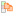
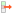
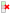

.. _ima-menu-edit:

Manipulate metadata
===================

This section describes how to manipulate metadata in DataLab.

.. figure:: /images/shots/i_edit.png

    Screenshot of the "Edit" menu.

The "Edit" menu allows you to perform classic editing operations on the current image
or group of images (create/rename group, move up/down, delete image/group of images,
etc.).

It also allows you to manipulate metadata associated with the current image.

Copy/paste metadata
-------------------

As metadata contains useful information about the image, it can be copied and pasted
from one image to another by selecting the "Copy metadata" |metadata_copy| and
"Paste metadata" |metadata_paste| actions in the "Edit" menu.

.. |metadata_paste| image:: ../../../cdl/data/icons/edit/metadata_paste.svg
    :width: 24px
    :height: 24px
    :class: dark-light no-scaled-link

This feature allows you to tranfer those information from one image to another:

- :ref:`Regions Of Interest (ROIs) <ima-roi>`: that is a very efficient way to reuse
  the same ROI on different images and easily compare the results of the analysis on
  those images
- Analyze results, such as a centroid position or a contour detection (the relevance
  of transferring such information depends on the context and is up to the user
  to decide)
- Any other information that you may have added to the metadata of an image

.. note::

    Copying metadata from an image to another will overwrite the metadata of the
    destination image (for the metadata keys that are common to both images)
    or simply add the metadata keys that are not present in the destination image.

Import/export metadata
----------------------

Metadata can also be imported and exported from/to a JSON file using the "Import
metadata" |metadata_import| and "Export metadata" |metadata_export| actions in the
"Edit" menu. This is exactly the same as the copy/paste metadata feature (see above
for more details on the use cases of this feature), but it allows you to save the
metadata to a file and then import it back later.

.. |metadata_import| image:: ../../../cdl/data/icons/edit/metadata_import.svg
    :width: 24px
    :height: 24px
    :class: dark-light no-scaled-link

Delete metadata
---------------

When deleting metadata using the "Delete metadata" |metadata_delete| action in the
"Edit" menu, you will be prompted to confirm the deletion of Region of Interests (ROIs)
if they are present in the metadata. After this eventual confirmation, the metadata
will be deleted, meaning that analysis results, ROIs, and any other information
associated with the image will be lost.

Image titles
------------

Image titles may be considered as metadata from a user point of view, even if they
are not stored in the metadata of the image (but in an attribute of the image object).

The "Edit" menu allows you to:

- "Add object title to plot": this action will add a label on top of the image
  with its title, which might be useful in combination with the "Distribute on a grid"
  operation (see :ref:`ima-menu-operations`) to easily identify the images.

- "Copy titles to clipboard" |copy_titles|: this action will copy the titles of the
  selected images to the clipboard, which might be useful to paste them in a text
  editor or in a spreadsheet.

  Example of the content of the clipboard:

  .. code-block:: text

    g001:
        s001: lorentz(a=1,sigma=1,mu=0,ymin=0)
        s002: derivative(s001)
        s003: wiener(s002)
    g002: derivative(g001)
        s004: derivative(s001)
        s005: derivative(s002)
        s006: derivative(s003)
    g003: fft(g002)
        s007: fft(s004)
        s008: fft(s005)
        s009: fft(s006)

.. |copy_titles| image:: ../../../cdl/data/icons/edit/copy_titles.svg
    :width: 24px
    :height: 24px
    :class: dark-light no-scaled-link

.. _ima-roi:

Regions Of Interest (ROI)
-------------------------

The Regions Of Interest (ROI) are image areas that are defined by the user to
perform specific operations, processing, or analysis on them.

ROI are taken into account almost in all computing features in DataLab:

- The "Operations" menu features are done only on the ROI if one is defined (except
  if the operation changes the data shape - like the resize operation - or the pixel
  size - like the binning operation).

- The "Processing" menu actions are performed only on the ROI if one is defined (except
  if the destination signal data type is different from the source's, like in the
  Fourier analysis features or like the thresholding operations).

- The "Analysis" menu actions are done only on the ROI if one is defined.

.. note::

    ROI are stored as metadata, and thus attached to image.

The "Edit" menu allows you to:

- "Edit regions of interest" |roi|: open a dialog box to manage ROI associated with
  the selected image (add, remove, move, resize, etc.). The ROI definition dialog is
  exactly the same as ROI extraction (see below).

.. figure:: /images/shots/i_roi_image.png

    An image with an ROI.

- "Remove regions of interest" |roi_delete|: remove all defined ROI for the selected
  images.

.. |roi_delete| image:: ../../../cdl/data/icons/edit/roi_delete.svg
    :width: 24px
    :height: 24px
    :class: dark-light
