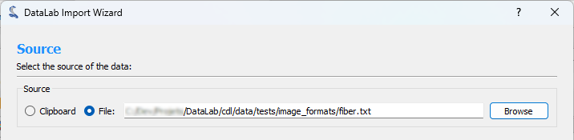
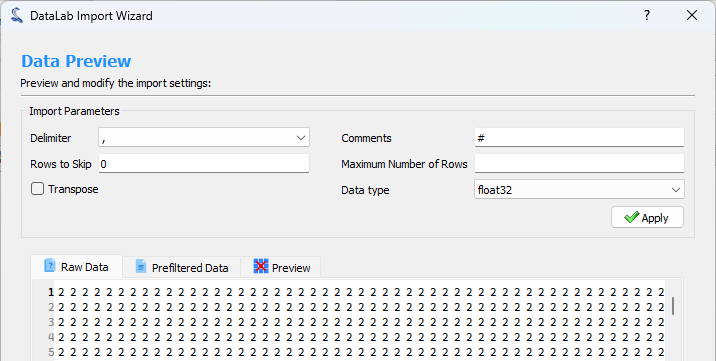
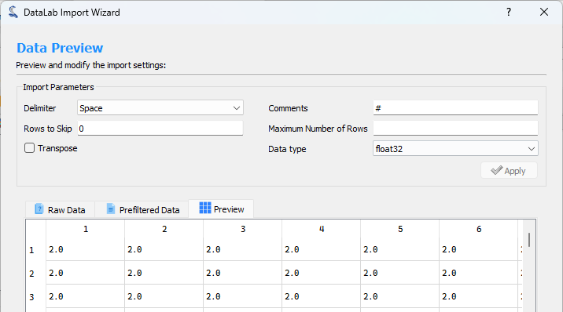
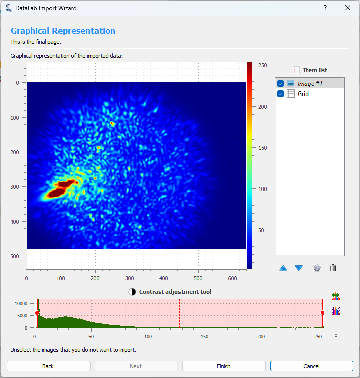

.. _ima-menu-file:

Create, open and save Images
============================

This section describes how to create, open and save images (and workspaces).

.. figure:: /images/shots/i_file.png

    Screenshot of the "File" menu.

When the "Image Panel" is selected, the menus and toolbars are updated to
provide image-related actions.

The "File" menu allows you to:

- Create, open, save and close images (see below).

- Save and restore the current workspace or browse HDF5 files (see :ref:`workspace`).

- Edit DataLab preferences (see :ref:`settings`).

New image
^^^^^^^^^

Create a new image from various models
(supported datatypes: uint8, uint16, int16, float32, float64):

.. list-table::
    :header-rows: 1
    :widths: 20, 80

    * - Model
      - Equation
    * - Zeros
      - :math:`z[i] = 0`
    * - Empty
      - Data is directly taken from memory as it is
    * - Random
      - :math:`z[i] \in [0, z_{max})` where :math:`z_{max}` is the datatype maximum value
    * - 2D Gaussian
      - :math:`z = A.exp(-\dfrac{(\sqrt{(x-x0)^2+(y-y0)^2}-\mu)^2}{2\sigma^2})`

.. _open_image:

Open image
^^^^^^^^^^

Create a new image from the following supported filetypes:

.. list-table::
    :header-rows: 1

    * - File type
      - Extensions
    * - PNG files
      - .png
    * - TIFF files
      - .tif, .tiff
    * - 8-bit images
      - .jpg, .gif
    * - NumPy arrays
      - .npy
    * - MAT-Files
      - .mat
    * - Text files
      - .txt, .csv, .asc
    * - Andor SIF files
      - .sif
    * - Princeton Instruments SPE files
      - .spe
    * - Opticks GEL files
      - .gel
    * - Hammamatsu NDPI files
      - .ndpi
    * - PCO Camera REC files
      - .rec
    * - SPIRICON files
      - .scor-data
    * - FXD files
      - .fxd
    * - Bitmap images
      - .bmp

.. note::

    DataLab also supports any image format that can be read by the `imageio` library,
    provided that the associated plugin(s) are installed (see `imageio documentation <https://imageio.readthedocs.io/en/stable/formats/index.html>`_)
    and that the output NumPy array data type and shape are supported by DataLab.

    To add a new file format, you may use the `imageio_formats` entry of DataLab configuration file.
    This entry is a formatted like the `IMAGEIO_FORMATS` object which represents the natively supported formats:

    .. autodata:: cdl.config.IMAGEIO_FORMATS

Save image
^^^^^^^^^^

Save current image (see "Open image" supported filetypes).

Import text file
^^^^^^^^^^^^^^^^

DataLab can natively import many types of image files (e.g. TIFF, JPEG, PNG, etc.).
However some specific text file formats may not be supported. In this case, you can
use the `Import text file` feature, which allows you to import a text file and
convert it to an image.

This feature is accessible from the `File` menu, under the `Import text file` option.

It opens an import wizard that guides you through the process of importing the text
file.

Step 1: Select the source
-------------------------

The first step is to select the source of the text file. You can either select a file
from your computer or the clipboard if you have copied the text from another
application.

   Step 1: Select the source

Step 2: Preview and configure the import
-----------------------------------------

The second step consists of configuring the import and previewing the result. You can
configure the following options:

- **Delimiter**: The character used to separate the values in the text file.
- **Comments**: The character used to indicate that the line is a comment and should be
  ignored.
- **Rows to Skip**: The number of rows to skip at the beginning of the file.
- **Maximum Number of Rows**: The maximum number of rows to import. If the file contains
  more rows, they will be ignored.
- **Transpose**: If checked, the rows and columns will be transposed.
- **Data type**: The destination data type of the imported data.

When you are done configuring the import, click the `Apply` button to see the result.

   Step 2: Configure the import

   Step 2: Preview the result

Step 3: Show graphical representation
-------------------------------------

The third step shows a graphical representation of the imported data. You can use the
`Finish` button to import the data into DataLab workspace.

   Step 3: Show graphical representation