.. _ima-menu-operations:

Operations on Images
====================

This section describes the operations that can be performed on images.

.. seealso::

    :ref:`ima-menu-processing` for more information on image processing features,
    or :ref:`ima-menu-analysis` for information on analysis features on images.

.. figure:: /images/shots/i_operation.png

    Screenshot of the "Operations" menu.

When the "Image Panel" is selected, the menus and toolbars are updated to
provide image-related actions.

The "Operations" menu allows you to perform various operations on the current
image or group of images. It also allows you to extract profiles, distribute
images on a grid, or resize images.

Operations with a constant
--------------------------

Create a new image which is the result of a constant operation on each selected image:

.. list-table::
    :header-rows: 1
    :widths: 25, 75

    * - Operation
      - Equation
    * - |constant_add| Add
      - :math:`z_{k} = z_{k-1} + conv(c)`
    * - |constant_subtract| Subtract
      - :math:`z_{k} = z_{k-1} - conv(c)`
    * - |constant_multiply| Multiply
      - :math:`z_{k} = conv(z_{k-1} \times c)`
    * - |constant_divide| Divide
      - :math:`z_{k} = conv(\dfrac{z_{k-1}}{c})`

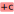

.. |constant_subtract| image:: ../../../datalab/data/icons/operations/constant_subtract.svg
    :width: 24px
    :height: 24px
    :class: dark-light no-scaled-link

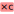

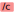

where :math:`c` is the constant value and :math:`conv` is the conversion function
which handles data type conversion (keeping the same data type as the input image).

Basic arithmetic operations
---------------------------
Arithmetic operations are performed pixel by pixel between the selected images.

.. list-table::
    :header-rows: 1
    :widths: 40, 60

    * - Operation
      - Description
    * - |sum| Sum
      - :math:`z_{M} = \sum_{k=0}^{M-1}{z_{k}}`
    * - |difference| Difference
      - :math:`z_{2} = z_{1} - z_{0}`
    * - |product| Product
      - :math:`z_{M} = \prod_{k=0}^{M-1}{z_{k}}`
    * - |division| Division
      - :math:`z_{2} = \dfrac{z_{1}}{z_{0}}`
    * - |inverse| Inverse
      - :math:`z_{2} = \dfrac{1}{z_{1}}`
    * - |exponential| Exponential
      - :math:`z_{2} = \exp(z_{1})`
    * - |logarithm| Logarithm (base 10)
      - :math:`z_{2} = \log_{10}(z_{1})`

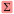

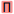

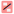

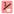

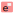

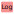

Basic mathematical functions
----------------------------

.. list-table::
    :header-rows: 1
    :widths: 40, 60

    * - Function
      - Description
    * - |exp| Exponential
      - :math:`z_{k} = \exp(z_{k})`
    * - |log10| Logarithm (base 10)
      - :math:`z_{k} = \log_{10}(z_{k})`
    * - Log10(z+10)
      - :math:`z_{k} = \log_{10}(z_{k}+n)` (useful if image background is zero)

Convolution and Deconvolution
------------------------------

.. list-table::
    :header-rows: 1
    :widths: 40, 60

    * - Operation
      - Implementation
    * - |convolution| Convolution
      - Based on `scipy.signal.convolve <https://docs.scipy.org/doc/scipy/reference/generated/scipy.signal.convolve.html>`_
    * - |deconvolution| Deconvolution
      - Frequency domain deconvolution

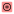

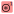

Absolute value and complex image operations
-------------------------------------------

.. list-table::
    :header-rows: 1
    :widths: 40, 60

    * - Operation
      - Description
    * - |abs| Absolute value
      - :math:`z_{k} = |z_{k-1}|`
    * - |phase| Phase (argument)
      - :py:func:`sigima.proc.image.phase`
    * - |complex_from_magnitude_phase| Combine with phase
      - Consider current image as the module and allow to select a image
        representing the phase to merge them in a complex image
        :py:func:`sigima.proc.image.complex_from_magnitude_phase`
    * - |re| Real part
      - :math:`z_{k} = \Re(z_{k-1})`
    * - |im| Imaginary part
      - :math:`z_{k} = \Im(z_{k-1})`
    * - |complex_from_real_imag| Combine with imaginary part
      - Consider current image as the real part and allow to select a image
        representing the imaginary part to merge them in a complex image
        :py:func:`sigima.proc.image.complex_from_real_imag`

.. |phase| image:: ../../../datalab/data/icons/operations/phase.svg
    :width: 24px
    :height: 24px
    :class: dark-light no-scaled-link

.. |complex_from_magnitude_phase| image:: ../../../datalab/data/icons/operations/phase.svg
    :width: 24px
    :height: 24px
    :class: dark-light no-scaled-link

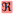

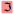

Data type conversion
--------------------

The "Convert data type" |convert_dtype| action allows you to convert the data type
of the selected images. For integer data types, the conversion is done by clipping
the values to the new data type range before effectively converting the data type.
For floating point data types, the conversion is straightforward.

.. note::

    Data type conversion uses the :py:func:`sigima.tools.datatypes.clip_astype`
    function which relies on :py:func:`numpy.ndarray.astype` function with
    the default parameters (`casting='unsafe'`).

Statistics between images
^^^^^^^^^^^^^^^^^^^^^^^^^^^
Create a new image which is the result of a statistical operation on each pixel of the selected images:

.. list-table::
    :header-rows: 1
    :widths: 40, 60

    * - Operation
      - Description
    * - |average| Average
      - :math:`z_{M} = \dfrac{1}{M}\sum_{k=0}^{M-1}{z_{k}}`
    * - |standard_deviation| Standard Deviation
      - :math:`z_{M} = \sqrt{\dfrac{1}{M}\sum_{k=0}^{M-1}{(y_{k} - \bar{y})^{2}}}`
    * - |quadratic_difference| Quadratic difference
      - :math:`z_{2} = \dfrac{z_{1} - z_{0}}{\sqrt{2}}`
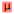

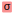

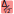

Flat-field correction
^^^^^^^^^^^^^^^^^^^^^

Create a new image which is flat-field correction
of the **two** selected images:

.. math::
    z_{1} =
    \begin{cases}
        \dfrac{z_{0}}{z_{f}}.\overline{z_{f}} & \text{if } z_{0} > z_{threshold} \\
        z_{0} & \text{otherwise}
    \end{cases}`

where :math:`z_{0}` is the raw image,
:math:`z_{f}` is the flat field image,
:math:`z_{threshold}` is an adjustable threshold
and :math:`\overline{z_{f}}` is the flat field image average value:

.. math::
    \overline{z_{f}}=
    \dfrac{1}{N_{row}.N_{col}}.\sum_{i=0}^{N_{row}}\sum_{j=0}^{N_{col}}{z_{f}(i,j)}

.. note::

    Raw image and flat field image are supposedly already
    corrected by performing a dark frame subtraction.
