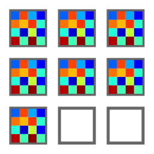
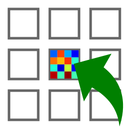

.. _ima-menu-operations:

Operations on Images
====================

This section describes the operations that can be performed on images.

.. seealso::

    :ref:`ima-menu-processing` for more information on image processing features,
    or :ref:`ima-menu-analysis` for information on analysis features on images.

.. figure:: /images/shots/i_operation.png

    Screenshot of the "Operations" menu.

When the "Image Panel" is selected, the menus and toolbars are updated to
provide image-related actions.

The "Operations" menu allows you to perform various operations on the current
image or group of images. It also allows you to extract profiles, distribute
images on a grid, or resize images.

Operations with a constant
--------------------------

Create a new image which is the result of a constant operation on each selected image:

.. list-table::
    :header-rows: 1
    :widths: 25, 75

    * - Operation
      - Equation
    * - |constant_add| Addition
      - :math:`z_{k} = z_{k-1} + conv(c)`
    * - |constant_subtract| Subtraction
      - :math:`z_{k} = z_{k-1} - conv(c)`
    * - |constant_multiply| Multiplication
      - :math:`z_{k} = conv(z_{k-1} \times c)`
    * - |constant_divide| Division
      - :math:`z_{k} = conv(\dfrac{z_{k-1}}{c})`

.. |constant_add| image:: ../../../datalab/data/icons/operations/constant_add.svg
    :width: 24px
    :height: 24px
    :class: dark-light no-scaled-link

.. |constant_subtract| image:: ../../../datalab/data/icons/operations/constant_subtract.svg
    :width: 24px
    :height: 24px
    :class: dark-light no-scaled-link

.. |constant_multiply| image:: ../../../datalab/data/icons/operations/constant_multiply.svg
    :width: 24px
    :height: 24px
    :class: dark-light no-scaled-link

.. |constant_divide| image:: ../../../datalab/data/icons/operations/constant_divide.svg
    :width: 24px
    :height: 24px
    :class: dark-light no-scaled-link

where :math:`c` is the constant value and :math:`conv` is the conversion function
which handles data type conversion (keeping the same data type as the input image).

Basic arithmetic operations
---------------------------

.. list-table::
    :header-rows: 1
    :widths: 40, 60

    * - Operation
      - Description
    * - |sum| Sum
      - :math:`z_{M} = \sum_{k=0}^{M-1}{z_{k}}`
    * - |average| Average
      - :math:`z_{M} = \dfrac{1}{M}\sum_{k=0}^{M-1}{z_{k}}`
    * - |standard_deviation| Standard Deviation
      - :math:`z_{M} = \sqrt{\dfrac{1}{M}\sum_{k=0}^{M-1}{(y_{k} - \bar{y})^{2}}}`
    * - |difference| Difference
      - :math:`z_{2} = z_{1} - z_{0}`
    * - |quadratic_difference| Quadratic difference
      - :math:`z_{2} = \dfrac{z_{1} - z_{0}}{\sqrt{2}}`
    * - |product| Product
      - :math:`z_{M} = \prod_{k=0}^{M-1}{z_{k}}`
    * - |division| Division
      - :math:`z_{2} = \dfrac{z_{1}}{z_{0}}`
    * - |inverse| Inverse
      - :math:`z_{2} = \dfrac{1}{z_{1}}`

.. |sum| image:: ../../../datalab/data/icons/operations/sum.svg
    :width: 24px
    :height: 24px
    :class: dark-light no-scaled-link

.. |average| image:: ../../../datalab/data/icons/operations/average.svg
    :width: 24px
    :height: 24px
    :class: dark-light no-scaled-link

.. |standard_deviation| image:: ../../../datalab/data/icons/operations/std.svg
    :width: 24px
    :height: 24px
    :class: dark-light no-scaled-link

.. |difference| image:: ../../../datalab/data/icons/operations/difference.svg
    :width: 24px
    :height: 24px
    :class: dark-light no-scaled-link

.. |quadratic_difference| image:: ../../../datalab/data/icons/operations/quadratic_difference.svg
    :width: 24px
    :height: 24px
    :class: dark-light no-scaled-link

.. |product| image:: ../../../datalab/data/icons/operations/product.svg
    :width: 24px
    :height: 24px
    :class: dark-light no-scaled-link

.. |division| image:: ../../../datalab/data/icons/operations/division.svg
    :width: 24px
    :height: 24px
    :class: dark-light no-scaled-link

.. |inverse| image:: ../../../datalab/data/icons/operations/inverse.svg
    :width: 24px
    :height: 24px
    :class: dark-light no-scaled-link

Absolute value and complex image operations
-------------------------------------------

.. list-table::
    :header-rows: 1
    :widths: 40, 60

    * - Operation
      - Description
    * - |abs| Absolute value
      - :math:`z_{k} = |z_{k-1}|`
    * - |phase| Phase (argument)
      - :py:func:`sigima.proc.image.phase`
    * - |complex_from_magnitude_phase| Complex from magnitude and phase
      - :py:func:`sigima.proc.image.complex_from_magnitude_phase`
    * - |re| Real part
      - :math:`z_{k} = \Re(z_{k-1})`
    * - |im| Imaginary part
      - :math:`z_{k} = \Im(z_{k-1})`
    * - |complex_from_real_imag| Complex from real and imaginary parts
      - :py:func:`sigima.proc.image.complex_from_real_imag`

.. |abs| image:: ../../../datalab/data/icons/operations/abs.svg
    :width: 24px
    :height: 24px
    :class: dark-light no-scaled-link

.. |phase| image:: ../../../datalab/data/icons/operations/phase.svg
    :width: 24px
    :height: 24px
    :class: dark-light no-scaled-link

.. |complex_from_magnitude_phase| image:: ../../../datalab/data/icons/operations/phase.svg
    :width: 24px
    :height: 24px
    :class: dark-light no-scaled-link

.. |re| image:: ../../../datalab/data/icons/operations/re.svg
    :width: 24px
    :height: 24px
    :class: dark-light no-scaled-link

.. |im| image:: ../../../datalab/data/icons/operations/im.svg
    :width: 24px
    :height: 24px
    :class: dark-light no-scaled-link

.. |complex_from_real_imag| image:: ../../../datalab/data/icons/operations/im.svg
    :width: 24px
    :height: 24px
    :class: dark-light no-scaled-link

Data type conversion
--------------------

The "Convert data type" |convert_dtype| action allows you to convert the data type
of the selected images. For integer data types, the conversion is done by clipping
the values to the new data type range before effectively converting the data type.
For floating point data types, the conversion is straightforward.

.. |convert_dtype| image:: ../../../datalab/data/icons/operations/convert_dtype.svg
    :width: 24px
    :height: 24px
    :class: dark-light no-scaled-link

.. note::

    Data type conversion uses the :py:func:`sigima.tools.datatypes.clip_astype`
    function which relies on :py:func:`numpy.ndarray.astype` function with
    the default parameters (`casting='unsafe'`).

Basic mathematical functions
----------------------------

.. list-table::
    :header-rows: 1
    :widths: 40, 60

    * - Function
      - Description
    * - |exp| Exponential
      - :math:`z_{k} = \exp(z_{k})`
    * - |log10| Logarithm (base 10)
      - :math:`z_{k} = \log_{10}(z_{k})`
    * - Logarithmic transformation
      - :math:`z_{k} = \log_{10}(z_{k}+n)` (useful if image background is zero)

.. |exp| image:: ../../../datalab/data/icons/operations/exp.svg
    :width: 24px
    :height: 24px
    :class: dark-light no-scaled-link

.. |log10| image:: ../../../datalab/data/icons/operations/log10.svg
    :width: 24px
    :height: 24px
    :class: dark-light no-scaled-link

Other operations
----------------

.. list-table::
    :header-rows: 1
    :widths: 40, 60

    * - Operation
      - Implementation
    * - |convolution| Convolution
      - Based on `scipy.signal.convolve <https://docs.scipy.org/doc/scipy/reference/generated/scipy.signal.convolve.html>`_
    * - |deconvolution| Deconvolution
      - Frequency domain deconvolution

.. |convolution| image:: ../../../datalab/data/icons/operations/convolution.svg
    :width: 24px
    :height: 24px
    :class: dark-light no-scaled-link

.. |deconvolution| image:: ../../../datalab/data/icons/operations/deconvolution.svg
    :width: 24px
    :height: 24px
    :class: dark-light no-scaled-link

Flat-field correction
^^^^^^^^^^^^^^^^^^^^^

Create a new image which is flat-field correction
of the **two** selected images:

.. math::
    z_{1} =
    \begin{cases}
        \dfrac{z_{0}}{z_{f}}.\overline{z_{f}} & \text{if } z_{0} > z_{threshold} \\
        z_{0} & \text{otherwise}
    \end{cases}`

where :math:`z_{0}` is the raw image,
:math:`z_{f}` is the flat field image,
:math:`z_{threshold}` is an adjustable threshold
and :math:`\overline{z_{f}}` is the flat field image average value:

.. math::
    \overline{z_{f}}=
    \dfrac{1}{N_{row}.N_{col}}.\sum_{i=0}^{N_{row}}\sum_{j=0}^{N_{col}}{z_{f}(i,j)}

.. note::

    Raw image and flat field image are supposedly already
    corrected by performing a dark frame subtraction.

Flip or rotation
^^^^^^^^^^^^^^^^

Create a new image by flipping or rotating the data of the selected image.
The image may be flipped horizontally, vertically, or diagonally (transposition).
It may be rotated by 90°, 270° or any user-defined value.

Intensity profiles
^^^^^^^^^^^^^^^^^^

Line profile
    Extract an horizontal or vertical profile from each selected image, and create
    new signals from these profiles.

    .. figure:: /images/shots/i_profile.png

        Line profile dialog. Parameters may also be set manually
        ("Edit profile parameters" button).

Segment profile
    Extract a segment profile from each selected image, and create new signals
    from these profiles.

Average profile
    Extract an horizontal or vertical profile averaged over a rectangular area, from
    each selected image, and create new signals from these profiles.

    .. figure:: /images/shots/i_profile_average.png

        Average profile dialog: the area is defined by a rectangle shape.
        Parameters may also be set manually ("Edit profile parameters" button).

Radial profile extraction
    Extract a radial profile from each selected image, and create new signals from
    these profiles.

    The following parameters are available:

    .. list-table::
        :header-rows: 1
        :widths: 25, 75

        * - Parameter
          - Description
        * - Center
          - Center around which the radial profile is computed: centroid, image center, or user-defined
        * - X
          - X coordinate of the center (if user-defined), in pixels
        * - Y
          - Y coordinate of the center (if user-defined), in pixels

Distribute images along a grid
^^^^^^^^^^^^^^^^^^^^^^^^^^^^^^

.. list-table::
    :header-rows: 1
    :widths: 40, 60

    * - Feature
      - Description
    * - |distribute_on_grid| Distribute on a grid
      - Distribute selected images on a regular grid
    * - |reset_positions| Reset image positions
      - Reset the positions of the selected images to first image (x0, y0) coordinates

