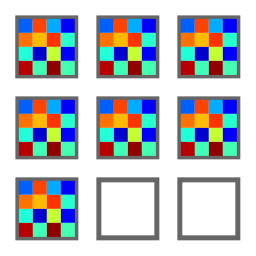
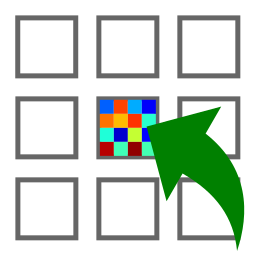

.. _ima-menu-processing:

Processing Images
=================

This section describes the image processing features available in DataLab.

.. seealso::

    :ref:`ima-menu-operations` for more information on operations that can be performed
    on images, or :ref:`ima-menu-analysis` for information on analysis features on
    images.

.. figure:: /images/shots/i_processing.png

    Screenshot of the "Processing" menu.

When the "Image Panel" is selected, the menus and toolbars are updated to
provide image-related actions.

The "Processing" menu allows you to perform various processing on the current
image or group of images: it allows you to apply filters, to perform exposure
correction, to perform denoising, to perform morphological operations, and so on.

Geometry
^^^^^^^^

Flip and rotation
~~~~~~~~~~~~~~~~~

Create a new image by flipping or rotating the data of the selected image.
The image may be flipped horizontally, vertically, or diagonally (transposition).
It may be rotated by 90°, 270° or any user-defined value.

.. list-table::
    :header-rows: 1
    :widths: 40, 60

    * - Operation
      - Description
    * - Flip horizontally
      - Mirror image along the vertical axis
    * - Flip diagonally
      - Transpose the image (swap X/Y axes)
    * - Flip vertically
      - Mirror image along the horizontal axis
    * - Rotate 90° right
      - Rotate image 90° clockwise
    * - Rotate 90° left
      - Rotate image 90° counter-clockwise
    * - Rotate by...
      - Rotate image by any angle (user-defined)

Distribute images along a grid
~~~~~~~~~~~~~~~~~~~~~~~~~~~~~~~

.. list-table::
    :header-rows: 1
    :widths: 40, 60

    * - Feature
      - Description
    * - |distribute_on_grid| Distribute on a grid
      - Distribute selected images on a regular grid
    * - |reset_positions| Reset image positions
      - Reset the positions of the selected images to first image (x0, y0) coordinates

Axis transformation
^^^^^^^^^^^^^^^^^^^

Set uniform coordinates
~~~~~~~~~~~~~~~~~~~~~~~

Create a new image with uniform coordinates (i.e., with a constant pixel size in both X and Y directions).

Polynomial calibration
~~~~~~~~~~~~~~~~~~~~~~

Create a new image which is a polynomial calibration
of each selected image with respect to Z axis.

.. note::

    Linear calibration was removed from the UI as it is a special case of polynomial calibration with degree 1.

Level adjustment
^^^^^^^^^^^^^^^^

Normalize
~~~~~~~~~

Create a new image which is the normalized version of each selected image
by maximum, amplitude, sum, energy or RMS:

.. list-table::
    :header-rows: 1
    :widths: 25, 75

    * - Normalization
      - Equation
    * - Maximum
      - :math:`z_{1} = \dfrac{z_{0}}{z_{\max}}`
    * - Amplitude
      - :math:`z_{1} = \dfrac{z_{0}}{z_{\max}-z_{\min}}`
    * - Area
      - :math:`z_{1} = \dfrac{z_{0}}{\sum_{i=0}^{N-1}{z_{i}}}`
    * - Energy
      - :math:`z_{1}= \dfrac{z_{0}}{\sqrt{\sum_{n=0}^{N}\left|z_{0}[n]\right|^2}}`
    * - RMS
      - :math:`z_{1}= \dfrac{z_{0}}{\sqrt{\dfrac{1}{N}\sum_{n=0}^{N}\left|z_{0}[n]\right|^2}}`

Clipping
~~~~~~~~

Apply the clipping to each selected image.

Offset correction
~~~~~~~~~~~~~~~~~

Create a new image which is the result of offset correction on each selected image.
This operation is performed by subtracting the image background value which is estimated
by the mean value of a user-defined rectangular area.

Noise addition
^^^^^^^^^^^^^^

Generate new images by adding the same noise to each selected image.
The available noise types are:

.. list-table::
    :header-rows: 1
    :widths: 25, 75

    * - Noise
      - Description
    * - Gaussian
      - Normal distribution
    * - Uniform
      - Uniform distribution
    * - Poisson
      - Poisson distribution

Noise reduction
^^^^^^^^^^^^^^^

Create a new image which is the result of noise reduction on each selected image.

The following filters are available:

.. list-table::
    :header-rows: 1
    :widths: 25, 75

    * - Filter
      - Formula/implementation
    * - Gaussian filter
      - `scipy.ndimage.gaussian_filter <https://docs.scipy.org/doc/scipy/reference/generated/scipy.ndimage.gaussian_filter.html>`_
    * - Moving average
      - `scipy.ndimage.uniform_filter <https://docs.scipy.org/doc/scipy/reference/generated/scipy.ndimage.uniform_filter.html>`_
    * - Moving median
      - `scipy.ndimage.median_filter <https://docs.scipy.org/doc/scipy/reference/generated/scipy.ndimage.median_filter.html>`_
    * - Wiener filter
      - `scipy.signal.wiener <https://docs.scipy.org/doc/scipy/reference/generated/scipy.signal.wiener.html>`_

Fourier analysis
^^^^^^^^^^^^^^^^

Zero padding
~~~~~~~~~~~~

Create a new image which is the result of zero padding on each selected image.

The following parameters are available:

.. list-table::
    :header-rows: 1
    :widths: 25, 75

    * - Parameter
      - Description
    * - Strategy
      - Zero padding strategy (see below)
    * - Rows
      - Number of rows to add (if `strategy` is 'custom')
    * - Columns
      - Number of columns to add (if `strategy` is 'custom')
    * - Position
      - Position of the added zeros: 'bottom-right', 'centered'

Zero padding strategy refers to the method used to add zeros to the image, and it can be one of the following:

.. list-table::
    :header-rows: 1
    :widths: 25, 75

    * - Strategy
      - Description
    * - next_pow2
      - Next power of 2 (e.g. 512, 1024, ...)
    * - multiple_of_64
      - Next multiple of 64 (e.g. 512, 576, ...)
    * - custom
      - Custom size (user-defined)

FFT related functions
~~~~~~~~~~~~~~~~~~~~~

Create a new image which is the result of a Fourier analysis on each selected image.

The following functions are available:

.. list-table::
    :header-rows: 1
    :widths: 20, 30, 50

    * - Function
      - Description
      - Formula/implementation
    * - FFT
      - Fast Fourier Transform
      - `numpy.fft.fft2 <https://numpy.org/doc/stable/reference/generated/numpy.fft.fft2.html>`_
    * - Inverse FFT
      - Inverse Fast Fourier Transform
      - `numpy.fft.ifft2 <https://numpy.org/doc/stable/reference/generated/numpy.fft.ifft2.html>`_
    * - Magnitude spectrum
      - Optional: output in decibels (dB)
      - | :math:`z_{1} = \left|\FFT\left(z_{0}\right)\right|` or
        | :math:`z_{1} = 20 \log_{10} \left(\left|\FFT\left(z_{0}\right)\right|\right)` (dB)
    * - Phase spectrum
      - Phase of the FFT expressed in degrees, using `numpy.angle <https://docs.scipy.org/doc/numpy/reference/generated/numpy.angle.html>`_
      - :math:`z_{1} = \angle\left(\FFT\left(z_{0}\right)\right)`
    * - Power spectral density
      - Optional: output in decibels (dB)
      - | :math:`z_{1} = \left|\FFT\left(z_{0}\right)\right|^2` or
        | :math:`z_{1} = 10 \log_{10} \left(\left|\FFT\left(z_{0}\right)\right|^2\right)` (dB)

.. note::

    FFT and inverse FFT are performed using frequency shifting if the option is enabled
    in DataLab settings (see :ref:`settings`).

Frequency-domain filters
^^^^^^^^^^^^^^^^^^^^^^^^

The following frequency-domain filters are available:

.. list-table::
    :header-rows: 1
    :widths: 25, 75

    * - Method
      - Description
    * - Butterworth
      - Butterworth filter, based on `skimage.filters.butterworth <https://scikit-image.org/docs/stable/api/skimage.filters.html#skimage.filters.butterworth>`_
    * - Gaussian filter
      - Gaussian filter

Thresholding
^^^^^^^^^^^^

Create a new image which is the result of thresholding on each selected image,
eventually based on user-defined parameters ("Parametric thresholding").

The following parameters are available when selecting "Parametric thresholding":

.. list-table::
    :header-rows: 1
    :widths: 25, 75

    * - Parameter
      - Description
    * - Threshold method
      - The thresholding method to use (see table below)
    * - Bins
      - Number of bins for histogram calculation
    * - Value
      - Threshold value
    * - Operation
      - Operation to apply (> or <)

The following thresholding methods are available:

.. list-table::
    :header-rows: 1
    :widths: 25, 75

    * - Method
      - Implementation
    * - Manual
      - Manual thresholding (user-defined parameters)
    * - ISODATA
      - `skimage.filters.threshold_isodata <https://scikit-image.org/docs/stable/api/skimage.filters.html#skimage.filters.threshold_isodata>`_
    * - Li
      - `skimage.filters.threshold_li <https://scikit-image.org/docs/stable/api/skimage.filters.html#skimage.filters.threshold_li>`_
    * - Mean
      - `skimage.filters.threshold_mean <https://scikit-image.org/docs/stable/api/skimage.filters.html#skimage.filters.threshold_mean>`_
    * - Minimum
      - `skimage.filters.threshold_minimum <https://scikit-image.org/docs/stable/api/skimage.filters.html#skimage.filters.threshold_minimum>`_
    * - Otsu
      - `skimage.filters.threshold_otsu <https://scikit-image.org/docs/stable/api/skimage.filters.html#skimage.filters.threshold_otsu>`_
    * - Triangle
      - `skimage.filters.threshold_triangle <https://scikit-image.org/docs/stable/api/skimage.filters.html#skimage.filters.threshold_triangle>`_
    * - Yen
      - `skimage.filters.threshold_yen <https://scikit-image.org/docs/stable/api/skimage.filters.html#skimage.filters.threshold_yen>`_

.. note::

    The "All thresholding methods" option allows to perform all thresholding methods
    on the same image. Combined with the "distribute on a grid" option, this allows
    to compare the different thresholding methods on the same image.

Exposure
^^^^^^^^

Create a new image which is the result of exposure correction on each selected image.

The following functions are available:

.. list-table::
    :header-rows: 1
    :widths: 25, 25, 50

    * - Function
      - Implementation
      - Comments
    * - Gamma correction
      - `skimage.exposure.adjust_gamma <https://scikit-image.org/docs/stable/api/skimage.exposure.html#skimage.exposure.adjust_gamma>`_
      -
    * - Logarithmic correction
      - `skimage.exposure.adjust_log <https://scikit-image.org/docs/stable/api/skimage.exposure.html#skimage.exposure.adjust_log>`_
      -
    * - Sigmoid correction
      - `skimage.exposure.adjust_sigmoid <https://scikit-image.org/docs/stable/api/skimage.exposure.html#skimage.exposure.adjust_sigmoid>`_
      -
    * - Histogram equalization
      - `skimage.exposure.equalize_hist <https://scikit-image.org/docs/stable/api/skimage.exposure.html#skimage.exposure.equalize_hist>`_
      -
    * - Adaptive histogram equalization
      - `skimage.exposure.equalize_adapthist <https://scikit-image.org/docs/stable/api/skimage.exposure.html#skimage.exposure.equalize_adapthist>`_
      - Contrast Limited Adaptive Histogram Equalization (CLAHE) algorithm
    * - Intensity rescaling
      - `skimage.exposure.rescale_intensity <https://scikit-image.org/docs/stable/api/skimage.exposure.html#skimage.exposure.rescale_intensity>`_
      - Stretch or shrink image intensity levels

Restoration
^^^^^^^^^^^

Create a new image which is the result of restoration on each selected image.

The following functions are available:

.. list-table::
    :header-rows: 1
    :widths: 25, 25, 50

    * - Function
      - Implementation
      - Comments
    * - Total variation denoising
      - `skimage.restoration.denoise_tv_chambolle <https://scikit-image.org/docs/stable/api/skimage.restoration.html#denoise-tv-chambolle>`_
      -
    * - Bilateral filter denoising
      - `skimage.restoration.denoise_bilateral <https://scikit-image.org/docs/stable/api/skimage.restoration.html#denoise-bilateral>`_
      -
    * - Wavelet denoising
      - `skimage.restoration.denoise_wavelet <https://scikit-image.org/docs/stable/api/skimage.restoration.html#denoise-wavelet>`_
      -
    * - White Top-Hat denoising
      - `skimage.morphology.white_tophat <https://scikit-image.org/docs/stable/api/skimage.morphology.html#skimage.morphology.white_tophat>`_
      - Denoise image by subtracting its white top hat transform

.. note::

    The "All denoising methods" option allows to perform all denoising methods
    on the same image. Combined with the "distribute on a grid" option, this allows
    to compare the different denoising methods on the same image.

Morphology
^^^^^^^^^^

Create a new image which is the result of morphological operations on each selected image,
using a disk footprint.

The following functions are available:

.. list-table::
    :header-rows: 1
    :widths: 25, 75

    * - Function
      - Implementation
    * - White Top-Hat (disk)
      - `skimage.morphology.white_tophat <https://scikit-image.org/docs/stable/api/skimage.morphology.html#skimage.morphology.white_tophat>`_
    * - Black Top-Hat (disk)
      - `skimage.morphology.black_tophat <https://scikit-image.org/docs/stable/api/skimage.morphology.html#skimage.morphology.black_tophat>`_
    * - Erosion (disk)
      - `skimage.morphology.erosion <https://scikit-image.org/docs/stable/api/skimage.morphology.html#skimage.morphology.erosion>`_
    * - Dilation (disk)
      - `skimage.morphology.dilation <https://scikit-image.org/docs/stable/api/skimage.morphology.html#skimage.morphology.dilation>`_
    * - Opening (disk)
      - `skimage.morphology.opening <https://scikit-image.org/docs/stable/api/skimage.morphology.html#skimage.morphology.opening>`_
    * - Closing (disk)
      - `skimage.morphology.closing <https://scikit-image.org/docs/stable/api/skimage.morphology.html#skimage.morphology.closing>`_

.. note::

    The "All morphological operations" option allows to perform all morphological operations
    on the same image. Combined with the "distribute on a grid" option, this allows to compare
    the different morphological operations on the same image.

Edges
^^^^^

Create a new image which is the result of edge filtering on each selected image.

The following functions are available:

.. list-table::
    :header-rows: 1
    :widths: 25, 75

    * - Function
      - Implementation
    * - Canny filter
      - `skimage.feature.canny <https://scikit-image.org/docs/stable/api/skimage.feature.html#skimage.feature.canny>`_
    * - Farid filter
      - `skimage.filters.farid <https://scikit-image.org/docs/stable/api/skimage.filters.html#skimage.filters>`_
    * - Farid filter (horizontal)
      - `skimage.filters.farid_h <https://scikit-image.org/docs/stable/api/skimage.filters.html#skimage.filters.farid_h>`_
    * - Farid filter (vertical)
      - `skimage.filters.farid_v <https://scikit-image.org/docs/stable/api/skimage.filters.html#skimage.filters.farid_v>`_
    * - Laplace filter
      - `skimage.filters.laplace <https://scikit-image.org/docs/stable/api/skimage.filters.html#skimage.filters.laplace>`_
    * - Prewitt filter
      - `skimage.filters.prewitt <https://scikit-image.org/docs/stable/api/skimage.filters.html#skimage.filters.prewitt>`_
    * - Prewitt filter (horizontal)
      - `skimage.filters.prewitt_h <https://scikit-image.org/docs/stable/api/skimage.filters.html#skimage.filters.prewitt_h>`_
    * - Prewitt filter (vertical)
      - `skimage.filters.prewitt_v <https://scikit-image.org/docs/stable/api/skimage.filters.html#skimage.filters.prewitt_v>`_
    * - Roberts filter
      - `skimage.filters.roberts <https://scikit-image.org/docs/stable/api/skimage.filters.html#skimage.filters.roberts>`_
    * - Scharr filter
      - `skimage.filters.scharr <https://scikit-image.org/docs/stable/api/skimage.filters.html#skimage.filters.scharr>`_
    * - Scharr filter (horizontal)
      - `skimage.filters.scharr_h <https://scikit-image.org/docs/stable/api/skimage.filters.html#skimage.filters.scharr_h>`_
    * - Scharr filter (vertical)
      - `skimage.filters.scharr_v <https://scikit-image.org/docs/stable/api/skimage.filters.html#skimage.filters.scharr_v>`_
    * - Sobel filter
      - `skimage.filters.sobel <https://scikit-image.org/docs/stable/api/skimage.filters.html#skimage.filters.sobel>`_
    * - Sobel filter (horizontal)
      - `skimage.filters.sobel_h <https://scikit-image.org/docs/stable/api/skimage.filters.html#skimage.filters.sobel_h>`_
    * - Sobel filter (vertical)
      - `skimage.filters.sobel_v <https://scikit-image.org/docs/stable/api/skimage.filters.html#skimage.filters.sobel_v>`_

.. note::

    The "All edges filters" option allows to perform all edge filtering algorithms
    on the same image. Combined with the "distribute on a grid" option, this allows
    to compare the different edge filters on the same image.

Erase area
^^^^^^^^^^

Erase an area in the image as defined by a region of interest (ROI).

.. note::

    The region to erase is defined by the user through a dialog box. It can consist of
    a single ROI or multiple ROIs with various shapes (rectangular, circular, etc.).
    Note that the ROI defined here is not bound to any object; it is used solely to
    specify the area to erase in the image. In particular, it is independent of the
    image’s ROI, if any (the latter is shown in the dialog box as a masked area).

Resize
^^^^^^

Create a new image which is a resized version of each selected image.

Pixel binning
^^^^^^^^^^^^^

Combine clusters of adjacent pixels, throughout the image,
into single pixels. The result can be the sum, average, median, minimum,
or maximum value of the cluster.

Resampling
^^^^^^^^^^

Generate new images by resampling each selected image.
The following parameters are available:

.. list-table::
    :header-rows: 1
    :widths: 25, 75

    * - Parameter
      - Description
    * - math:`x_{min}`
      - Minimum x-coordinate of the output image
    * - :math:`x_{max}`
      - Maximum x-coordinate of the output image
    * - :math:`y_{min}`
      - Minimum y-coordinate of the output image
    * - :math:`y_{max}`
      - Maximum y-coordinate of the output image
    * - Mode
      - Image size definition mode: 'Pixel size' or 'Output shape'. The 'Pixel size' mode
        allows to define the pixel size of the new image, while the 'Output shape' mode
        allows to define the number of pixels of the new image.
    * - ΔX
      - Pixel size in x-direction (if 'Pixel size' mode is selected)
    * - ΔY
      - Pixel size in y-direction (if 'Pixel size' mode is selected)
    * - Width
      - Output image width in pixels (if 'Output shape' mode is selected)
    * - Height
      - Output image height in pixels (if 'Output shape' mode is selected)
    * - Interpolation method
      - Interpolation method to use: 'nearest', 'linear', 'cubic'
    * - Fill value
      - Value to use for points outside the input image domain (if None, function uses NaN for extrapolation)
