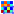

.. _ima-menu-roi:

Regions Of Interest (ROI)
=========================

This section describes how to manipulate Regions Of Interest (ROIs) for images in DataLab.

.. figure:: /images/shots/i_roi.png

    Screenshot of the "ROI" menu.

The "ROI" menu allows you to manage Regions Of Interest (ROIs) associated with the current image.

.. seealso::

    For more information about image metadata, see the :ref:`ima-menu-edit` section.

The Regions Of Interest (ROI) are image areas that are defined by the user to perform specific operations, processing, or analysis on them.

ROI are taken into account almost in all computing features in DataLab:

- The "Operations" menu features are done only on the ROI if one is defined (except if the operation changes the data shape - like the resize operation - or the pixel size - like the binning operation).

- The "Processing" menu actions are performed only on the ROI if one is defined (except if the destination signal data type is different from the source's, like in the Fourier analysis features or like the thresholding operations).

- The "Analysis" menu actions are done only on the ROI if one is defined.

.. note::

    ROI are stored as metadata, and thus attached to image.

The "ROI" menu allows you to:

- "Edit regions of interest" |roi|: open a dialog box to manage ROI associated with the selected image (add, remove, move, resize, etc.). The ROI definition dialog is exactly the same as ROI extraction (see below).

.. figure:: /images/shots/i_roi_editor.png

    An image with an ROI.

- "Remove regions of interest" |roi_delete|: remove all defined ROI for the selected images.

- "Extract regions of interest" |image_roi|: extract the defined ROI from the selected images. This will create a new image for each ROI (or a single image, if the "Extract all ROIs into a single image" option is selected in the dialog), with the same metadata as the original image, but with the data corresponding to the ROI only. The new images will be added to the current workspace.

.. figure:: /images/shots/i_roi_dialog.png

    ROI extraction dialog: the ROI is defined by moving the position and adjusting the size of a rectangle shape.

.. |roi| image:: ../../../datalab/data/icons/roi/roi.svg
    :width: 24px
    :height: 24px
    :class: dark-light

.. |roi_delete| image:: ../../../datalab/data/icons/roi/roi_delete.svg
    :width: 24px
    :height: 24px
    :class: dark-light

