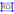
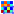
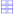
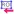
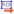
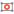

.. _ima-menu-roi:

Regions Of Interest (ROI)
=========================

This section describes how to manipulate Regions Of Interest (ROIs) for images in DataLab.

.. figure:: /images/shots/i_roi.png

    Screenshot of the "ROI" menu.

The "ROI" menu allows you to manage Regions Of Interest (ROIs) associated with the current image.

.. seealso::

    For more information about image metadata, see the :ref:`ima-menu-edit` section.

The Regions Of Interest (ROI) are image areas that are defined by the user to perform specific operations, processing, or analysis on them.

ROI are taken into account almost in all computing features in DataLab:

- The "Operations" menu features are done only on the ROI if one is defined (except if the operation changes the data shape - like the resize operation - or the pixel size - like the binning operation).

- The "Processing" menu actions are performed only on the ROI if one is defined (except if the destination signal data type is different from the source's, like in the Fourier analysis features or like the thresholding operations).

- The "Analysis" menu actions are done only on the ROI if one is defined.

.. note::

    ROI are stored as metadata, and thus attached to image.

The "ROI" menu allows you to:

- "Edit graphically" |edit_roi|: open a dialog box to manage ROI associated with the selected image (add, remove, move, resize, etc.). The ROI definition dialog is exactly the same as ROI extraction (see below).

.. figure:: /images/shots/i_roi_editor.png

    An image with an ROI.

- "Edit numerically": open a dialog box to edit the parameters of the selected ROIs numerically (i.e. using a simple form). This allows you to define or modify ROIs based on numerical values.

- "Create ROI grid" |roi_grid|: open a dialog box to create a grid of ROIs on the selected image. This allows you to define multiple ROIs distributed evenly across the image.

- "Extract" |image_roi|: extract the defined ROI from the selected images. This will create a new image for each ROI (or a single image, if the "Extract all ROIs into a single image" option is selected in the dialog), with the same metadata as the original image, but with the data corresponding to the ROI only. The new images will be added to the current workspace.

- "Copy" |roi_copy|: copy the defined ROI from the selected images to the clipboard. This allows you to paste the ROI into another image or use it in other operations.

- "Paste" |roi_paste|: paste the copied ROI from the clipboard to the selected images. This will add the ROI to the images, allowing you to define or modify ROIs based on previously copied ones.

- "Import" |roi_import|: import ROIs from a file. This allows you to load previously saved ROIs into the current image.

- "Export" |roi_export|: export the defined ROIs to a file. This allows you to save the ROIs for later use or to share them with others.

- "Remove all" |roi_delete|: remove all defined ROI for the selected images.

.. figure:: /images/shots/i_roi_dialog.png

    ROI extraction dialog: the ROI is defined by moving the position and adjusting the size of a rectangle shape.

.. |roi_copy| image:: ../../../datalab/data/icons/roi/roi_copy.svg
    :width: 24px
    :height: 24px
    :class: dark-light

.. |roi_paste| image:: ../../../datalab/data/icons/roi/roi_paste.svg
    :width: 24px
    :height: 24px
    :class: dark-light

