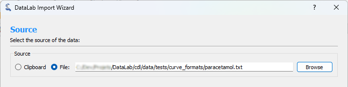
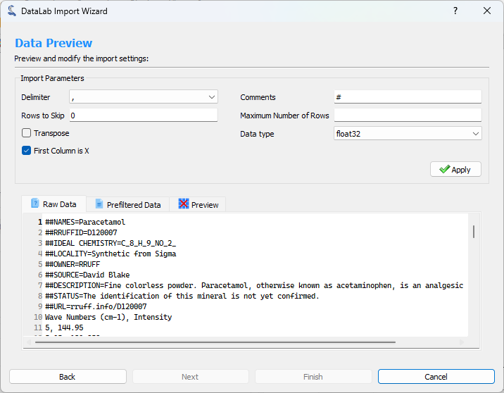
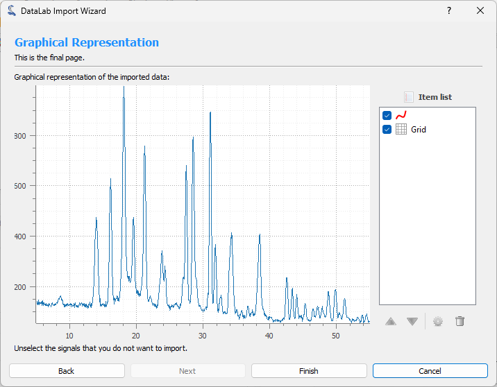

.. _sig-menu-file:

Open and save Signals
=====================

This section describes how to open and save signals (and workspaces).

.. note::

    For creating new signals from mathematical models, see :ref:`sig-menu-create`.

.. figure:: /images/shots/s_file.png

    Screenshot of the "File" menu.

When the "Signal Panel" is selected, the menus and toolbars are updated to
provide signal-related actions.

The "File" menu allows you to:

- Open, save and close signals (see below).

- Save and restore the current workspace or browse HDF5 files (see :ref:`overview`).

- Edit DataLab preferences (see :ref:`settings`).

.. _open_signal:

Open signal
^^^^^^^^^^^

Create a new signal from the following supported filetypes:

.. list-table::
    :header-rows: 1

    * - File type
      - Extensions
    * - Text files
      - .txt, .csv
    * - NumPy arrays
      - .npy
    * - MAT-Files
      - .mat
    * - FT-Lab files
      - .sig

Open from directory
^^^^^^^^^^^^^^^^^^^

Open multiple signals from a specified directory.

Save signal
^^^^^^^^^^^

Save current signal to the following supported filetypes:

.. list-table::
    :header-rows: 1

    * - File type
      - Extensions
    * - Text files
      - .csv

Save signals to directory
^^^^^^^^^^^^^^^^^^^^^^^^^

Save all selected signals to a specified directory, with configurable filename pattern
and signal format.

.. figure:: /images/shots/s_save_to_directory.png

    Save signals to directory dialog.

When you select "Save to directory..." from the File menu, a dialog appears where you can:

- **Directory**: Choose the target directory where signals will be saved
- **Filename pattern**: Define a pattern for the filenames using Python format strings
- **File extension**: Select the output format (.csv, .txt, etc.)
- **Overwrite**: Choose whether to overwrite existing files
- **Preview**: See the list of files that will be created (with object IDs)

The filename pattern supports the following placeholders:

- ``{title}``: Signal title
- ``{index}``: 1-based index of the signal in the selection (with zero-padding)
- ``{count}``: Total number of selected signals
- ``{xlabel}``, ``{xunit}``, ``{ylabel}``, ``{yunit}``: Axis labels and units
- ``{metadata[key]}``: Access metadata values

You can also use format modifiers, for example ``{index:03d}`` will format the index
with 3 digits zero-padding (001, 002, 003, etc.).

Import text file
^^^^^^^^^^^^^^^^

DataLab can natively import signal files (e.g. CSV, NPY, etc.). However some specific
text file formats may not be supported. In this case, you can use the `Import text file`
feature, which allows you to import a text file and convert it to a signal.

This feature is accessible from the `File` menu, under the `Import text file` option.

It opens an import wizard that guides you through the process of importing the text
file.

Step 1: Select the source
-------------------------

The first step is to select the source of the text file. You can either select a file
from your computer or the clipboard if you have copied the text from another
application.

   Step 1: Select the source

Step 2: Preview and configure the import
-----------------------------------------

The second step consists of configuring the import and previewing the result. You can
configure the following options:

- **Delimiter**: The character used to separate the values in the text file.
- **Comments**: The character used to indicate that the line is a comment and should be
  ignored.
- **Rows to Skip**: The number of rows to skip at the beginning of the file.
- **Maximum Number of Rows**: The maximum number of rows to import. If the file contains
  more rows, they will be ignored.
- **Transpose**: If checked, the rows and columns will be transposed.
- **Data type**: The destination data type of the imported data.
- **First Column is X**: If checked, the first column will be used as the X axis.

When you are done configuring the import, click the `Apply` button to see the result.

   Step 2: Configure the import

.. figure:: ../../images/import_text_file/s_03.png
   :alt: Step 2: Preview the result
   :align: center

   Step 2: Preview the result

Step 3: Show graphical representation
-------------------------------------

The third step shows a graphical representation of the imported data. You can use the
`Finish` button to import the data into DataLab workspace.

   Step 3: Show graphical representation