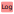
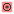

.. _sig-menu-operations:

Operations on Signals
=====================

This section describes the operations that can be performed on signals.

.. seealso::

    :ref:`sig-menu-processing` for more information on signal processing features,
    or :ref:`sig-menu-analysis` for information on analysis features on signals.

.. figure:: /images/shots/s_operation.png

    Screenshot of the "Operations" menu.

When the "Signal Panel" is selected, the menus and toolbars are updated to
provide signal-related actions.

The "Operations" menu allows you to perform various operations on the
selected signals, such as arithmetic operations, peak detection, or
convolution.

Operations with a constant
--------------------------

Create a new signal which is the result of a constant operation on each selected signal:

.. list-table::
    :header-rows: 1
    :widths: 40, 60

    * - Operation
      - Description
    * - |constant_add| Addition
      - :math:`y_{k} = y_{k-1} + c`
    * - |constant_subtract| Subtraction
      - :math:`y_{k} = y_{k-1} - c`
    * - |constant_multiply| Multiplication
      - :math:`y_{k} = y_{k-1} \times c`
    * - |constant_divide| Division
      - :math:`y_{k} = \dfrac{y_{k-1}}{c}`

.. |constant_add| image:: ../../../datalab/data/icons/operations/constant_add.svg
    :width: 24px
    :height: 24px
    :class: dark-light no-scaled-link

.. |constant_subtract| image:: ../../../datalab/data/icons/operations/constant_subtract.svg
    :width: 24px
    :height: 24px
    :class: dark-light no-scaled-link

.. |constant_multiply| image:: ../../../datalab/data/icons/operations/constant_multiply.svg
    :width: 24px
    :height: 24px
    :class: dark-light no-scaled-link

.. |constant_divide| image:: ../../../datalab/data/icons/operations/constant_divide.svg
    :width: 24px
    :height: 24px
    :class: dark-light no-scaled-link

Basic arithmetic operations
---------------------------

.. list-table::
    :header-rows: 1
    :widths: 40, 60

    * - Operation
      - Description
    * - |sum| Sum
      - :math:`y_{M} = \sum_{k=0}^{M-1}{y_{k}}`
    * - |difference| Difference
      - :math:`y_{2} = y_{1} - y_{0}`
    * - |product| Product
      - :math:`y_{M} = \prod_{k=0}^{M-1}{y_{k}}`
    * - |division| Division
      - :math:`y_{2} = \dfrac{y_{1}}{y_{0}}`
    * - |inverse| Inverse
      - :math:`y_{2} = \dfrac{1}{y_{1}}`
    * - |exponential| Exponential
      - :math:`y_{2} = \exp(y_{1})`
    * - |logarithm| Logarithm (base 10)
      - :math:`y_{2} = \log_{10}(y_{1})`

.. |sum| image:: ../../../datalab/data/icons/operations/sum.svg
    :width: 24px
    :height: 24px
    :class: dark-light no-scaled-link

.. |difference| image:: ../../../datalab/data/icons/operations/difference.svg
    :width: 24px
    :height: 24px
    :class: dark-light no-scaled-link

.. |product| image:: ../../../datalab/data/icons/operations/product.svg
    :width: 24px
    :height: 24px
    :class: dark-light no-scaled-link

.. |division| image:: ../../../datalab/data/icons/operations/division.svg
    :width: 24px
    :height: 24px
    :class: dark-light no-scaled-link

.. |inverse| image:: ../../../datalab/data/icons/operations/inverse.svg
    :width: 24px
    :height: 24px
    :class: dark-light no-scaled-link

.. |exponential| image:: ../../../datalab/data/icons/operations/exp.svg
    :width: 24px
    :height: 24px
    :class: dark-light no-scaled-link

Convolution and Deconvolution
------------------------------

.. list-table::
    :header-rows: 1
    :widths: 40, 60

    * - Operation
      - Implementation
    * - |convolution| Convolution
      - Based on `scipy.signal.convolve <https://docs.scipy.org/doc/scipy/reference/generated/scipy.signal.convolve.html>`_
    * - |deconvolution| Deconvolution
      - Frequency domain deconvolution

.. |deconvolution| image:: ../../../datalab/data/icons/operations/deconvolution.svg
    :width: 24px
    :height: 24px
    :class: dark-light no-scaled-link

Absolute value and complex signal operations
--------------------------------------------

.. list-table::
    :header-rows: 1
    :widths: 40, 60

    * - Operation
      - Description
    * - |abs| Absolute value
      - :math:`y_{k} = |y_{k-1}|`
    * - |phase| Phase (argument)
      - :py:func:`sigima.proc.signal.phase`
    * - |complex_from_magnitude_phase| Combine with phase
      - Consider current signal as the module and allow to select a signal representing the phase to merge them in a complex signal
        :py:func:`sigima.proc.signal.complex_from_magnitude_phase`
    * - |re| Real part
      - :math:`y_{k} = \Re(y_{k-1})`
    * - |im| Imaginary part
      - :math:`y_{k} = \Im(y_{k-1})`
    * - |complex_from_real_imag| Combine with imaginary part
      - Consider current signal as the real part and allow to select a signal representing the imaginary part to merge them in a complex signal :py:func:`sigima.proc.signal.complex_from_real_imag`

.. |phase| image:: ../../../datalab/data/icons/operations/phase.svg
    :width: 24px
    :height: 24px
    :class: dark-light no-scaled-link

.. |complex_from_magnitude_phase| image:: ../../../datalab/data/icons/operations/phase.svg
    :width: 24px
    :height: 24px
    :class: dark-light no-scaled-link

.. |re| image:: ../../../datalab/data/icons/operations/re.svg
    :width: 24px
    :height: 24px
    :class: dark-light no-scaled-link

.. |im| image:: ../../../datalab/data/icons/operations/im.svg
    :width: 24px
    :height: 24px
    :class: dark-light no-scaled-link

.. |complex_from_real_imag| image:: ../../../datalab/data/icons/operations/im.svg
    :width: 24px
    :height: 24px
    :class: dark-light no-scaled-link

Data type conversion
--------------------

The "Convert data type" |convert_dtype| action allows you to convert the data type
of the selected signals.

.. |convert_dtype| image:: ../../../datalab/data/icons/operations/convert_dtype.svg
    :width: 24px
    :height: 24px
    :class: dark-light no-scaled-link

.. note::

    Data type conversion relies on :py:func:`numpy.ndarray.astype` function with
    the default parameters (`casting='unsafe'`).

Statistics between signals
^^^^^^^^^^^^^^^^^^^^^^^^^^^
Create a new signal which is the result of a statistical operation on each point of the selected signals:

.. list-table::
    :header-rows: 1
    :widths: 40, 60

    * - Operation
      - Description
    * - |average| Average
      - :math:`y_{M} = \dfrac{1}{M}\sum_{k=0}^{M-1}{y_{k}}`
    * - |standard_deviation| Standard Deviation
      - :math:`y_{M} = \sqrt{\dfrac{1}{M}\sum_{k=0}^{M-1}{(y_{k} - \bar{y})^{2}}}`

.. |average| image:: ../../../datalab/data/icons/operations/average.svg
    :width: 24px
    :height: 24px
    :class: dark-light no-scaled-link

.. |standard_deviation| image:: ../../../datalab/data/icons/operations/std.svg
    :width: 24px
    :height: 24px
    :class: dark-light no-scaled-link

Other mathematical functions
----------------------------

.. list-table::
    :header-rows: 1
    :widths: 40, 60

    * - Function
      - Description
    * - |power| Power
      - :math:`y_{k} = y_{k}^{n}`
    * - |sqrt| Square root
      - :math:`y_{k} = \sqrt{y_{k}}`
    * - |derivative| Derivative
      - Based on `numpy.gradient <https://numpy.org/doc/stable/reference/generated/numpy.gradient.html>`_
    * - |integral| Integral
      - Based on `scipy.integrate.cumulative_trapezoid <https://docs.scipy.org/doc/scipy/reference/generated/scipy.integrate.cumulative_trapezoid.html>`_
    * - |signal_to_image| Assemble signals into image
      - Create a 2D image by assembling selected 1D signals as rows or columns,
        with optional normalization.

.. |power| image:: ../../../datalab/data/icons/operations/power.svg
    :width: 24px
    :height: 24px
    :class: dark-light no-scaled-link

.. |sqrt| image:: ../../../datalab/data/icons/operations/sqrt.svg
    :width: 24px
    :height: 24px
    :class: dark-light no-scaled-link

.. |derivative| image:: ../../../datalab/data/icons/operations/derivative.svg
    :width: 24px
    :height: 24px
    :class: dark-light no-scaled-link

.. |integral| image:: ../../../datalab/data/icons/operations/integral.svg
    :width: 24px
    :height: 24px
    :class: dark-light no-scaled-link

.. |signal_to_image| image:: ../../../datalab/data/icons/operations/signals_to_image.svg
    :width: 24px
    :height: 24px
    :class: dark-light no-scaled-link
