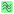

.. _sig-menu-processing:

Processing Signals
==================

This section describes the signal processing features available in DataLab.

.. seealso::

    :ref:`sig-menu-operations` for more information on operations that can be performed
    on signals, or :ref:`sig-menu-computing` for information on computing features on
    signals.

.. figure:: /images/shots/s_processing.png

    Screenshot of the "Processing" menu.

When the "Signal Panel" is selected, the menus and toolbars are updated to
provide signal-related actions.

The "Processing" menu allows you to perform various processing on the
selected signals, such as smoothing, normalization, or interpolation.

Axis transformation
^^^^^^^^^^^^^^^^^^^

Linear calibration
~~~~~~~~~~~~~~~~~~

Create a new signal which is a linear calibration of each selected signal
with respect to X or Y axis:

.. list-table::
    :header-rows: 1
    :widths: 40, 60

    * - Parameter
      - Linear calibration
    * - X-axis
      - :math:`x_{1} = a.x_{0} + b`
    * - Y-axis
      - :math:`y_{1} = a.y_{0} + b`

Swap X/Y axes
~~~~~~~~~~~~~

Create a new signal which is the result of swapping X/Y data.

Reverse X-axis
~~~~~~~~~~~~~~

Create a new signal which is the result of reversing X data.

Level adjustment
^^^^^^^^^^^^^^^^

Normalize
~~~~~~~~~

Create a new signal which is the normalization of each selected signal
by maximum, amplitude, sum, energy or RMS:

.. list-table::
    :header-rows: 1
    :widths: 25, 75

    * - Parameter
      - Normalization
    * - Maximum
      - :math:`y_{1}= \dfrac{y_{0}}{max(y_{0})}`
    * - Amplitude
      - :math:`y_{1}= \dfrac{y_{0}'}{max(y_{0}')}` with :math:`y_{0}'=y_{0}-min(y_{0})`
    * - Area
      - :math:`y_{1}= \dfrac{y_{0}}{\sum_{n=0}^{N}y_{0}[n]}`
    * - Energy
      - :math:`y_{1}= \dfrac{y_{0}}{\sqrt{\sum_{n=0}^{N}|y_{0}[n]|^2}}`
    * - RMS
      - :math:`y_{1}= \dfrac{y_{0}}{\sqrt{\dfrac{1}{N}\sum_{n=0}^{N}|y_{0}[n]|^2}}`

Clipping
~~~~~~~~

Create a new signal which is the result of clipping each selected signal.

Offset correction
~~~~~~~~~~~~~~~~~

Create a new signal which is the result of offset correction of each selected signal.
This operation is performed by subtracting the signal baseline which is estimated by
the mean value of a user-defined range.

Noise reduction
^^^^^^^^^^^^^^^

Create a new signal which is the result of noise reduction of each selected signal.

The following filters are available:

.. list-table::
    :header-rows: 1
    :widths: 25, 75

    * - Filter
      - Formula/implementation
    * - Gaussian filter
      - `scipy.ndimage.gaussian_filter <https://docs.scipy.org/doc/scipy/reference/generated/scipy.ndimage.gaussian_filter.html>`_
    * - Moving average
      - `scipy.ndimage.uniform_filter <https://docs.scipy.org/doc/scipy/reference/generated/scipy.ndimage.uniform_filter.html>`_
    * - Moving median
      - `scipy.ndimage.median_filter <https://docs.scipy.org/doc/scipy/reference/generated/scipy.ndimage.median_filter.html>`_
    * - Wiener filter
      - `scipy.signal.wiener <https://docs.scipy.org/doc/scipy/reference/generated/scipy.signal.wiener.html>`_

Fourier analysis
^^^^^^^^^^^^^^^^

Create a new signal which is the result of a Fourier analysis of each selected signal.

The following functions are available:

.. list-table::
    :header-rows: 1
    :widths: 20, 30, 50

    * - Function
      - Description
      - Formula/implementation
    * - FFT
      - Fast Fourier Transform
      - `numpy.fft.fft <https://docs.scipy.org/doc/numpy/reference/generated/numpy.fft.fft.html>`_
    * - Inverse FFT
      - Inverse Fast Fourier Transform
      - `numpy.fft.ifft <https://docs.scipy.org/doc/numpy/reference/generated/numpy.fft.ifft.html>`_
    * - Magnitude spectrum
      - Optionnal: use logarithmic scale (dB)
      - :math:`y_{1} = |FFT(y_{0})|` or :math:`20.log_{10}(|FFT(y_{0})|)` (dB)
    * - Phase spectrum
      -
      - :math:`y_{1} = \angle FFT(y_{0})`
    * - Power spectral density (PSD)
      - Optionnal: use logarithmic scale (dB). PSD is estimated using Welch's method
        (see `scipy.signal.welch <https://docs.scipy.org/doc/scipy/reference/generated/scipy.signal.welch.html>`_)
      - :math:`Y_{k} = PSD(y_{k})` or :math:`10.log_{10}(PSD(y_{k}))` (dB)

.. note::

    FFT and inverse FFT are performed using frequency shifting if the option is enabled
    in DataLab settings (see :ref:`settings`).

Frequency filters
^^^^^^^^^^^^^^^^^

Create a new signal which is the result of applying a frequency filter to each selected signal.

The following filters are available:

.. list-table::
    :header-rows: 1
    :widths: 25, 75

    * - Filter
      - Description
    * - |lowpass| Low-pass
      - Filter out high frequencies, above a cutoff frequency
    * - |highpass| High-pass
      - Filter out low frequencies, below a cutoff frequency
    * - |bandpass| Band-pass
      - Filter out frequencies outside a range
    * - |bandstop| Band-stop
      - Filter out frequencies inside a range

.. |highpass| image:: ../../../cdl/data/icons/processing/highpass.svg
    :width: 24px
    :height: 24px
    :class: dark-light no-scaled-link

.. |bandpass| image:: ../../../cdl/data/icons/processing/bandpass.svg
    :width: 24px
    :height: 24px
    :class: dark-light no-scaled-link

For each filter, the following methods are available:

.. list-table::
    :header-rows: 1
    :widths: 25, 75

    * - Method
      - Description
    * - Bessel
      - Bessel filter, using SciPy's `scipy.signal.bessel <https://docs.scipy.org/doc/scipy/reference/generated/scipy.signal.bessel.html>`_ function
    * - Butterworth
      - Butterworth filter, using SciPy's `scipy.signal.butter <https://docs.scipy.org/doc/scipy/reference/generated/scipy.signal.butter.html>`_ function
    * - Chebyshev I
      - Chebyshev type I filter, using SciPy's `scipy.signal.cheby1 <https://docs.scipy.org/doc/scipy/reference/generated/scipy.signal.cheby1.html>`_ function
    * - Chebyshev II
      - Chebyshev type II filter, using SciPy's `scipy.signal.cheby2 <https://docs.scipy.org/doc/scipy/reference/generated/scipy.signal.cheby2.html>`_ function
    * - Elliptic
      - Elliptic filter, using SciPy's `scipy.signal.ellip <https://docs.scipy.org/doc/scipy/reference/generated/scipy.signal.ellip.html>`_ function

Fitting
^^^^^^^

Open an interactive curve fitting tool in a modal dialog box.

.. list-table::
    :header-rows: 1
    :widths: 20, 80

    * - Model
      - Equation
    * - Linear
      - :math:`y = c_{0}+c_{1}.x`
    * - Polynomial
      - :math:`y = c_{0}+c_{1}.x+c_{2}.x^2+...+c_{n}.x^n`
    * - Gaussian
      - :math:`y = y_{0}+\dfrac{A}{\sqrt{2\pi}.\sigma}.exp(-\dfrac{1}{2}.(\dfrac{x-x_{0}}{\sigma})^2)`
    * - Lorentzian
      - :math:`y = y_{0}+\dfrac{A}{\sigma.\pi}.\dfrac{1}{1+(\dfrac{x-x_{0}}{\sigma})^2}`
    * - Voigt
      - :math:`y = y_{0}+A.\dfrac{Re(exp(-z^2).erfc(-j.z))}{\sqrt{2\pi}.\sigma}` with :math:`z = \dfrac{x-x_{0}-j.\sigma}{\sqrt{2}.\sigma}`
    * - Multi-Gaussian
      - :math:`y = y_{0}+\sum_{i=0}^{K}\dfrac{A_{i}}{\sqrt{2\pi}.\sigma_{i}}.exp(-\dfrac{1}{2}.(\dfrac{x-x_{0,i}}{\sigma_{i}})^2)`
    * - Exponential
      - :math:`y = y_{0}+A.exp(B.x)`
    * - Sinusoidal
      - :math:`y = y_{0}+A.sin(2\pi.f.x+\phi)`
    * - Cumulative Distribution Function (CDF)
      - :math:`y = y_{0}+A.erf(\dfrac{x-x_{0}}{\sigma.\sqrt{2}})`

Windowing
^^^^^^^^^

Create a new signal which is the result of applying a window function to each selected signal.

The following window functions are available:

.. list-table::
    :header-rows: 1
    :widths: 20, 80

    * - Window function
      - Reference
    * - Barthann
      - :py:func:`scipy.signal.windows.barthann`
    * - Bartlett
      - :py:func:`numpy.bartlett`
    * - Blackman
      - :py:func:`scipy.signal.windows.blackman`
    * - Blackman-Harris
      - :py:func:`scipy.signal.windows.blackmanharris`
    * - Bohman
      - :py:func:`scipy.signal.windows.bohman`
    * - Boxcar
      - :py:func:`scipy.signal.windows.boxcar`
    * - Cosine
      - :py:func:`scipy.signal.windows.cosine`
    * - Exponential
      - :py:func:`scipy.signal.windows.exponential`
    * - Flat top
      - :py:func:`scipy.signal.windows.flattop`
    * - Gaussian
      - :py:func:`scipy.signal.windows.gaussian`
    * - Hamming
      - :py:func:`numpy.hamming`
    * - Hanning
      - :py:func:`numpy.hanning`
    * - Kaiser
      - :py:func:`scipy.signal.windows.kaiser`
    * - Lanczos
      - :py:func:`scipy.signal.windows.lanczos`
    * - Nuttall
      - :py:func:`scipy.signal.windows.nuttall`
    * - Parzen
      - :py:func:`scipy.signal.windows.parzen`
    * - Rectangular
      - :py:func:`numpy.ones`
    * - Taylor
      - :py:func:`scipy.signal.windows.taylor`
    * - Tukey
      - :py:func:`scipy.signal.windows.tukey`

Detrending
^^^^^^^^^^

Create a new signal which is the detrending of each selected signal.
This features is based on SciPy's `scipy.signal.detrend <https://docs.scipy.org/doc/scipy/reference/generated/scipy.signal.detrend.html>`_ function.

The following parameters are available:

.. list-table::
    :header-rows: 1
    :widths: 25, 75

    * - Parameter
      - Description
    * - Method
      - Detrending method: 'linear' or 'constant'. See SciPy's `scipy.signal.detrend <https://docs.scipy.org/doc/scipy/reference/generated/scipy.signal.detrend.html>`_ function.

Interpolation
^^^^^^^^^^^^^

Create a new signal which is the interpolation of each selected signal
with respect to a second signal X-axis (which might be the same as one of
the selected signals).

The following interpolation methods are available:

.. list-table::
    :header-rows: 1
    :widths: 25, 75

    * - Method
      - Description
    * - Linear
      - Linear interpolation, using using NumPy's `interp <https://docs.scipy.org/doc/numpy/reference/generated/numpy.interp.html>`_ function
    * - Spline
      - Cubic spline interpolation, using using SciPy's `scipy.interpolate.splev <https://docs.scipy.org/doc/scipy/reference/generated/scipy.interpolate.splev.html>`_ function
    * - Quadratic
      - Quadratic interpolation, using using NumPy's `polyval <https://docs.scipy.org/doc/numpy/reference/generated/numpy.polyval.html>`_ function
    * - Cubic
      - Cubic interpolation, using using SciPy's `Akima1DInterpolator <https://docs.scipy.org/doc/scipy/reference/generated/scipy.interpolate.Akima1DInterpolator.html>`_ class
    * - Barycentric
      - Barycentric interpolation, using using SciPy's `BarycentricInterpolator <https://docs.scipy.org/doc/scipy/reference/generated/scipy.interpolate.BarycentricInterpolator.html>`_ class
    * - PCHIP
      - Piecewise Cubic Hermite Interpolating Polynomial (PCHIP) interpolation, using using SciPy's `PchipInterpolator <https://docs.scipy.org/doc/scipy/reference/generated/scipy.interpolate.PchipInterpolator.html>`_ class

Resampling
^^^^^^^^^^

Create a new signal which is the resampling of each selected signal.

The following parameters are available:

.. list-table::
    :header-rows: 1
    :widths: 25, 75

    * - Parameter
      - Description
    * - Method
      - Interpolation method (see previous section)
    * - Fill value
      - Interpolation fill value (see previous section)
    * - Xmin
      - Minimum X value
    * - Xmax
      - Maximum X value
    * - Mode
      - Resampling mode: step size or number of points
    * - Step size
      - Resampling step size
    * - Number of points
      - Resampling number of points

ROI extraction
^^^^^^^^^^^^^^

Create a new signal from a user-defined Region of Interest (ROI).

.. figure:: /images/shots/s_roi_dialog.png

    ROI extraction dialog: the ROI is defined by moving the position
    and adjusting the width of an horizontal range.
