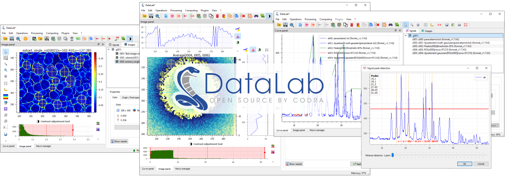
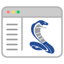
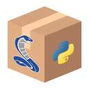
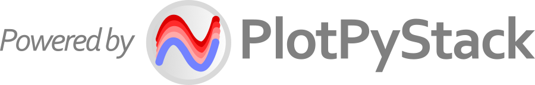

DataLab
=======

.. meta::
    :description: Home of DataLab, the open-source platform for scientific and technical data processing and visualization
    :keywords: DataLab, scientific, data, processing, visualization, open-source, platform, Python, Qt, NumPy, SciPy, scikit-image, OpenCV, PlotPyStack, Codra, Pierre Raybaut

DataLab is an **open-source platform for scientific and technical data processing
and visualization** with unique features designed to meet industrial requirements.
Leveraging the richness of the scientific Python ecosystem [#f1]_, DataLab serves as a
complementary tool for your signal and image processing workflows. It can be extended
with your Python code through :bdg-ref-success-line:`Plugins <about_plugins>` or
directly from :ref:`your IDE <use_cases>` or :ref:`your Jupyter notebooks <use_cases>`.
Go to :bdg-ref-success-line:`Installation <installation>` to get started!

.. only:: html and not latex

    :octicon:`play;1em;sd-text-info` Want to know more?
    See our :bdg-ref-success-line:`Tutorials <tutorials>` --
    Try DataLab online, without installation: :octicon:`rocket;1em;sd-text-info` |binder|.

.. |binder| image:: https://mybinder.org/badge_logo.svg
    :target: https://mybinder.org/v2/gh/DataLab-Platform/DataLab/binder-environments?urlpath=git-pull%3Frepo%3Dhttps%253A%252F%252Fgithub.com%252FDataLab-Platform%252FDataLab%26urlpath%3Ddesktop%252F%26branch%3Dbinder-environments
    :class: new-window

.. only:: latex and not html

    To immediately see DataLab in action, you have two options:

    - Read or view our :ref:`Tutorials <tutorials>`,
    - Try DataLab online, without installation, using our `Binder environment <https://mybinder.org/v2/gh/DataLab-Platform/DataLab/binder-environments?urlpath=git-pull%3Frepo%3Dhttps%253A%252F%252Fgithub.com%252FDataLab-Platform%252FDataLab%26urlpath%3Ddesktop%252F%26branch%3Dbinder-environments>`_.

    Signal and image visualization in DataLab

.. only:: html and not latex

    .. grid:: 2 2 4 4
        :gutter: 1 2 3 4

        .. grid-item-card:: :octicon:`rocket;1em;sd-text-info`  Getting started
            :link: intro/index
            :link-type: doc

            Installation, use cases, key strengths, ...

        .. grid-item-card:: :octicon:`tools;1em;sd-text-info`  Features
            :link: features/index
            :link-type: doc

            In-depth description of DataLab features

        .. grid-item-card:: :octicon:`book;1em;sd-text-info`  API
            :link: api/index
            :link-type: doc

            Reference documentation of DataLab API

        .. grid-item-card:: :octicon:`gear;1em;sd-text-info`  Contributing
            :link: contributing/index
            :link-type: doc

            Getting involved in DataLab project

With its user-friendly experience and versatile :ref:`usage_modes`
(|appmode| Stand-alone, |libmode| Library, |remotemode| Remote), DataLab enables
efficient development of your data processing and visualization applications while
benefiting from an industrial-grade technological platform.

    DataLab is powered by `PlotPyStack <https://github.com/PlotPyStack>`_,
    the scientific Python-Qt visualization and graphical user interface stack.

.. only:: latex and not html

    .. toctree::
        :maxdepth: 2
        :caption: Contents

        intro/index
        features/index
        api/index
        contributing/index

    .. note:: DataLab was created by `Codra`_/`Pierre Raybaut`_ in 2023. It is
            developed and maintained by DataLab Platform Developers.

.. rubric:: Footnotes

.. [#f1] DataLab processing features are mainly based on `NumPy`_, `SciPy`_,
   `scikit-image`_, `OpenCV`_ and `PyWavelets`_ libraries. DataLab visualization
   capabilities are based on `PlotPyStack`_ toolkit, a set of Python libraries
   for building scientific applications with Qt graphical user interfaces.

.. _NumPy: https://numpy.org/
.. _SciPy: https://www.scipy.org/
.. _scikit-image: https://scikit-image.org/
.. _OpenCV: https://opencv.org/
.. _PyWavelets: https://pywavelets.readthedocs.io/
.. _PlotPyStack: https://github.com/PlotPyStack
.. _Codra: https://codra.net/
.. _Pierre Raybaut: https://github.com/PierreRaybaut/
