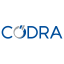

DataLab
=======

.. meta::
    :description: Home of DataLab, the open-source platform for scientific and technical data processing and visualization
    :keywords: DataLab, scientific, data, processing, visualization, open-source, platform, Python, Qt, NumPy, SciPy, scikit-image, OpenCV, PlotPyStack, Sigima, CODRA, Pierre Raybaut

DataLab is an **open-source platform for signal and image processing and visualization**
for research, education and industry. Leveraging the richness of the scientific Python
ecosystem [#f1]_, DataLab is the ideal complement to your data analysis workflows as it
can be extended with your Python code through :bdg-ref-success-line:`Plugins <about_plugins>`
or directly from :ref:`your IDE <use_cases>` or :ref:`your Jupyter notebooks <use_cases>`.
Go to :bdg-ref-success-line:`Installation <installation>` to get started!

.. only:: html and not latex

    .. dropdown:: Notice for users upgrading from DataLab v0.20
        :animate: fade-in
        :icon: alert

        DataLab v1.0 introduces breaking changes. Plugins must be updated to work with the new version. See the :ref:`migration guide <migration_v020_to_v100>` for details.

.. only:: html and not latex

    :octicon:`play;1em;sd-text-info` Want to know more?
    See our :bdg-ref-success-line:`Tutorials <tutorials>` --
    Try DataLab online, without installation: :octicon:`rocket;1em;sd-text-info` |binder|.

.. |binder| image:: https://mybinder.org/badge_logo.svg
    :target: https://mybinder.org/v2/gh/DataLab-Platform/DataLab/binder-environments?urlpath=git-pull%3Frepo%3Dhttps%253A%252F%252Fgithub.com%252FDataLab-Platform%252FDataLab%26urlpath%3Ddesktop%252F%26branch%3Dbinder-environments
    :class: new-window

.. only:: latex and not html

    To immediately see DataLab in action, you have two options:

    - Read or view our :ref:`Tutorials <tutorials>`,
    - Try DataLab online, without installation, using our `Binder environment <https://mybinder.org/v2/gh/DataLab-Platform/DataLab/binder-environments?urlpath=git-pull%3Frepo%3Dhttps%253A%252F%252Fgithub.com%252FDataLab-Platform%252FDataLab%26urlpath%3Ddesktop%252F%26branch%3Dbinder-environments>`_.

.. figure:: images/DataLab-Overview.png
    :class: dark-light

    Signal and image visualization in DataLab

.. only:: html and not latex

    .. grid:: 2 2 4 4
        :gutter: 1 2 3 4

        .. grid-item-card:: :octicon:`rocket;1em;sd-text-info`  Getting started
            :link: intro/index
            :link-type: doc

            Installation, tutorials, use cases...

        .. grid-item-card:: :octicon:`tools;1em;sd-text-info`  Features
            :link: features/index
            :link-type: doc

            Detailed description

        .. grid-item-card:: :octicon:`megaphone;1em;sd-text-info`  Talks & Events
            :link: outreach/index
            :link-type: doc

            Conference presentations

        .. grid-item-card:: :octicon:`gear;1em;sd-text-info`  Contributing
            :link: contributing/index
            :link-type: doc

            Getting involved in the project

DataLab has been funded, chronologically, by the following stakeholders:

.. list-table::
    :header-rows: 0

    * - |cea_logo|
      - `CEA <https://www.cea.fr>`_, the French Alternative Energies and Atomic Energy Commission, is the major investor in DataLab, and is the main contributor to the project.

    * - |codra_logo|
      - `CODRA`_, a software engineering and editor firm, has supported DataLab open-source journey since its inception (see `here <https://codra.net/en/offer/software-engineering/datalab/>`_).

    * - |nlnet_logo|
      - `NLnet Foundation <https://nlnet.nl>`_, as part of the NGI0 Commons Fund, backed by the European Commission, has funded the `redesign of DataLab's core architecture <https://nlnet.nl/project/DataLab/>`_.

.. |cea_logo| image:: images/logos/cea.svg
    :width: 64px
    :height: 64px
    :target: https://www.cea.fr
    :class: dark-light no-scaled-link

.. |nlnet_logo| image:: images/logos/nlnet.svg
    :width: 64px
    :height: 64px
    :target: https://nlnet.nl
    :class: dark-light no-scaled-link

.. figure:: _static/plotpy-stack-powered.png
    :align: center
    :width: 300 px
    :class: dark-light no-scaled-link

    DataLab is powered by `PlotPyStack <https://github.com/PlotPyStack>`_,
    the scientific Python-Qt visualization and graphical user interface stack.

.. figure:: images/logos/Sigima-Banner.png
    :align: center
    :width: 200 px
    :class: dark-light no-scaled-link

    DataLab processing features are based on `Sigima <https://sigima.readthedocs.io/>`_,
    the open-source signal and image processing library (part of the DataLab Platform).

.. toctree::
    :maxdepth: 2
    :hidden:

    intro/index
    features/index
    contributing/index
    changelog

.. only:: html and not latex

    .. toctree::
        :hidden:

        outreach/index

.. only:: latex and not html

    .. note:: DataLab was created by `CODRA`_/`Pierre Raybaut`_ in 2023. It is
            developed and maintained by DataLab Platform Developers.

.. note::

    This project (DataLab Platform) should not be confused with the `datalab-org <https://datalab-org.io/>`_
    project, which is a separate and unrelated initiative focused on materials science databases and computational tools.

.. rubric:: Footnotes

.. [#f1] DataLab processing primitives are mainly based on
   `Sigima <https://sigima.readthedocs.io/>`_, `NumPy`_, `SciPy`_,
   `scikit-image`_, `OpenCV`_ and `PyWavelets`_ libraries. DataLab visualization
   capabilities are based on `PlotPyStack`_ toolkit, a set of Python libraries
   for building scientific applications with Qt graphical user interfaces.

.. _NumPy: https://numpy.org/
.. _SciPy: https://www.scipy.org/
.. _scikit-image: https://scikit-image.org/
.. _OpenCV: https://opencv.org/
.. _PyWavelets: https://pywavelets.readthedocs.io/
.. _PlotPyStack: https://github.com/PlotPyStack
.. _CODRA: https://codra.net/
.. _Pierre Raybaut: https://github.com/PierreRaybaut/
