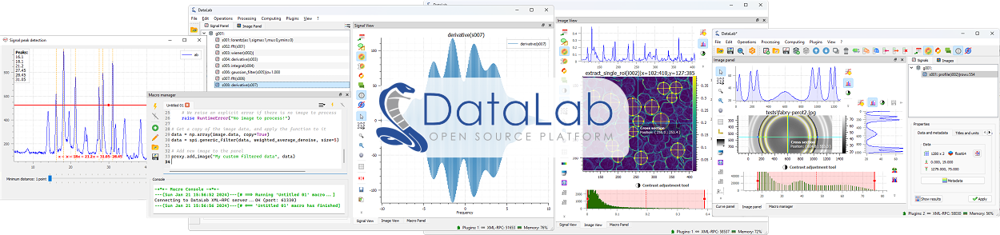

DataLab
=======

DataLab is an **open-source platform for scientific and technical data processing
and visualization** with unique features designed to meet industrial requirements
(see :ref:`key_strengths`: Extensibility, Interoperability, ...).
It is based on Python scientific libraries (such as NumPy, SciPy or scikit-image)
and Qt graphical user interfaces (thanks to the powerful `PlotPyStack`_).

    Signal and image visualization in DataLab

.. only:: html and not latex

    .. grid:: 4

        .. grid-item-card:: Getting started
            :link: intro/index
            :link-type: doc

            Installation, use cases, key strengths, ...

        .. grid-item-card:: Features
            :link: features/index
            :link-type: doc

            In-depth description of DataLab features

        .. grid-item-card:: API
            :link: api/index
            :link-type: doc

            Reference documentation of DataLab API

        .. grid-item-card:: Development
            :link: dev/index
            :link-type: doc

            Roadmap, contributing, ...

With its user-friendly experience and versatile :ref:`usage_modes`,
DataLab enables efficient development of your data processing and
visualization applications while benefiting from an industrial-grade
technological platform.

.. figure:: _static/plotpy-stack-powered.png
    :align: center
    :width: 300 px

    DataLab is powered by `PlotPyStack <https://github.com/PlotPyStack>`_,
    the scientific Python-Qt visualization and graphical user interface stack.

.. toctree::
   :maxdepth: 2
   :caption: Contents:

   intro/index
   features/index
   api/index
   dev/index

.. note:: DataLab was created by `Codra`_/`Pierre Raybaut`_ in 2023. It is
          developed and maintained by DataLab open-source project team with
          the support of `Codra`_.

.. _PlotPyStack: https://github.com/PlotPyStack
.. _guidata: https://pypi.python.org/pypi/guidata
.. _PlotPy: https://pypi.python.org/pypi/PlotPy
.. _PyPI: https://pypi.python.org/pypi/CDL
.. _Home: https://codra-ingenierie-informatique.github.io/DataLab/
.. _GitHub: https://github.com/Codra-Ingenierie-Informatique/DataLab
.. _Codra: https://codra.net/
.. _BSD 3-Clause: https://github.com/Codra-Ingenierie-Informatique/DataLab/blob/master/LICENSE
.. _Pierre Raybaut: https://github.com/PierreRaybaut/
