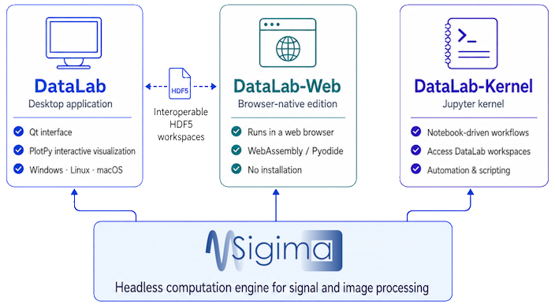

.. _ecosystem:

The DataLab Platform
====================

.. meta::
    :description: The DataLab Platform ecosystem - desktop application, browser-native DataLab-Web, DataLab-Kernel Jupyter kernel and the Sigima computation engine
    :keywords: DataLab, DataLab Platform, DataLab-Web, browser, WebAssembly, Pyodide, DataLab-Kernel, Jupyter, Sigima, desktop, ecosystem, editions

When DataLab started in 2023, it was a single product: a desktop application. Since then,
the same scientific core has grown into a small family of complementary tools — the
**DataLab Platform**. This page clarifies the terminology and helps you choose the edition
that best fits your needs.

.. _ecosystem_naming:

A note on terminology
---------------------

The word *DataLab* is used both for the whole family and for its historical member, the
desktop application. To avoid confusion, this documentation uses the following vocabulary:

.. list-table::
    :header-rows: 1
    :widths: 25 75

    * - Name
      - Meaning
    * - **DataLab Platform**
      - The umbrella term for the whole ecosystem (all the products listed below).
    * - **DataLab**
      - The reference **desktop application** (Qt-based). Unless stated otherwise, the rest
        of this documentation describes this product.
    * - **DataLab-Web**
      - The **browser-native** edition: the full platform running inside a web browser tab,
        with no installation. Try it at `datalab-platform.com/web
        <https://datalab-platform.com/web/>`_ --
        `project on GitHub <https://github.com/DataLab-Platform/web>`__.
    * - **DataLab-Kernel**
      - A **Jupyter kernel** exposing DataLab workspaces to notebooks.
        `Documentation <https://datalab-kernel.readthedocs.io/>`__.
    * - **Sigima**
      - The headless **computation engine** (signal and image processing) shared by all of
        the above. `Documentation <https://sigima.readthedocs.io/>`__.

.. note::

    This documentation site is, first and foremost, the documentation of the **desktop
    application**. Everything that is shared across editions — the object model, the
    processing catalog, the parameters — is described here and applies to DataLab-Web as
    well. Only the differences specific to an edition are called out explicitly.

Members of the platform
-----------------------

    The DataLab Platform: the desktop application, DataLab-Web and DataLab-Kernel are three
    access modes sharing the same Sigima computation engine and interoperable through HDF5
    workspaces.

.. only:: html and not latex

    .. grid:: 1 1 2 2
        :gutter: 1 2 3 4

        .. grid-item-card:: :octicon:`device-desktop;1em;sd-text-info`  DataLab (desktop)

            The reference application, with a native Qt graphical user interface and the full
            PlotPyStack interactive visualization. Runs locally on Windows, Linux and macOS.

        .. grid-item-card:: :octicon:`browser;1em;sd-text-info`  DataLab-Web

            The same platform, running entirely inside your browser via WebAssembly. Zero
            install, your data never leaves your machine. Try it at
            `datalab-platform.com/web <https://datalab-platform.com/web/>`_ or browse the
            `project on GitHub <https://github.com/DataLab-Platform/web>`__.

        .. grid-item-card:: :octicon:`terminal;1em;sd-text-info`  DataLab-Kernel

            A Jupyter kernel for notebook-driven workflows, optionally synchronized with a
            running desktop session. See the
            `DataLab-Kernel documentation <https://datalab-kernel.readthedocs.io/>`_.

        .. grid-item-card:: :octicon:`cpu;1em;sd-text-info`  Sigima

            The open-source computation engine that powers every edition. See the
            `Sigima documentation <https://sigima.readthedocs.io/>`_.

.. only:: latex and not html

    - **DataLab (desktop)** — the reference application, with a native Qt graphical user
      interface and the full PlotPyStack interactive visualization.
    - **DataLab-Web** — the same platform, running entirely inside your browser via
      WebAssembly (`datalab-platform.com/web <https://datalab-platform.com/web/>`_).
    - **DataLab-Kernel** — a Jupyter kernel for notebook-driven workflows
      (`documentation <https://datalab-kernel.readthedocs.io/>`_).
    - **Sigima** — the open-source computation engine that powers every edition
      (`documentation <https://sigima.readthedocs.io/>`_).

Which one should I use?
-----------------------

The desktop application and DataLab-Web are not competitors: they are two access modes to
the *same* platform, and they can be used interchangeably (HDF5 workspaces are
interoperable). A few rules of thumb:

- **Use the desktop application** when you work on your own machine and want the richest,
  fastest experience, the full set of interactive PlotPy tools, native file access, and the
  ability to handle very large datasets limited only by your system RAM.
- **Use DataLab-Web** when you cannot or do not want to install anything — for example on a
  shared or locked-down computer, on someone else's machine, or simply to give DataLab a
  quick try. Everything runs locally in the browser tab; no server, no account, no upload.
- **Use DataLab-Kernel** when your workflow is notebook-centric and you want DataLab's
  processing catalog available from a Jupyter notebook.

A common pattern is to use the desktop application on your personal workstation and
DataLab-Web everywhere else, sharing work back and forth through HDF5 workspace files.

DataLab vs DataLab-Web
----------------------

DataLab-Web shares the **computation engine** (Sigima) and the **processing catalog** with
the desktop application: results are identical for the same inputs. The differences are
about the **runtime environment**, not about the science.

.. list-table::
    :header-rows: 1
    :widths: 22 39 39

    * - Topic
      - DataLab (desktop)
      - DataLab-Web
    * - Installation
      - Installed locally (Windows, Linux, macOS)
      - None — runs in the browser
    * - Python runtime
      - System CPython
      - Pyodide (CPython compiled to WebAssembly)
    * - Graphical interface
      - Qt + PlotPy
      - React + Plotly.js
    * - Plotting
      - PlotPy (Qt), full interactive tools
      - Plotly.js (interactive tools partially reimplemented)
    * - File access
      - Native file system I/O
      - Browser file picker, drag-and-drop
    * - Persistence
      - HDF5 on disk
      - HDF5 download / upload (workspaces are interoperable)
    * - Memory
      - Limited by system RAM (64-bit)
      - ~2 GB WebAssembly heap by default; an optional on-disk storage mode lifts this
        limit entirely, bounding the working set by available disk space instead of RAM
    * - Remote control
      - XML-RPC and FastAPI Web API
      - In-browser proxy and optional ``postMessage`` SDK

What is **not** different: the object model (``SignalObj``, ``ImageObj``, ROIs, groups), the
processing catalog discovered from Sigima, the auto-generated parameter dialogs, and the
HDF5 workspace format. A workspace saved in the desktop application can be opened in
DataLab-Web, and vice versa.

.. note::

    Plugins are largely portable between the desktop application and DataLab-Web, with a few
    constraints related to the browser runtime. See :ref:`about_plugins` for details.
