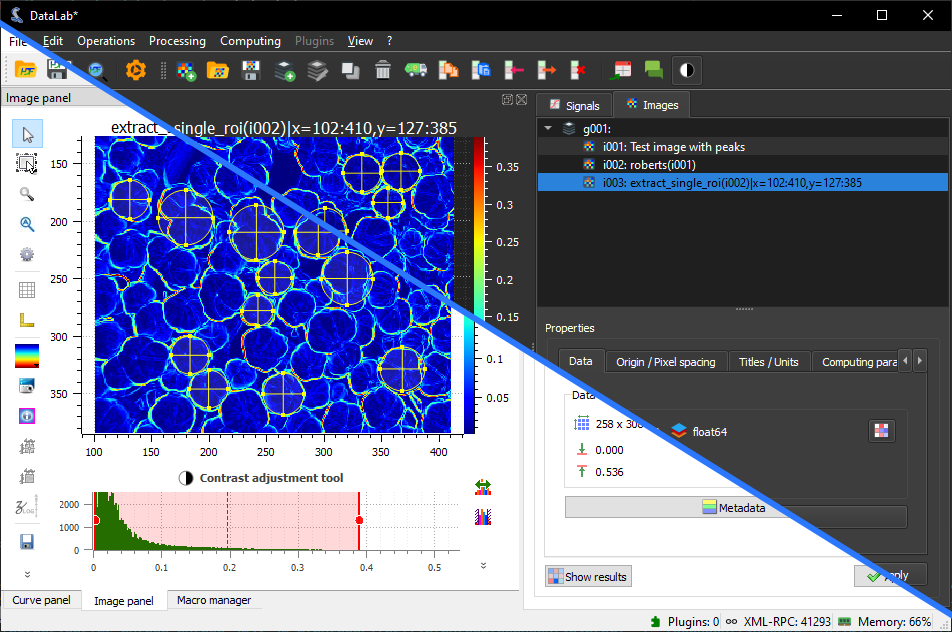

.. _key_features:

Key features
============

This page presents briefly DataLab key features.

    DataLab supports dark and light mode depending on your platform settings (this
    is handled by the `guidata`_ package, and may be overridden by setting the
    `QT_COLOR_MODE` environment variable to `dark` or `light`).

.. _guidata: https://pypi.python.org/pypi/guidata

Data visualization
^^^^^^^^^^^^^^^^^^

====== ====== ====================================
Signal Image  Feature
====== ====== ====================================
✓      ✓      Screenshots (save, copy)
✓      Z-axis Lin/log scales
✓      ✓      Data table editing
✓      ✓      Statistics on user-defined ROI
✓      ✓      Markers
..     ✓      Aspect ratio (1:1, custom)
..     ✓      50+ available colormaps
..     ✓      X/Y raw/averaged profiles
✓      ✓      Annotations
✓      ✓      Persistance of settings in workspace
..     ✓      Distribute images on a grid
====== ====== ====================================

Data processing
^^^^^^^^^^^^^^^

====== ====== ===================================================
Signal Image  Feature
====== ====== ===================================================
✓      ✓      Process isolation for running computations
✓      ✓      Remote control from Jupyter, Spyder or any IDE
✓      ✓      Remote control from a third-party application
✓      ✓      Sum, average, difference, product, ...
✓      ✓      ROI extraction, Swap X/Y axes
✓      ..     Semi-automatic multi-peak detection
✓      ..     Convolution
..     ✓      Flat-field correction
..     ✓      Rotation (flip, rotate), resize, ...
..     ✓      Intensity profiles (line, average, radial)
..     ✓      Pixel binning
✓      ..     Normalize, derivative, integral
✓      ✓      Linear calibration
..     ✓      Thresholding, clipping
✓      ✓      Gaussian filter, Wiener filter
✓      ✓      Moving average, moving median
✓      ✓      FFT, inverse FFT
✓      ..     Interpolation, resampling
✓      ..     Detrending
✓      ..     Interactive fit: Gauss, Lorenzt, Voigt, polynomial
✓      ..     Interactive multigaussian fit
..     ✓      Butterworth filter
..     ✓      Exposure correction (gamma, log, ...)
..     ✓      Restauration (Total Variation, Bilateral, ...)
..     ✓      Morphology (erosion, dilation, ...)
..     ✓      Edges detection (Roberts, Sobel, ...)
✓      ✓      Computing on custom ROI
✓      ..     FWHM, FW @ 1/e²
..     ✓      Centroid (robust method w/r noise)
..     ✓      Minimum enclosing circle center
..     ✓      2D peak detection
..     ✓      Contour detection
..     ✓      Circle Hough transform
..     ✓      Blob detection (OpenCV, Laplacian of Gaussian, ...)
====== ====== ===================================================
