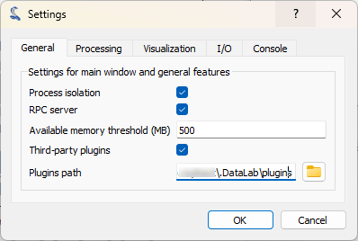
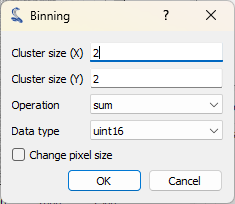
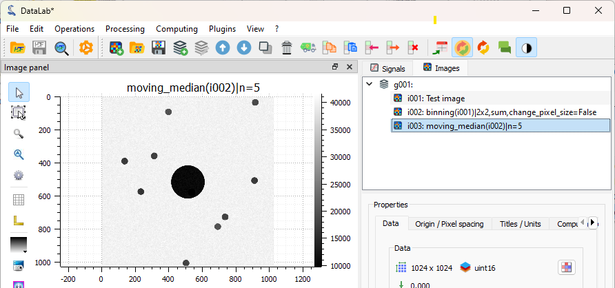
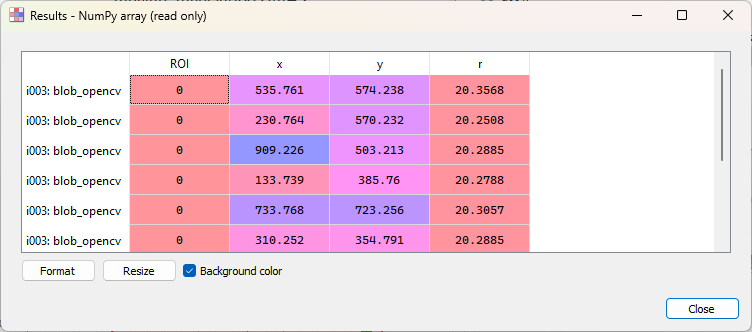

.. _tutorial_blobs:

:octicon:`book;1em;sd-text-info` Detecting blobs on an image
============================================================

This example shows how to detect blobs on an image with DataLab,
and also covers other features such as the plugin system:

-   Add a new plugin to DataLab
-   Denoise an image
-   Detect blobs on an image
-   Save the workspace to a file

First, we open DataLab, and open the settings dialog (using "File > Settings...",
or the |libre-gui-settings| icon in the toolbar).

.. |libre-gui-settings| image:: ../../../cdl/data/icons/libre-gui-settings.svg
    :width: 24px
    :height: 24px

    In the "General" tab, we can see the "Plugins path" field. This is the path where
    DataLab will look for plugins. We can add a new plugin by copying/pasting the
    plugin file in this directory.

.. seealso::

    The plugin system is described in the :ref:`about_plugins` section.

Let's add the `cdl_example_imageproc.py` plugin to DataLab (this is an example plugin
that is shipped with DataLab source package, or may be downloaded from `here on GitHub <https://github.com/DataLab-Platform/DataLab/tree/main/plugins/examples>`_).

If we close and reopen DataLab, we can see that the plugin is now available in the
"Plugins" menu: there is a new "Extract blobs (example)" entry.

.. figure:: ../../images/tutorials/blobs/02.png

    The "About DataLab" dialog shows the list of available plugins.

.. figure:: ../../images/tutorials/blobs/03.png

    Let's click on "Extract blobs (example) > Generate test image"

For information, the image is generated by the plugin using the following code::

    def generate_test_image(self) -> None:
        """Generate test image"""
        # Create a NumPy array:
        arr = np.random.normal(10000, 1000, (2048, 2048))
        for _ in range(10):
            row = np.random.randint(0, arr.shape[0])
            col = np.random.randint(0, arr.shape[1])
            rr, cc = skimage.draw.disk((row, col), 40, shape=arr.shape)
            arr[rr, cc] -= np.random.randint(5000, 6000)
        icenter = arr.shape[0] // 2
        rr, cc = skimage.draw.disk((icenter, icenter), 200, shape=arr.shape)
        arr[rr, cc] -= np.random.randint(5000, 8000)
        data = np.clip(arr, 0, 65535).astype(np.uint16)

        # Create a new image object and add it to the image panel
        image = cdl.obj.create_image("Test image", data, units=("mm", "mm", "lsb"))
        self.proxy.add_object(image)

.. figure:: ../../images/tutorials/blobs/04.png

    The plugin has generated a test image, and added it to the "Images" panel. The
    image shows a few blobs, with a central dark disk, and a noisy background.

The plugin has other features, such as denoising the image, and detecting blobs on
the image, but we won't cover them here: we will use the same DataLab native features
as the plugin, manually.

The image is a bit noisy, and also quite large. Let's reduce the size of the image
while denoising it a bit by binning the image by a factor of 2.

.. figure:: ../../images/tutorials/blobs/05.png

    Click on "Operations > Pixel binning".

    The "Binning" dialog opens. Set the binning factor to 2, and click on "OK".

.. figure:: ../../images/tutorials/blobs/07.png

    The binned image is added to the "Images" panel.
    It is now easier to see the blobs (even if they were already quite visible on
    the original image: this is just an example), and the image will be faster to
    process.

Let's apply a moving median filter to the image, to denoise it a bit more.

.. figure:: ../../images/tutorials/blobs/08.png

    Click on "Processing > Moving median" entry, and set the window size to ``5``.

    The filtered image is added to the "Images" panel. Denoising is quite efficient.

Now, let's detect the blobs on the image.

.. figure:: ../../images/tutorials/blobs/10.png

    Click on "Computing > Blob detection > Blob detection (OpenCV)".

.. figure:: ../../images/tutorials/blobs/11.png

    The "Blob detection (OpenCV)" dialog opens. Set the parameters as shown on the
    screenshot, and click on "OK".

    The "Results" dialog opens, showing the detected blobs: one line per blob, with
    the blob coordinates and radius.

.. note::

    If you want to show the computing results again, you can select the "Show results"
    |show_results| entry in the "Computing" menu, or the "Show results" |show_results|
    button, below the image list:

    .. image:: ../../images/tutorials/fabry_perot/12.png

.. |show_results| image:: ../../../cdl/data/icons/show_results.svg
    :width: 24px
    :height: 24px

.. figure:: ../../images/tutorials/blobs/13.png

    The detected blobs are also added to the image metadata, and can be seen in the
    visualization panel on the left.

Finally, we can save the workspace to a file. The workspace contains all the images
that were loaded in DataLab, as well as the processing results. It also contains the
visualization settings (colormaps, contrast, etc.), the metadata, and the annotations.
To save the workspace, click on "File > Save to HDF5 file...", or the |filesave_h5|
button in the toolbar.

.. |filesave_h5| image:: ../../../cdl/data/icons/filesave_h5.svg
    :width: 24px
    :height: 24px

If you want to load the workspace again, you can use the "File > Open HDF5 file..."
(or the |fileopen_h5| button in the toolbar) to load the whole workspace, or the
"File > Browse HDF5 file..." (or the |h5browser| button in the toolbar) to load
only a selection of data sets from the workspace.

.. |fileopen_h5| image:: ../../../cdl/data/icons/fileopen_h5.svg
    :width: 24px
    :height: 24px

.. |h5browser| image:: ../../../cdl/data/icons/h5browser.svg
    :width: 24px
    :height: 24px