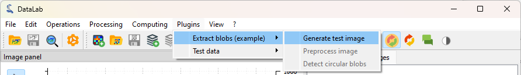
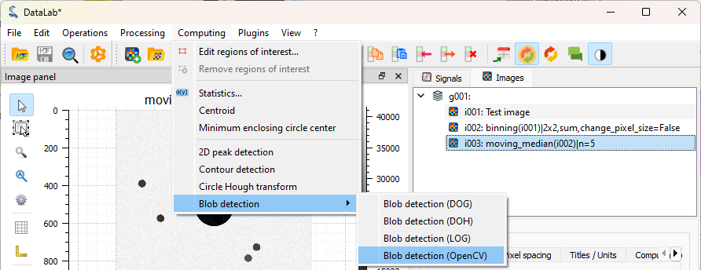
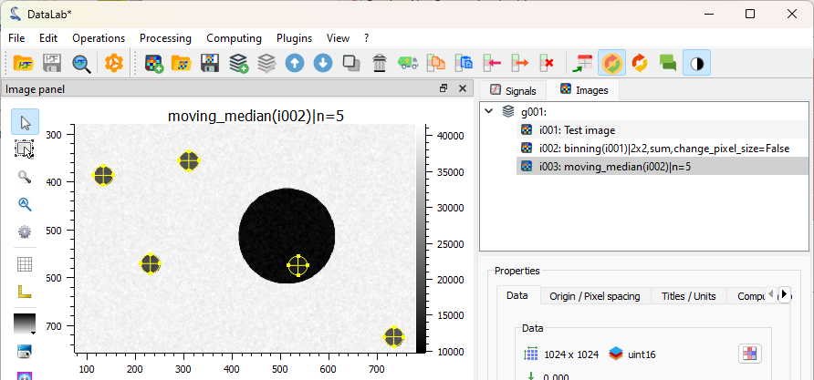

.. _tutorial_blobs:

:octicon:`book;1em;sd-text-info` Detecting blobs on an image
============================================================

This example shows how to detect blobs on an image with DataLab,
and also covers other features such as the plugin system:

-   Add a new plugin to DataLab
-   Denoise an image
-   Detect blobs on an image
-   Save the workspace to a file

First, we open DataLab, and open the settings dialog (using "File > Settings...",
or the |libre-gui-settings| icon in the toolbar).

.. |libre-gui-settings| image:: ../../../datalab/data/icons/libre-gui-settings.svg
    :width: 24px
    :height: 24px
    :class: dark-light no-scaled-link

.. figure:: ../../images/tutorials/blobs/01.png

    In the "General" tab, we can see the "Plugins path" field. This is the path where
    DataLab will look for plugins. We can add a new plugin by copying/pasting the
    plugin file in this directory.

.. seealso::

    The plugin system is described in the :ref:`about_plugins` section.

Let's add the `datalab_example_imageproc.py` plugin to DataLab (this is an example
plugin that is shipped with DataLab source package, or may be downloaded from
`here <https://github.com/DataLab-Platform/DataLab/tree/main/plugins/examples>`_).

If we close and reopen DataLab, we can see that the plugin is now available in the
"Plugins" menu: there is a new "Extract blobs (example)" entry.

.. figure:: ../../images/tutorials/blobs/02.png

    The "About DataLab" dialog shows the list of available plugins.

    Let's click on "Extract blobs (example) > Generate test image"

.. note:: DataLab menus change between images and signals. To be able to see the
    "Extract blobs (example)" menu, make sure that the "Images" panel is selected
    (click on the "Images" tab on the left).

A pop-up dialog appears, asking for the parameters of the test image to generate
(the size of the image and its title).
We can just keep the default parameters and click on "OK".

For information, the image is generated by the plugin using the following code::

    def generate_test_image(self) -> None:
        """Generate test image"""
        newparam = self.edit_new_image_parameters(
            title="Test image", hide_dtype=True, shape=(2048, 2048)
        )
        if newparam is not None:
            # Create a NumPy array:
            shape = (newparam.height, newparam.width)
            arr = np.random.normal(10000, 1000, shape)
            for _ in range(10):
                row = np.random.randint(0, shape[0])
                col = np.random.randint(0, shape[1])
                rr, cc = skimage.draw.disk((row, col), min(shape) // 50, shape=shape)
                arr[rr, cc] -= np.random.randint(5000, 6000)
            center = (shape[0] // 2,) * 2
            rr, cc = skimage.draw.disk(center, min(shape) // 10, shape=shape)
            arr[rr, cc] -= np.random.randint(5000, 8000)
            data = np.clip(arr, 0, 65535).astype(np.uint16)

            # Create a new image object and add it to the image panel
            obj = sigima.objects.create_image(
                newparam.title, data, units=("mm", "mm", "lsb")
            )
            self.proxy.add_object(obj)

.. figure:: ../../images/tutorials/blobs/04.png

    The plugin has generated a test image, and added it to the "Images" panel. The
    image shows a few blobs, with a central bigger disk, and a noisy background.

The plugin has other features, such as denoising the image, and detecting blobs on
the image, but we won't cover them here: we will instead use the DataLab native features
to achieve, manually, the same operations as the plugin.

The image is a bit noisy, and also quite large. In addition, the blobs are large
with respect to the pixel size.

To reduce the noise there are several functions available in DataLab. Due to the
considerations we just made, we can consider that a binning would reduce the noise
without losing the information we look for. Let's apply a binning to the image by a
factor of 2 on both axes.
This will reduce the image size by a factor of 4, and the noise standard deviation
by a factor of 2. Choosing to change the pixel size accordingly
will keep the blob size constant in the previous unit (in this case, pixels,
but in a real application we can calibrate them to respect a real physical size).

.. figure:: ../../images/tutorials/blobs/05.png

    Click on "Operations > Pixel binning".

.. figure:: ../../images/tutorials/blobs/06.png

    The "Binning" dialog opens, with several options. Set the binning factor to 2 for
    both axes, select the "change pixel size" case and click on "OK".

.. figure:: ../../images/tutorials/blobs/07.png

    The binned image is added to the "Images" panel.
    It is now easier to see the blobs (even if they were already quite visible on
    the original image: this is just an example), and the image will be faster to
    process.

A different approach we can take is to apply a moving median filter, to reduce the
importance of the spikes. We do it with a window of 5; of course in practice different
window sizes can be tested to find a good compromise between noise reduction and
resolution. Let's see how to do that.

.. figure:: ../../images/tutorials/blobs/08.png

    Click on "Processing > Noise reduction > Moving median" entry,
    and set the window size to ``5``.

.. figure:: ../../images/tutorials/blobs/09.png

    The filtered image is added to the "Images" panel. Denoising is quite efficient.

Now, we can be satisfied with our denoising: it is visible that the noise is smaller.
We can thus move to the following step: detect the blobs on the image.
To do that, we can use the "Blob detection" function available in the
"Analysis" menu. Different :ref:`algorithms <ima-blob-detection>` are available,
here we will use the OpenCV one.

    Click on "Analysis > Blob detection > Blob detection (OpenCV)".

.. figure:: ../../images/tutorials/blobs/11.png

    The "Blob detection (OpenCV)" dialog opens. Set the parameters as shown on the
    screenshot, and click on "OK".

.. figure:: ../../images/tutorials/blobs/12.png

    The "Results" dialog opens, showing the detected blobs: one line per blob, with
    the blob coordinates and radius.

.. note::

    If you want to show the analysis results again, you can select the "Show results"
    |show_results| entry in the "Analysis" menu, or the "Results" |show_results|
    button, in the property panel below the image list:

    .. image:: ../../images/tutorials/fabry_perot/12.png

.. |show_results| image:: ../../../datalab/data/icons/analysis/show_results.svg
    :width: 24px
    :height: 24px
    :class: dark-light no-scaled-link

    The detected blobs are also added to the image metadata, and can be seen in the
    visualization panel on the right.

Finally, we can save the workspace to a file. The workspace contains all the images
that were loaded in DataLab, as well as the processing results. It also contains the
visualization settings (colormaps, contrast, etc.), the metadata, and the annotations.
To save the workspace, click on "File > Save to HDF5 file...", or the |filesave_h5|
button in the toolbar.

.. |filesave_h5| image:: ../../../datalab/data/icons/io/filesave_h5.svg
    :width: 24px
    :height: 24px
    :class: dark-light no-scaled-link

If you want to load the workspace again, you can use the "File > Open HDF5 file..."
(or the |fileopen_h5| button in the toolbar) to load the whole workspace, or the
"File > Browse HDF5 file..." (or the |h5browser| button in the toolbar) to load
only a selection of data sets from the workspace.

.. |fileopen_h5| image:: ../../../datalab/data/icons/io/fileopen_h5.svg
    :width: 24px
    :height: 24px
    :class: dark-light no-scaled-link

.. |h5browser| image:: ../../../datalab/data/icons/h5/h5browser.svg
    :width: 24px
    :height: 24px
    :class: dark-light no-scaled-link
