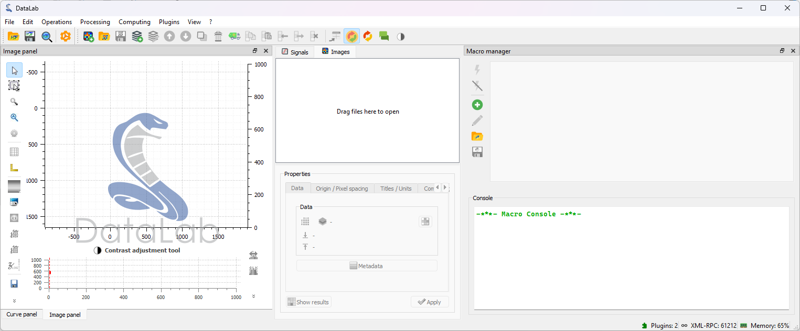
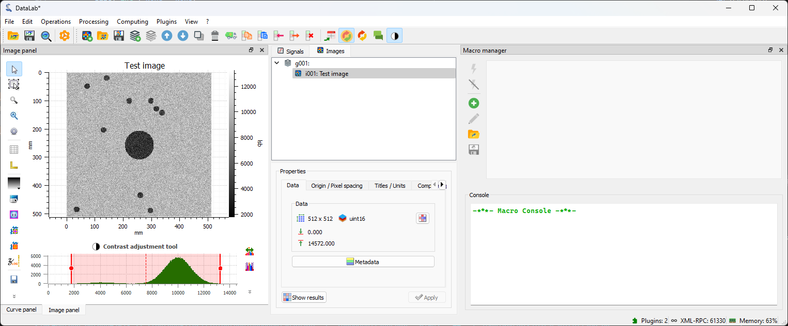

.. _tutorial_custom_func:

:octicon:`book;1em;sd-text-info` Prototyping a custom processing pipeline
=========================================================================

.. meta::
    :description: Tutorial on how to prototype a custom image processing pipeline using DataLab (macro, plugin, external IDE, Jupyter notebook)
    :keywords: DataLab, custom function, macro-command, plugin, image processing, prototype, Spyder, Jupyter

For your specific application, it is possible that you will need a function that is not
available in DataLab by default. In this case, you can define your own function and
integrate it in DataLab to conveniently analyze your data. DataLab has been designed
to be flexible and extensible, and the goal of this tutorial is to show you how to do
that.

This example shows how to prototype a custom image processing pipeline using DataLab:

-   Define a custom processing function
-   Create a macro-command to apply the function to an image
-   Use the same code from an external IDE (e.g. Spyder) or a Jupyter notebook
-   Create a plugin to integrate the function in the DataLab GUI

Define a custom processing function
-----------------------------------

To illustrate the extensibility of DataLab, we will use a simple image processing
function that is not available in the standard DataLab distribution, and that
represents a typical use case for prototyping a custom processing pipeline.

The function that we will work on is a denoising filter that combines the ideas of
averaging and edge detection. This filter will average the pixel values in the
neighborhood, but with a twist: it will give less weight to pixels that are
significantly different from the central pixel, assuming they might be part of an
edge or noise. Once you have understood how to implement custom processing in
DataLab, you will define your own functions adapted to your specific needs.

Here is the code of the ``weighted_average_denoise`` function::

    def weighted_average_denoise(data: np.ndarray) -> np.ndarray:
        """Apply a custom denoising filter to an image.

        This filter averages the pixels in a 5x5 neighborhood, but gives less weight
        to pixels that significantly differ from the central pixel.
        """

        def filter_func(values: np.ndarray) -> float:
            """Filter function"""
            central_pixel = values[len(values) // 2]
            differences = np.abs(values - central_pixel)
            weights = np.exp(-differences / np.mean(differences))
            return np.average(values, weights=weights)

        return spi.generic_filter(data, filter_func, size=5)

Setup the test environment
--------------------------

To test our processing function, we will use an image generated from a DataLab
plugin example (`plugins/examples/datalab_example_imageproc.py`). Before starting,
make sure that the plugin is installed in DataLab (see the first steps of the
tutorial :ref:`tutorial_blobs` to understand how to do it).

We then reorganize the DataLab window layout to have a comfortable environment for
developing and testing our function: we reorganize the window layout of DataLab to have
the "Image Panel" on the left and the "Macro Panel" on the right. To do so, you can
simply drag and drop the panels to the desired position. If the
"Macro Panel" is not visible, you can enable it from the "View > Panels > Macro Panel".

    The window layout of DataLab reorganized to have the "Image Panel" on
    the left and the "Macro Panel" on the right.

We can now generate a test image using the plugin that we installed before. To do so,
we click on the "Plugins > Extract blobs (example) > Generate test image" menu. The
function we are developing is quite slow, so we choose a limited size for the image
(for example 512x512 pixels).

.. figure:: ../../images/tutorials/custom_func/02.png

    We generate a new image using the
    "Plugins > Extract blobs (example) > Generate test image" menu.

.. figure:: ../../images/tutorials/custom_func/03.png

    We select the size for the image and click on "OK".

The plugin generates a test image and adds it to the "Image Panel".

    The generated image in the "Image Panel".

Create a macro-command
----------------------

A macro is a code that can be executed directly inside DataLab to automate tasks.
Macros are written in Python, and use the DataLab API to interact with DataLab.

In addition, macros have the following important features:

-   Macros are part of DataLab's **workspace**, which means that they are saved
    and restored when exporting and importing to/from an HDF5 file.

-   Macros are executed in a separate process, so we need to import the necessary
    modules and initialize the proxy to DataLab. The proxy is a special object that
    allows us to communicate with DataLab.

-   As a consequence, **when defining a plugin or when controlling DataLab from an
    external IDE, we can use exactly the same code as in the macro-command**. This
    is a very important point, because it means that we can prototype our processing
    pipeline in DataLab, and then use the same code in a plugin or in an external IDE
    to develop it further.

.. note::

    The macro-command is executed in DataLab's Python environment, so we can use
    the modules that are available in DataLab. However, we can also use our own
    modules, as long as they are installed in DataLab's Python environment or in
    a Python distribution that is compatible with DataLab's Python environment.
    A list of the modules that are available in your DataLab's Python environment
    is available in the "? > Installation and configuration >
    Installation configuration" dialog.

    If your custom modules are not installed in DataLab's Python environment, and
    if they are compatible with DataLab's Python version, you can prepend the
    ``sys.path`` with the path to the Python distribution that contains your
    modules::

        import sys
        sys.path.insert(0, "/path/to/my/python/distribution")

    This will allow you to import your modules in the macro-command and mix them
    with the modules that are available in DataLab.

    .. warning::

        If you use this method, make sure that your modules are compatible with
        DataLab's Python version. Otherwise, you will get errors when importing
        them.

To edit macros, we use the "Macro Panel" that is available in DataLab. This panel is
separated in two parts: the upper part is the macro editor, where we can write and edit
the macro code; the lower part is the console, where we can see the output of the macro.
If the macro editor is too small to show all the buttons of the macro toolbar, some of
them are hidden and can be accessed by clicking on the unfold button. Alternatively, you
can resize the macro editor by dragging the splitter between the editor and the console.

Let's get back to our custom function. We can create a new macro-command that will
apply the function to the current image. To do so, we open the "Macro Panel" and
click on the "New macro" |libre-gui-add| button.

DataLab creates a new macro-command which is not empty: it contains a sample code
that shows how to create a new image and add it to the "Image Panel".

In this code, we can notice the presence of the ``RemoteProxy`` class that is used to
communicate with DataLab. This class is part of the DataLab API, and is used to access
DataLab objects and functions from a macro-command, a plugin, or an external IDE.
You can find the documentation of the DataLab API in the :ref:`api` section.

We can remove this code and replace it with our own code::

    # Import the necessary modules
    import numpy as np
    import scipy.ndimage as spi
    from datalab.control.proxy import RemoteProxy

    # Define our custom processing function
    def weighted_average_denoise(values: np.ndarray) -> float:
        """Apply a custom denoising filter to an image.

        This filter averages the pixels in a 5x5 neighborhood, but gives less weight
        to pixels that significantly differ from the central pixel.
        """
        central_pixel = values[len(values) // 2]
        differences = np.abs(values - central_pixel)
        weights = np.exp(-differences / np.mean(differences))
        return np.average(values, weights=weights)

    # Initialize the proxy to DataLab
    proxy = RemoteProxy()

    # Switch to the "Image Panel" and get the current image
    proxy.set_current_panel("image")
    image = proxy.get_object()
    if image is None:
        # We raise an explicit error if there is no image to process
        raise RuntimeError("No image to process!")

    # Get a copy of the image data, and apply the function to it
    data = np.array(image.data, copy=True)
    data = spi.generic_filter(data, weighted_average_denoise, size=5)

    # Add new image to the panel
    proxy.add_image("My custom filtered data", data)

Now, let's execute the macro-command by clicking on the "Run macro"
|libre-camera-flash-on| button:

-   The macro-command is executed in a separate process, so we can continue to
    work in DataLab while the macro-command is running. And, if the macro-command
    takes too long to execute, we can stop it by clicking on the "Stop macro"
    |libre-camera-flash-off| button.

-   During the execution of the macro-command, we can see the progress in the
    "Macro Panel" window: the process standard output is displayed in the
    "Console" below the macro editor. We can see the following messages:

    - ``---[...]---[# ==> Running 'Untitled 01' macro...]``: the macro-command starts
    - ``Connecting to DataLab XML-RPC server...OK [...]``: the proxy is connected to DataLab
    - ``---[...]---[# <== 'Untitled 01' macro has finished]``: the macro-command ends

.. |libre-camera-flash-on| image:: ../../../datalab/data/icons/libre-camera-flash-on.svg
    :width: 24px
    :height: 24px
    :class: dark-light no-scaled-link

.. |libre-camera-flash-off| image:: ../../../datalab/data/icons/libre-camera-flash-off.svg
    :width: 24px
    :height: 24px
    :class: dark-light no-scaled-link

.. figure:: ../../images/tutorials/custom_func/05.png

    When the macro-command has finished, we can see the new image in the "Image Panel".
    Our filter has been applied to the image, and we can see that the noise has been
    reduced.

Prototyping with an external IDE
--------------------------------

Now that we have a working prototype of our processing pipeline, we can use the same
code in an external IDE to develop it further.

For example, we can use the Spyder IDE to debug our code. To do so, we need to
install Spyder but not necessarily in DataLab's Python environment (in the case
of the stand-alone version of DataLab, it wouldn't be possible anyway).

The only requirement is to install a DataLab client in Spyder's Python environment:

-   If you use the stand-alone version of DataLab or if you want or need to keep
    DataLab and Spyder in separate Python environments, you can install the
    `Sigima <https://pypi.org/project/sigima/>`_ (``sigima``) package that provides a
    simple remote client for DataLab. To install it, just run:

        pip install sigima

    Or you may also install the `DataLab Python package <https://pypi.org/project/datalab-platform/>`_
    (``datalab``) which includes the client (but also other modules, so we don't recommend
    this method if you don't need all DataLab's features in this Python environment)::

        pip install datalab

-   If you use the DataLab Python package, you may run Spyder in the same Python
    environment as DataLab, so you don't need to install the client: it is already
    available in the main DataLab package (the ``datalab`` package).

Once the client is installed, we can start Spyder and create a new Python script:

.. literalinclude:: custom_func.py
    :language: python
    :linenos:

We go back to DataLab and select the first image in the "Image Panel".

.. figure:: ../../images/tutorials/custom_func/06.png

    The first image in the "Image Panel" selected.

Then, we execute the script in Spyder (or your preferred editor), step-by-step (using
the defined cells), and we can see the result in DataLab.

.. figure:: ../../images/tutorials/custom_func/07.png

    The Spyder editor environment with the custom processing script.

We can see in DataLab that a new image has been added to the "Image Panel". This
image is the result of the execution of the script in Spyder.

Here we have used the script without any modification, but we could have modified it
to test new ideas, and then use the modified script in DataLab.

There is another useful application of having an external script interfaced with
DataLab: you can imagine letting your external script acquire the data and add
it to DataLab automatically, for example in an acquisition loop.
In this way you can improve your measurement workflow with the possibility to visualize
and analyze data directly after their acquisition.

Prototyping with a Jupyter notebook
-----------------------------------

We can also use a Jupyter notebook to prototype our processing pipeline. To do so,
we need to install Jupyter but not necessarily in DataLab's Python environment
(in the case of the stand-alone version of DataLab, it wouldn't be possible anyway).

The procedure is the same as for Spyder or any other IDE like Visual Studio Code, for example.

.. figure:: ../../images/tutorials/custom_func/nb.png

    A code interfaced with datalab written in a Jupyter notebook.

Creating a plugin
-----------------

Now that we have a working prototype of our processing pipeline, we can choose to create a
plugin to integrate it in DataLab's GUI. To do so, we need to create a new Python
module that will contain the plugin code. We can use the same code as in the
macro-command, but we need to make some changes.

.. seealso::

    The plugin system is described in the :ref:`about_plugins` section.

Apart from integrating the feature to DataLab's GUI which is more convenient for
the user, the advantage of creating a plugin is that we can take benefit of the
DataLab infrastructure if we encapsulate our processing function in a certain
way (see below):

-   Our function will be executed in a separate process, so we can interrupt it if it
    takes too long to execute.

-   Warnings and errors will be handled by DataLab, so we don't need to handle them
    ourselves.

The most significant change we need to make to our code is that we need to define a
function that will be operating on DataLab's native image objects
(:class:`sigima.objects.ImageObj`), instead of operating on NumPy arrays.
So we need to find a way to call our custom function
``weighted_average_denoise`` with a :class:`sigima.objects.ImageObj` as input
and output. To avoid writing a lot of boilerplate code, we can use the function wrapper provided by DataLab: :class:`sigima.proc.image.Wrap1to1Func`.

Besides we need to define a class that describes our plugin, which must inherit
from :class:`datalab.plugins.PluginBase` and name the Python script that contains the
plugin code with a name that starts with ``datalab_`` (e.g., ``datalab_custom_func.py``), so
that DataLab can discover it at startup.

Moreover, inside the plugin code, we want to add an entry in the "Plugins" menu, so
that the user can access our plugin from the GUI.

Here is the plugin code:

.. literalinclude:: ../../../plugins/examples/datalab_custom_func.py
    :language: python
    :linenos:

To test it, we have to add the plugin script to one of the plugin directories that
are discovered by DataLab at startup: you can find it under "Files > Settings"
(see the :ref:`about_plugins` section for more details, or the :ref:`tutorial_blobs`
for an example). We then restart DataLab and we can see that the plugin has been loaded.

.. figure:: ../../images/tutorials/custom_func/10.png

    At the restart we can see that the plugin has been loaded.

.. figure:: ../../images/tutorials/custom_func/11.png

    We generate again our test image using (see the first steps of the tutorial),
    and we process it using the plugin: "Plugins > My custom filters > Weighted average denoise".
