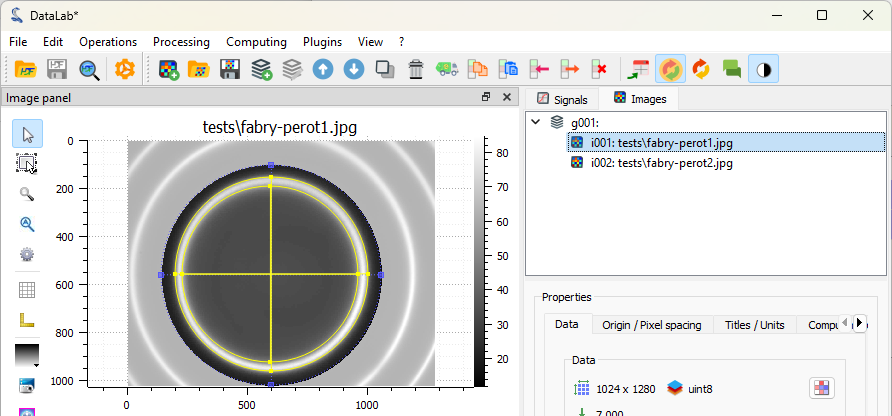
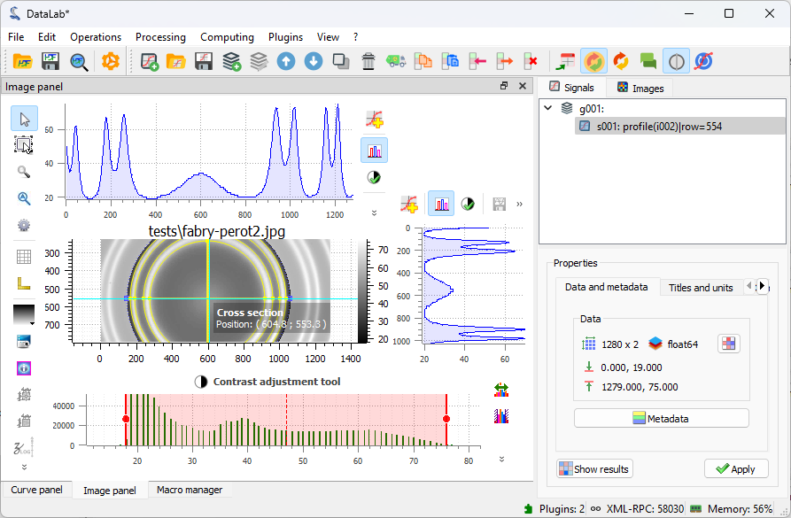

.. _tutorial_fabry_perot:

:octicon:`book;1em;sd-text-info` Measuring Fabry-Perot fringes
==============================================================

.. meta::
    :description: Tutorial on how to measure Fabry-Perot fringes using DataLab, the open-source scientific data analysis and visualization platform
    :keywords: DataLab, fabry-perot, interferometer, fringe, image processing, contour detection, circle fitting, intensity profile, signal processing, metadata, annotations, workspace, hdf5

This example shows how to measure Fabry-Perot fringes using the image processing
features of DataLab:

- Load an image of a Fabry-Perot interferometer
- Define a circular region of interest (ROI) around the central fringe
- Detect contours in the ROI and fit them to circles
- Show the radius of the circles
- Annotate the image
- Copy/paste the ROI to another image
- Extract the intensity profile along the X axis
- Save the workspace

Load the images
---------------

.. note::

    The images used in this tutorial "fabry_perot1.jpg" and "fabry_perot2.jpg" are
    available in the tutorial data folder of DataLab's installation directory
    (``<DataLab installation directory>/data/tutorials/``).

    .. only:: html

       Alternatively, you can download them from :download:`here </_download/fabry_perot.zip>`
       and extract to the folder of your choice.

    .. only:: latex

       Alternatively, they can be downloaded from the online documentation at
       https://datalab-platform.com.

First, we open DataLab and load the images from the menu file "File > Open Image...",
with the |fileopen_ima| button in the toolbar or by dragging and dropping the files
into DataLab.

.. figure:: ../../images/tutorials/fabry_perot/01.png

   Open the image files with "File > Open Image...", or with the |fileopen_ima| button in
   the toolbar, or by dragging and dropping the files into DataLab (on the panel on
   the right).

.. |fileopen_ima| image:: ../../../datalab/data/icons/io/fileopen_ima.svg
    :width: 24px
    :height: 24px
    :class: dark-light no-scaled-link

.. figure:: ../../images/tutorials/fabry_perot/02.png

    Go to the tutorial data folder in DataLab's installation directory (or the folder where you placed the images),
    select "fabry_perot1.jpg" and "fabry_perot2.jpg" and click "Open".

The selected image is displayed in the main window. We can zoom in and out by pressing
the right mouse button and dragging the mouse up and down. We can also pan the image
by pressing the middle mouse button and dragging the mouse.

.. figure:: ../../images/tutorials/fabry_perot/03.png

   Images loaded in DataLab. Zoom in and out with the right mouse button, pan the
   image with the middle mouse button.

.. note::

    When working on application-specific images (e.g. X-ray radiography images,
    or optical microscopy images), it is often useful to change the colormap to
    a grayscale colormap.
    If you see a different image colormap than the one shown in the figure, you can
    change it by selecting the image in the visualization panel, and the selecting
    the colormap in the vertical toolbar on the left of the visualization panel.

    Or, even better, you can change the default colormap in the DataLab settings
    by selecting "Edit > Settings..." in the menu, or the |libre-gui-settings|
    button in the toolbar.

    .. figure:: ../../images/tutorials/fabry_perot/default_colormap.png

       Select the "Visualization" tab, and select the "gray" colormap.

.. |libre-gui-settings| image:: ../../../datalab/data/icons/libre-gui-settings.svg
    :width: 24px
    :height: 24px
    :class: dark-light no-scaled-link

Define circular ROIs and fit contours
--------------------------------------

Let's define a circular region of interest (ROI) around the central fringe.
To do that, we firstly select the first image in the "Images" panel
(if not already selected), then we select the "Edit graphically" tool in
the "ROI" menu.

.. figure:: ../../images/tutorials/fabry_perot/04.png

   Select the "Edit graphically" tool in the "ROI" menu.

This opens the "Regions of interest" dialog, that provides all the tools to define and
edit ROIs. You can define ROIs graphically or via their coordinates.
You can define multiple ROIs on the same image, and even combine them using
boolean operations (union, intersection, difference).

.. figure:: ../../images/tutorials/fabry_perot/05a.png

   The "Regions of interest" dialog opens. Click "Add ROI" and select
   a circular ROI. Resize the predefined ROI by dragging the handles. Note that you
   may change the ROI radius while keeping its center fixed by pressing the "Ctrl" key.
   Click "OK" to close the dialog.

We choose to define a circular ROI graphically. To do that, we click on the "Graphical ROI"
button, and select the circular ROI option. We can now draw the circular ROI on the image
by clicking and dragging the mouse: the first click is on one side of the circle, and the
second click is on the opposite side of the circle.

.. figure:: ../../images/tutorials/fabry_perot/05b.png

    The option to graphically define a circular ROI.

Once created, the ROI can be selected
using the "Selection" tool, and moved or resized by dragging the ROI or its handles.
In addition, you can change the ROI radius while keeping its center fixed by
pressing the "Ctrl" key while dragging a handle.

.. figure:: ../../images/tutorials/fabry_perot/05c.png

   The circular ROI created appears in the image.

Once you are satisfied with the ROI position and size, click "OK" to close the dialog.
A confirmation dialog opens to ask you to apply the ROI to the image, and confirm
its parameters. Here you can also choose to invert the ROI mask (i.e., select the area
outside the ROI instead of the area inside the ROI): we do not want to invert the ROI
in this case, so we leave the "Invert ROI" checkbox unchecked, and click "OK". If you
want to obtain the exact results shown in this tutorial, make sure that the ROI parameters
are the same as in the figure.

.. figure:: ../../images/tutorials/fabry_perot/06.png

   The confirmation dialog.

Once confirmed, the ROI is applied to the image. The ROI is displayed on the image,
and the part outside the ROI is dimmed. Note that, internally, the ROI is defined by a
binary mask, i.e., image data is represented as a NumPy masked array.

.. figure:: ../../images/tutorials/fabry_perot/07.png

   The ROI displayed on the image.

Now, let's detect the contours in the area inside the ROI and fit them to circles. To
do that, we select the "Contour detection" tool in the "Analysis" menu. The contour
parameters dialog opens: we select the shape "Circle" and click "OK". Now you will see
a "Results" dialog opening, that displays the fitted circle parameters. Click "OK" to
close the dialog. The fitted circles are displayed on the image.

   The "Contour detection" tool in the "Analysis" menu.

.. figure:: ../../images/tutorials/fabry_perot/09.png

    The "Contour" parameters dialog.

.. figure:: ../../images/tutorials/fabry_perot/10.png

    The "Results" dialog.

    The fitted circles are displayed on the image.

.. note::

    If you want to show the analysis results again, you can select the "Show Results"
    |show_results| button in the "Analysis" menu, or the "Results" |show_results|
    button, in the Analysis panel located below the image list:

    .. image:: ../../images/tutorials/fabry_perot/12.png

.. |show_results| image:: ../../../datalab/data/icons/analysis/show_results.svg
    :width: 24px
    :height: 24px
    :class: dark-light no-scaled-link

The images (or signals) can also be displayed in a separate window, by clicking on
the "View in a new window" entry in the "View" menu (or the |new_window| button in
the toolbar). This is useful to compare images or signals side by side, and allows
you to add annotations (cursors, labels, shapes, etc.) to the image or signal: the
annotations are stored in the metadata of the image or signal, and saved together
with the data when the workspace is saved.

.. |new_window| image:: ../../../datalab/data/icons/view/new_window.svg
    :width: 24px
    :height: 24px
    :class: dark-light no-scaled-link

.. figure:: ../../images/tutorials/fabry_perot/13.png

   The image displayed in a separate window. The ROI and the fitted circles are
   also displayed. Annotations can be added to the image by clicking on the buttons
   at the bottom of the window. The annotations are stored in the metadata of the
   image, and saved together with the image data when the workspace is saved.
   Click on "OK" to close the window.

.. figure:: ../../images/tutorials/fabry_perot/14.png

   The image is displayed in the main window, together with the annotations.

If you want to take a closer look at the metadata, you can open the "Metadata" dialog.

    The "Metadata" button is located below the image list.

.. figure:: ../../images/tutorials/fabry_perot/16.png

    The "Metadata" dialog opens. Among other information, it displays the annotations
    (in a JSON format), some style information (e.g. the colormap), and the ROI.

Now, let's delete the image metadata (including the annotations) to clean up the image.
Select the "Delete object metadata..." entry in the "Edit" menu, or the |metadata_delete|
button in the toolbar, and answer "No" to the confirmation dialog to keep the ROI and
delete the rest of the metadata.

.. figure:: ../../images/tutorials/fabry_perot/17.png

   Select the "Delete object metadata" entry in the "Edit" menu.

.. |metadata_delete| image:: ../../../datalab/data/icons/edit/metadata_delete.svg
    :width: 24px
    :height: 24px
    :class: dark-light no-scaled-link

.. figure:: ../../images/tutorials/fabry_perot/18.png

    The "Delete metadata" dialog. Click "No" to keep the ROI and delete the
    rest of the metadata.

If we want to define the exact same ROI on the second image, we can copy/paste the
ROI from the first image to the second image. The best way to do that is to use
the copy/paste option present in the "ROI" menu, or the |roi_copy| and |roi_paste|
buttons in the toolbar: select the first image, then click on the "Copy" entry in
the "ROI" menu (or the |roi_copy| button in the toolbar), then select the second image,
and click on the "Paste ROI" entry in the "ROI" menu (or the |roi_paste| button in the
toolbar).

.. note::
    Copying/pasting the metadata copies/pastes all the metadata, including the ROIs, but
    this would have the side effect of also copying/pasting the rest of the metadata.

.. figure:: ../../images/tutorials/fabry_perot/19.png

    The "Copy" entry in the "ROI" menu.

.. |roi_copy| image:: ../../../datalab/data/icons/roi/roi_copy.svg
    :width: 24px
    :height: 24px
    :class: dark-light no-scaled-link

.. figure:: ../../images/tutorials/fabry_perot/20.png

    The "Paste" entry in the "ROI" menu, or the |roi_paste| button in the toolbar.

.. |roi_paste| image:: ../../../datalab/data/icons/roi/roi_paste.svg
    :width: 24px
    :height: 24px
    :class: dark-light no-scaled-link

.. figure:: ../../images/tutorials/fabry_perot/21.png

    The ROI is added to the second image.

Select the "Contour detection" tool in the "Analysis" menu, with the same
parameters as before (shape "Circle"). On this image, there are two fringes,
so four circles are fitted. The "Results" dialog opens and displays the
fitted circle parameters. Click "OK".

.. figure:: ../../images/tutorials/fabry_perot/22.png

    The "Results" dialog for the second image.

.. figure:: ../../images/tutorials/fabry_perot/23.png

    The fitted circles are displayed on the image.

Extract intensity profiles along the X axis
-------------------------------------------

.. note::

    For the sake of simplicity (and because we want to compare two methods of
    extraction), we will extract the intensity profile along the X axis
    at the center of the image. In a real application, you would probably want to
    extract the **radial intensity profile** instead, which can be done using
    the "Radial profile" entry in the "Analysis > Intensity profiles" menu: this
    would be more relevant and straightforward to analyze Fabry-Perot fringes.

To extract the intensity profile along the X axis, we have two options:

- Either select the "Line profile..." entry |profile| in the
  "Analysis > Intensity profiles" menu.

- Or activate the "Cross section" tool |cross_section| in the vertical toolbar
  on the left of the visualization panel.

.. |cross_section| image:: ../../images/tutorials/csection.png

Let's try the first option: select the "Line profile..." entry |profile|.
This is the most straightforward way to extract a profile from an image, and it
corresponds to the ``calc("line_profile")`` computation feature of DataLab's API
(so it can be used in a script, a plugin or a macro). Select the "Line profile..."
entry |profile| in the "Operations" menu and the "Line profile" dialog will open, letting you
select the profile row (for a horizontal profile) or column (for a vertical profile)
on the image.
You can also enter the row/column number directly by clicking on "parameters..." in the
"Line profile" dialog.

.. figure:: ../../images/tutorials/fabry_perot/24.png

    Select the "Line profile..." entry |profile| in the "Operations" menu.

    The "Profile" dialog opens. Enter the row of the horizontal profile
    (or the column of the vertical profile) in the dialog box that opens. Click "OK".

After clicking "OK", the intensity profile along the X axis is computed and
displayed in the "Signals" panel. DataLab automatically switches to the "Signals"
panel to display the profile.

.. figure:: ../../images/tutorials/fabry_perot/26.png

    The intensity profile is added to the "Signals" panel, and DataLab switches to
    this panel to display the profile.

If you want to do some measurements on the profile, or add annotations, you can
open the signal in a separate window, by clicking on the "View in a new window"
entry in the "View" menu (or the |new_window| button in the toolbar).

.. figure:: ../../images/tutorials/fabry_perot/27.png

    The signal is displayed in a separate window. Here, we added vertical cursors
    and a text label. As for the images, the annotations are stored
    in the metadata of the signal and saved together with the signal data when the workspace
    is saved. Click on "OK" to close the window.

Now, let's try the second option for extracting the intensity profile along the X axis,
using the "Cross section" tool |cross_section| in the vertical toolbar on the
left of the visualization panel (this tool is a
`PlotPy <https://github.com/PlotPyStack/plotpy>`_ feature). Before being able to use
it, we need to select the image again in the visualization panel (otherwise the tool is
grayed out). Then, we can click on the image to display the intensity profiles along
the X and Y axes. DataLab integrates a modified version of this tool which allows you to
transfer the profile to the "Signals" panel for further processing. Select the
"Cross section" tool |cross_section| in the vertical toolbar and click on the image to
display the intensity profiles along the X and Y axes.

    The cross section tool in the view panel. In the red circle, the button to
    activate it. In the blue circle, the button to transfer the profile to the
    "Signals" panel.

Click on the "Process signal" button |to_signal| in the toolbar near the
profile to transfer the profile to the "Signals" panel. The intensity profile is added
to the "Signals" panel, and DataLab switches to this panel to display the profile.

.. |to_signal| image:: ../../../datalab/data/icons/to_signal.svg
    :width: 24px
    :height: 24px
    :class: dark-light no-scaled-link

Save the workspace
------------------

Finally, we can save the workspace to a file. The workspace contains all the images
and signals that were loaded or processed in DataLab. It also contains the analysis
results, the visualization settings (colormaps, contrast, etc.), the metadata, and
the annotations.

.. figure:: ../../images/tutorials/fabry_perot/30.png

    Save the workspace to a file with "File > Save to HDF5 file...",
    or the |filesave_h5| button in the toolbar.

.. |filesave_h5| image:: ../../../datalab/data/icons/io/filesave_h5.svg
    :width: 24px
    :height: 24px
    :class: dark-light no-scaled-link

If you want to load the workspace again, you can use the "File > Open HDF5 file..."
(or the |fileopen_h5| button in the toolbar) to load the whole workspace, or the
"File > Browse HDF5 file..." (or the |h5browser| button in the toolbar) to load
only a selection of data sets from the workspace.

.. |fileopen_h5| image:: ../../../datalab/data/icons/io/fileopen_h5.svg
    :width: 24px
    :height: 24px
    :class: dark-light no-scaled-link

.. |h5browser| image:: ../../../datalab/data/icons/h5/h5browser.svg
    :width: 24px
    :height: 24px
    :class: dark-light no-scaled-link
