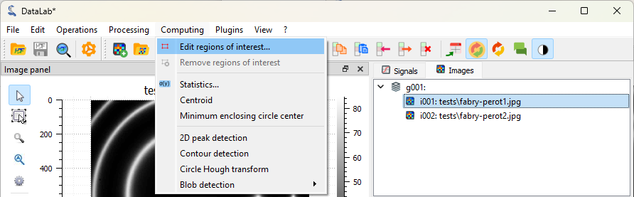
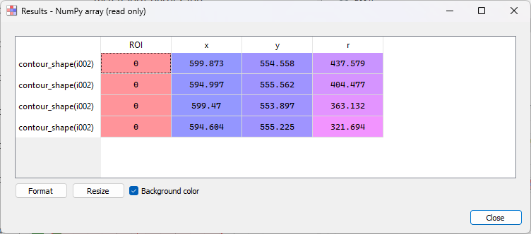

:octicon:`book;1em;sd-text-info` Measuring Fabry-Perot fringes
==============================================================

This example shows how to measure Fabry-Perot fringes using the image processing
features of DataLab:

- Load an image of a Fabry-Perot interferometer
- Define a circular region of interest (ROI) around the central fringe
- Detect contours in the ROI and fit them to circles
- Show the radius of the circles
- Annotate the image
- Copy/paste the ROI to another image
- Extract the intensity profile along the X axis
- Save the workspace

First, we open DataLab and load the images:

   Open the image files with "File > Open...", or with the |fileopen_ima| button in
   the toolbar, or by dragging and dropping the files into DataLab (on the panel on
   the right).

.. |fileopen_ima| image:: ../../../cdl/data/icons/fileopen_ima.svg
    :width: 24px
    :height: 24px

.. figure:: ../../images/tutorials/fabry_perot/02.png

    Select the test images "fabry_perot1.jpg" and "fabry_perot2.jpg" and click "Open".

The selected image is displayed in the main window. We can zoom in and out by pressing
the right mouse button and dragging the mouse up and down. We can also pan the image
by pressing the middle mouse button and dragging the mouse.

.. figure:: ../../images/tutorials/fabry_perot/03.png

   Zoom in and out with the right mouse button. Pan the image with the middle mouse
   button.

.. note::

    When working on application-specific images (e.g. X-ray radiography images,
    or optical microscopy images), it is often useful to change the colormap to
    a grayscale colormap.
    If you see a different image colormap than the one shown in the figure, you can
    change it by selecting the image in the visualization panel, and the selecting
    the colormap in the vertical toolbar on the left of the visualization panel.

    Or, even better, you can change the default colormap in the DataLab settings
    by selecting "Edit > Settings..." in the menu, or the |libre-gui-settings|
    button in the toolbar.

    .. figure:: ../../images/tutorials/fabry_perot/default_colormap.png

       Select the "Visualization" tab, and select the "gray" colormap.

.. |libre-gui-settings| image:: ../../../cdl/data/icons/libre-gui-settings.svg
    :width: 24px
    :height: 24px

Then, let's define a circular region of interest (ROI) around the central fringe.

   Select the "Edit regions of interest" tool in the "Computing" menu.

.. figure:: ../../images/tutorials/fabry_perot/05.png

   The "Regions of interest" dialog opens. Click "Add region of interest" and select
   a circular ROI. Resize the predefined ROI by dragging the handles. Note that you
   may change the ROI radius while keeping its center fixed by pressing the "Ctrl" key.
   Click "OK" to close the dialog.

.. figure:: ../../images/tutorials/fabry_perot/06.png

   Another dialog box opens, and asks you to confirm the ROI parameters. Click "OK".

   The ROI is displayed on the image: masked pixels are grayed out, and the ROI
   boundary is displayed in blue (note that, internally, the ROI is defined by a
   binary mask, i.e. image data is represented as a NumPy masked array).

Now, let's detect the contours in the ROI and fit them to circles.

.. figure:: ../../images/tutorials/fabry_perot/08.png

   Select the "Contour detection" tool in the "Computing" menu.

    The "Contour" parameters dialog opens. Select the shape "Circle" and click "OK".

.. figure:: ../../images/tutorials/fabry_perot/10.png

    The "Results" dialog opens, and displays the fitted circle parameters. Click "OK".

.. figure:: ../../images/tutorials/fabry_perot/11.png

    The fitted circles are displayed on the image.

.. note::

    If you want to show the computing results again, you can select the "Show results"
    |show_results| entry in the "Computing" menu, or the "Show results" |show_results|
    button, below the image list:

    .. image:: ../../images/tutorials/fabry_perot/12.png

.. |show_results| image:: ../../../cdl/data/icons/show_results.svg
    :width: 24px
    :height: 24px

The images (or signals) can also be displayed in a separate window, by clicking on
the "View in a new window" entry in the "View" menu (or the |new_window| button in
the toolbar). This is useful to compare side by side images or signals.

.. |new_window| image:: ../../../cdl/data/icons/new_window.svg
    :width: 24px
    :height: 24px

.. figure:: ../../images/tutorials/fabry_perot/13.png

   The image is displayed in a separate window. The ROI and the fitted circles are
   also displayed. Annotations can be added to the image by clicking on the buttons
   at the bottom of the window. The annotations are stored in the metadata of the
   image, and together with the image data when the workspace is saved.
   Click on "OK" to close the window.

.. figure:: ../../images/tutorials/fabry_perot/14.png

   The image is displayed in the main window, together with the annotations.

If you want to take a closer look at the metadata, you can open the "Metadata" dialog.

.. figure:: ../../images/tutorials/fabry_perot/15.png

    The "Metadata" button is located below the image list.

    The "Metadata" dialog opens. Among other information, it displays the annotations
    (in a JSON format), some style information (e.g. the colormap), and the ROI.

Now, let's delete the image metadata (including the annotations) to clean up the image.

.. figure:: ../../images/tutorials/fabry_perot/17.png

   Select the "Delete metadata" entry in the "Edit" menu, or the |metadata_delete|
   button in the toolbar.

.. |metadata_delete| image:: ../../../cdl/data/icons/metadata_delete.svg
    :width: 24px
    :height: 24px

.. figure:: ../../images/tutorials/fabry_perot/18.png

    The "Delete metadata" dialog opens. Click "No" to keep the ROI and delete the
    rest of the metadata.

If we want to define the exact same ROI on the second image, we can copy/paste the
ROI from the first image to the second image, using the metadata.

.. figure:: ../../images/tutorials/fabry_perot/19.png

    Select the "Copy metadata" entry in the "Edit" menu, or the |metadata_copy|
    button in the toolbar.

.. |metadata_copy| image:: ../../../cdl/data/icons/metadata_copy.svg
    :width: 24px
    :height: 24px

.. figure:: ../../images/tutorials/fabry_perot/20.png

    Select the second image in the "Images" panel, then select the "Paste metadata"
    entry in the "Edit" menu, or the |metadata_paste| button in the toolbar.

.. |metadata_paste| image:: ../../../cdl/data/icons/metadata_paste.svg
    :width: 24px
    :height: 24px

.. figure:: ../../images/tutorials/fabry_perot/21.png

    The ROI is added to the second image.

    Select the "Contour detection" tool in the "Computing" menu, with the same
    parameters as before (shape "Circle"). On this image, there are two fringes,
    so four circles are fitted. The "Results" dialog opens, and displays the
    fitted circle parameters. Click "OK".

    The fitted circles are displayed on the image.

To extract the intensity profile along the X axis, we have two options:

- Either select the "Line profile..." entry |profile| in the
  "Operations > Intensity profiles" menu.

- Or activate the "Cross section" tool |cross_section| in the vertical toolbar
  on the left of the visualization panel.

.. |profile| image:: ../../../cdl/data/icons/profile.svg
    :width: 24px
    :height: 24px

.. |cross_section| image:: ../../images/tutorials/csection.png

Let's try the first option, by selecting the "Line profile..." entry |profile|:
that is the most straightforward way to extract a profile from an image, and it
corresponds to the ``compute_profile`` method of DataLab's API (so it can be used
in a script, a plugin or a macro).

.. figure:: ../../images/tutorials/fabry_perot/24.png

    Select the "Line profile..." entry |profile| in the "Operations" menu.

.. figure:: ../../images/tutorials/fabry_perot/25.png

    The "Profile" dialog opens. Enter the row of the horizontal profile
    (or the column of the vertical profile) in the dialog box that opens. Click "OK".

.. figure:: ../../images/tutorials/fabry_perot/26.png

    The intensity profile is added to the "Signals" panel, and DataLab switches to
    this panel to display the profile.

If you want to do some measurements on the profile, or add annotations, you can
open the signal in a separate window, by clicking on the "View in a new window"
entry in the "View" menu (or the |new_window| button in the toolbar).

.. figure:: ../../images/tutorials/fabry_perot/27.png

    The signal is displayed in a separate window. Here, we added vertical cursors
    and a very interesting text label. As for the images, the annotations are stored
    in the metadata of the signal, and together with the signal data when the workspace
    is saved. Click on "OK" to close the window.

Now, let's try the second option for extracting the intensity profile along the X axis,
by activating the "Cross section" tool |cross_section| in the vertical toolbar on the
left of the visualization panel (this tool is a
`PlotPy <https://github.com/PlotPyStack/plotpy>`_ feature). Before being able to use
it, we need to select the image in the visualization panel (otherwise the tool is
grayed out). Then, we can click on the image to display the intensity profile along
the X axis. DataLab integrates a modified version of this tool, that allows to
transfer the profile to the "Signals" panel for further processing.

.. figure:: ../../images/tutorials/fabry_perot/28.png

    Switch back to the "Images" panel, and select the image *in the visualization
    panel* (otherwise the "Cross section" |cross_section| tool is grayed out).
    Select the "Cross section" tool |cross_section| in the vertical toolbar, and
    click on the image to display the intensity profiles along the X and Y axes.

Then, click on the "Process signal" button |to_signal| in the toolbar near the
profile to transfer the profile to the "Signals" panel.

.. |to_signal| image:: ../../../cdl/data/icons/to_signal.svg
    :width: 24px
    :height: 24px

.. figure:: ../../images/tutorials/fabry_perot/29.png

    The intensity profile is added to the "Signals" panel, and DataLab switches to
    this panel to display the profile.

Finally, we can save the workspace to a file. The workspace contains all the images
and signals that were loaded or processed in DataLab. It also contains the computing
results, the visualization settings (colormaps, contrast, etc.), the metadata, and
the annotations.

.. figure:: ../../images/tutorials/fabry_perot/30.png

    Save the workspace to a file with "File > Save to HDF5 file...",
    or the |filesave_h5| button in the toolbar.

.. |filesave_h5| image:: ../../../cdl/data/icons/filesave_h5.svg
    :width: 24px
    :height: 24px

If you want to load the workspace again, you can use the "File > Open HDF5 file..."
(or the |fileopen_h5| button in the toolbar) to load the whole workspace, or the
"File > Browse HDF5 file..." (or the |h5browser| button in the toolbar) to load
only a selection of data sets from the workspace.

.. |fileopen_h5| image:: ../../../cdl/data/icons/fileopen_h5.svg
    :width: 24px
    :height: 24px

.. |h5browser| image:: ../../../cdl/data/icons/h5browser.svg
    :width: 24px
    :height: 24px