.. _tutorial_history_panel:

:octicon:`book;1em;sd-text-info` Recording and replaying a processing chain
==========================================================================

.. meta::
    :description: Tutorial on how to record, replay and share a processing
        chain with the History Panel of DataLab, the open-source scientific
        data analysis and visualization platform
    :keywords: DataLab, tutorial, history, record, replay, session,
        reproducibility, processing chain, dlhist, HDF5

This tutorial shows how to use the **History Panel** to make a processing
workflow reproducible:

-   Record a complete processing chain on a test signal
-   Inspect the recorded actions and their workspace state
-   Replay the chain, and replay it step-by-step with modified parameters
-   Duplicate a session to compare two processing variants

.. seealso::

    The reference documentation of the panel (toolbar, tree view, persistence
    rules, chain reconnection) is available in the :ref:`historypanel` section.

Showing the History Panel
-------------------------

The History Panel is visible by default, but could be hidden in your
configuration. In this case, to display it, check the "History Panel" entry in
the "View" menu.

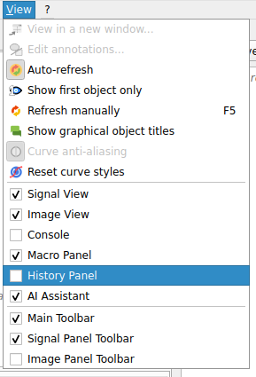

   The "View > History Panel" menu entry, which toggles the visibility of the
   panel.

The panel is empty when it is first displayed. It is made of three parts:
a toolbar at the top, the tree of recorded sessions and actions in the middle
(with the "Title", "Date and time" and "Description" columns), and the
workspace state tables at the bottom ("Signal" / "Shape" on the left,
"Image" / "Dimensions" on the right).

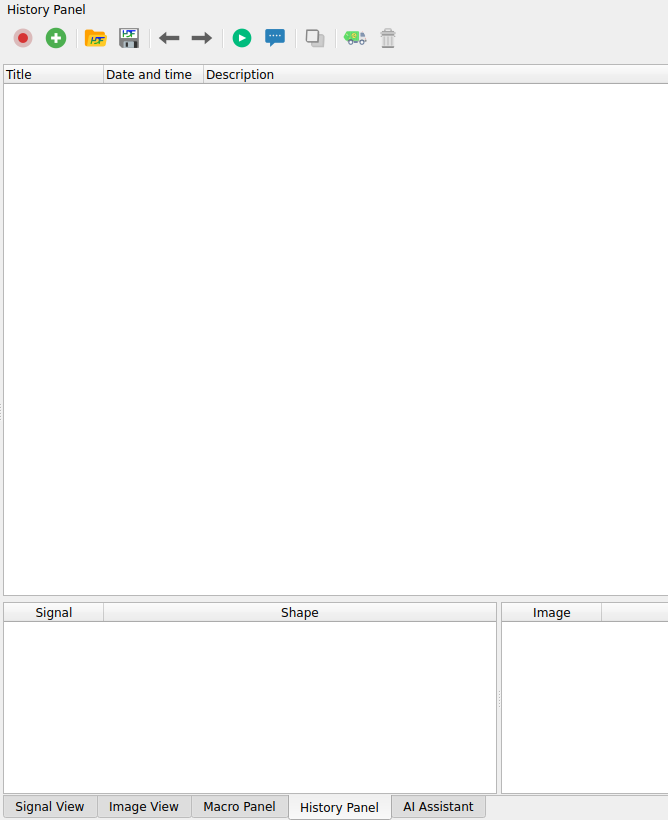

   The empty History Panel: toolbar, action tree and workspace state tables.

Like the other panels of DataLab, the History Panel is dockable: it can be
moved to any side of the main window, or detached as a floating window. Here,
it is docked on the left side, next to the Signal Panel, so that the recorded
actions remain visible while working on the data. We use this configuration in
the rest of the tutorial, but you can choose any layout that suits your
workflow.

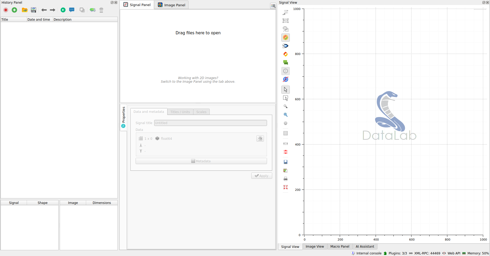

   The History Panel docked on the left side of the main window.

Recording a processing chain
----------------------------

Recording is disabled by default: the History Panel only starts collecting
actions once the |record| **Record mode** button is enabled in its toolbar.

.. |record| image:: ../../../datalab/data/icons/record.svg
    :width: 24px
    :height: 24px
    :class: dark-light no-scaled-link

The first object created after enabling the recording opens a new **session**,
which acts as a container for the whole processing chain. From then on, every
action producing or modifying an object -- creating a signal, running a
computation, removing an object -- is appended to that session.

When a new object is created afterwards, DataLab asks whether the current
session should be closed and a new one started. Since we want to record a
single, continuous processing chain, we answer **No** to keep appending to the
session already in progress.

To illustrate the recording of a processing chain, let's create a test using the
"Create > Gaussian" menu entry and then add to it some noise using "Processing
> Noise Addition > Gaussian Noise".

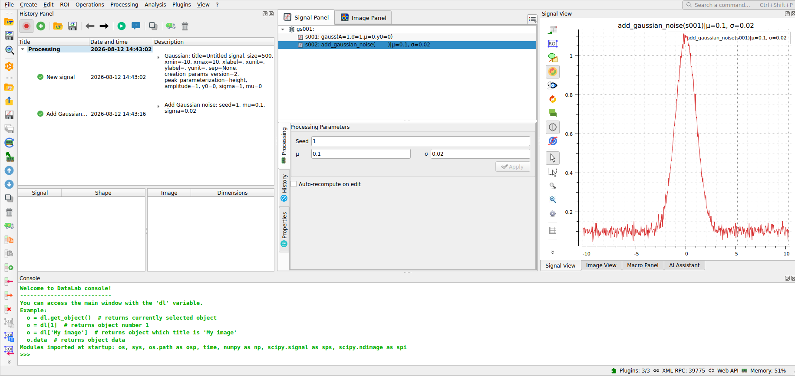

    The History Panel after creating a Gaussian signal and adding noise to it.

The tree now contains a **Processing** session with the two recorded actions:
the creation of the Gaussian signal and the addition of Gaussian noise. The
selected noise action exposes its parameters in the description column. The
Signal Panel shows both the original and resulting signals, while the
Processing Parameters panel displays the seed, mean and standard deviation
used for the selected action.

To create a longer chain, we can apply a few more processing steps, for example
a fitting. Once done, the action is recorded in the History Panel, and the
resulting signal is displayed in the Signal Panel.

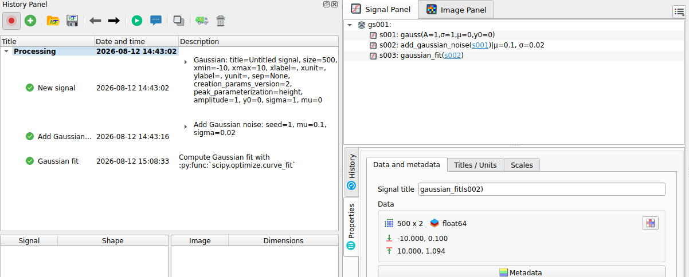

    The History Panel after fitting the noisy signal.

Familiarizing with the history panel commands
---------------------------------------------

Now we have a very simple processing chain, which is enough to illustrate the
main features of the History Panel.
The toolbar provides the following commands:

-   **Record mode** toggles the recording of subsequent actions.
-   **New session** starts a separate history session.
-   **Open history file** and **Save history file** load or save a standalone
    ``.dlhist`` history file.
-   **Previous step** and **Next step** select the adjacent action in the
    current session.
-   **Replay** applies the selected session or action without showing parameter
    dialogs, whereas **Step-by-step** replays it while allowing parameters to be
    edited at each step.
-   **Duplicate** copies the selected session, or the complete session
    containing the selected action, to compare a processing variant.
-   **Remove incompatible** removes actions that cannot be directly applied in
    the current workspace (i.e. because a signal has been deleted), and
    **Delete** removes the selected history entry.

When an action is selected in the tree, the corresponding resulting signal is
displayed in the Signal Panel.

Now select the fitting signal in the Signal Panel, and delete it using the
"Delete" button in the toolbar or pressing the "Delete" key. The fitting action
is still available in the History Panel, as it can be replayed using the
**Replay** button. In addition, the delete action has been recorded in the
history, but it is grayed: the reason is that the fitting signal has been
deleted, so the action cannot be directly applied in the current workspace.

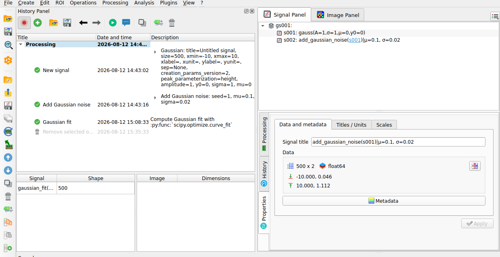

    The deleted fitted signal is no longer listed in the Signal Panel. The
    recorded deletion is grayed in the History Panel because it cannot be
    replayed in the current workspace.

We can now replay the fitting action: the resulting signal is recreated in the
Signal Panel and the "delete" action is no longer grayed, as it can now be
applied to the newly created signal.

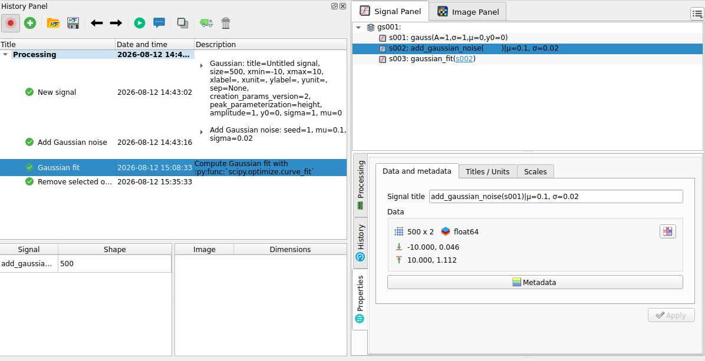

    Replaying the fit recreates the fitting signal. All recorded actions are
    again compatible with the current workspace.

Duplicating the chain to compare variants
-----------------------------------------

We can now duplicate the chain to compare two processing variants. First of all,
select the "Remove selected objects" entry in the History Panel and press the
Delete key. Then select the **Processing** session and click **Duplicate**.
DataLab creates a new **Processing Copy** session and a ``Copy - Processing``
group in the Signal Panel. This group contains independent copies of the
signals used and produced by the original chain.

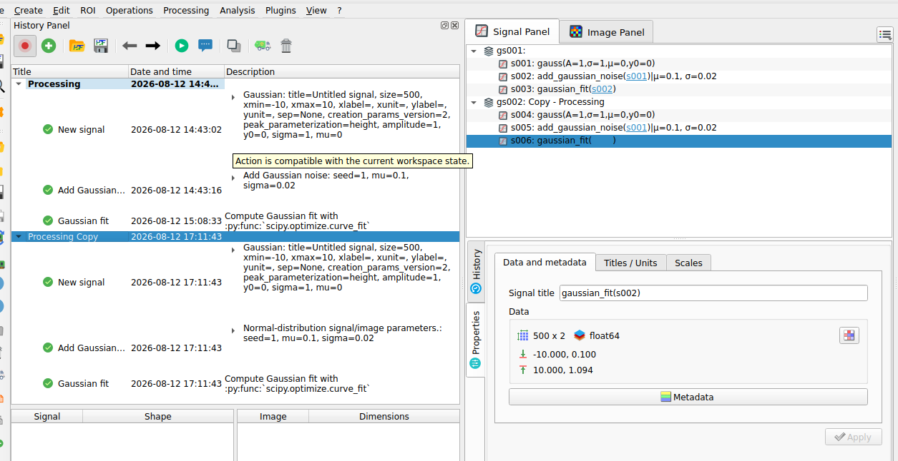

    The **Processing Copy** session contains the duplicated actions. The
    ``Copy - Processing`` group contains the independent signal copies.

To create a variant, select the **Processing Copy** session and click
**Step-by-step**. DataLab displays a parameter dialog for each action. In the
**Add Gaussian noise** dialog, change the noise level, for example set
``sigma`` to ``0.05``, then accept the remaining dialogs. The copied signal
chain is recomputed in place: its noisy signal and fit now use the new noise
level, while the original **Processing** session remains unchanged.

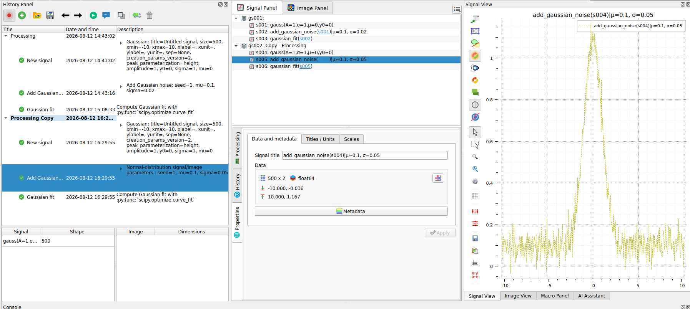

    The selected noise action in **Processing Copy** uses ``sigma = 0.05``.
    The original chain and the modified copy remain available side by side.

This can be useful to compare the effect of the noise level on the fitting
result, or to explore other processing variants. In this example, selecting both
the original and copied fitting signals in the Signal Panel shows a difference
between them, but it is quite slight.

Recording an image-to-signal workflow
-------------------------------------

The History Panel records workflows across both data panels in the same session.
Unlike the Signal Panel and Image Panel, it is not divided by data type: its
chronological tree shows image operations and any signals that they produce
together.

To illustrate this behavior, we will start from a clean workspace.
Alternatively, click **New session** in the History Panel to record it in a new
session of your current workspace.

In both cases, activate the history recording and switch to the **Image Panel**.

Create or open a test image and apply a first noise-reduction operation, for
example **Processing > Noise reduction > Moving Average**. As you can see, for
images the history is recorded in the same way that it is for signals.

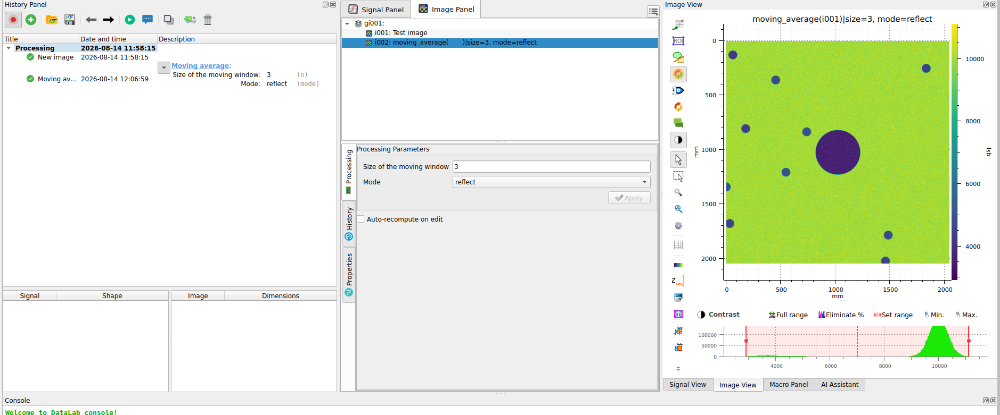

    The new image and its moving-average result are recorded in the same
    History Panel session.

Select the filtered image and choose **Analysis > Intensity profiles > Line
profile...**. Set the horizontal line in the profile dialog, then
confirm it. DataLab adds the extracted profile to the Signal Panel, while the
History Panel appends the **Line profile** action to the same session after the
image-processing actions.

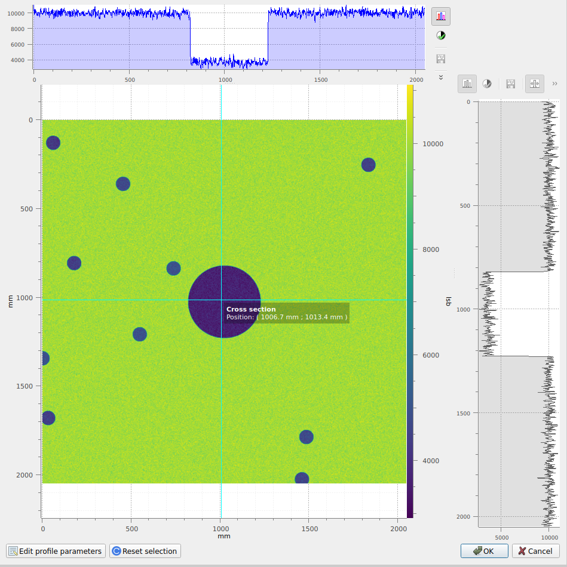

    Choose the horizontal line used to extract the profile from the filtered
    image.

This single history session therefore captures the full workflow: image
creation, noise reduction, and conversion of image data into a signal. Selecting
the image actions in the History Panel activates the Image Panel; selecting the
profile action activates the Signal Panel and selects the resulting signal.

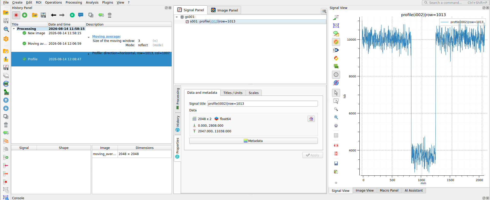

    The History Panel records the image operations and the resulting signal in
    one chronological session.
