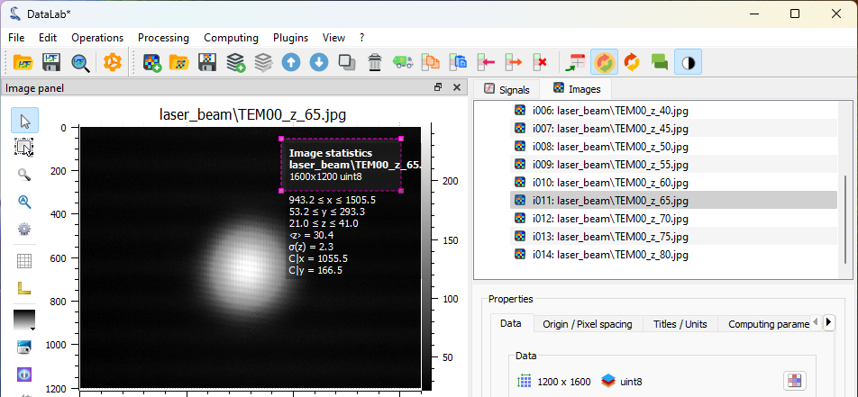
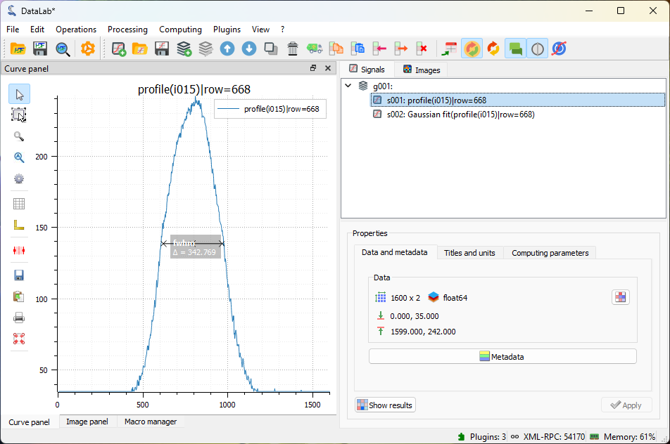

:octicon:`book;1em;sd-text-info` Measuring Laser Beam Size
==========================================================

.. meta::
    :description: Tutorial on how to measure the size of a laser beam using DataLab, the open-source scientific analysis and visualization platform
    :keywords: DataLab, tutorial, laser beam, size, FWHM, Gaussian fit, radial profile, line profile, thresholding, centroid, image statistics, linear calibration, HDF5, workspace

This example shows how to measure the size of a laser beam along the propagation
axis, using using DataLab:

- Load all the images in a folder
- Apply a threshold to the images
- Extract the intensity profile along an horizontal line
- Fit the intensity profile to a Gaussian function
- Compute the full width at half maximum (FWHM) of intensity profile
- Try another method: extract the radial intensity profile
- Compute the FWHM of the radial intensity profile
- Perform the same analysis on a stack of images and on the resulting profiles
- Plot the beam size as a function of the position along the propagation axis

First, we open DataLab and load the images:

.. figure:: ../../images/tutorials/fabry_perot/01.png

   Open the image files with "File > Open...", or with the |fileopen_ima| button in
   the toolbar, or by dragging and dropping the files into DataLab (on the panel on
   the right).

.. |fileopen_ima| image:: ../../../cdl/data/icons/io/fileopen_ima.svg
    :width: 24px
    :height: 24px

.. figure:: ../../images/tutorials/laser_beam/01.png

    Select the test images "TEM00_z_*.jpg" and click "Open".

The selected images are loaded in the "Images" panel. The last image is displayed
in the main window. On each image, we can zoom in and out by pressing the right
mouse button and dragging the mouse up and down. We can also pan the image by
pressing the middle mouse button and dragging the mouse.

.. figure:: ../../images/tutorials/laser_beam/02.png

   Zoom in and out with the right mouse button. Pan the image with the middle mouse
   button.

.. note::

    If we want to display the images side by side, we can select the
    "Distribute on a grid" entry |distribute_on_grid| in the "Operations" menu.

    .. figure:: ../../images/tutorials/laser_beam/03.png

        Images distributed on a 4 rows grid

    But, let's go back to the initial display by selecting the "Reset image positions"
    entry in the "Operations" menu.

.. |distribute_on_grid| image:: ../../../cdl/data/icons/operations/distribute_on_grid.svg
    :width: 24px
    :height: 24px

If we select on of the images, we can see that there is background noise, so it
might be useful to apply a threshold to the images.

.. figure:: ../../images/tutorials/laser_beam/04.png

    Select one of the images in the "Images" panel, select the associated image
    in the visualization panel, and enable the "Cross section" tool |cross_section| in
    the vertical toolbar on the left of the visualization panel (this tool is a
    `PlotPy <https://github.com/PlotPyStack/plotpy>`_ feature). On this figure, we
    can see that the background noise is around 30 lsb (to show the curve marker,
    we had to select the profile curve and right-click on it to display the context
    menu, and select "Markers > Bound to active item").

.. |cross_section| image:: ../../images/tutorials/csection.png

    Another way to measure the background noise is to use the "Image statistics" tool
    |imagestats| in the vertical toolbar on the left of the visualization panel.
    It displays statistics on a the rectangular area defined by dragging the mouse
    on the image. This confirms that the background noise is around 30 lsb.

.. |imagestats| image:: ../../images/tutorials/imagestats.png

.. figure:: ../../images/tutorials/laser_beam/06.png

    After applying a threshold at 35 lsb (with "Processing > Thresholding..."), we can
    compute a more accurate position of the beam center using "Computing > Centroid".

.. figure:: ../../images/tutorials/laser_beam/07.png

    Then we can extract a line profile along the horizontal axis with
    "Operations > Intensity profiles > Line profile". We set the row position to the
    centroid position computed previously (i.e. 668).

.. figure:: ../../images/tutorials/laser_beam/08.png

    The intensity profile is displayed in the "Signals" panel. We can fit the profile
    to a Gaussian function with "Processing > Fitting > Gaussian fit". Here we have
    selected both signals.

.. figure:: ../../images/tutorials/laser_beam/09.png

    If we go back to the first signal, the intensity profile, we can also directly
    compute the FWHM with "Computing > Full width at half maximum". The "Results"
    dialog displays a lot of information about the computation, including the
    FWHM value (that is the `L` column, "L" for "Length" because the result shape is
    a segment and FWHM is the length of the segment).

    The FWHM is also displayed on the curve, with an optional label (here, the
    title of this measurement has been displayed with
    "View > Show graphical object titles" or the |show_titles| button in the toolbar).

.. |show_titles| image:: ../../../cdl/data/icons/view/show_titles.svg
    :width: 24px
    :height: 24px

Now, let's try another method to measure the beam size.

From the "Images" panel, we can extract the radial intensity profile with
"Operations > Intensity profiles > Radial profile".

.. figure:: ../../images/tutorials/laser_beam/11.png

    The radial intensity profile may be computed around the centroid position,
    or around the center of the image, or around a user-defined position. Here we
    have selected the centroid position.

.. figure:: ../../images/tutorials/laser_beam/12.png

    The radial intensity profile is displayed in the "Signals" panel. It is smoother
    than the line profile, because it is computed from a larger number of pixels,
    thus averaging the noise.

All these operations and computations that we have performed on a single image can
be applied to all the images in the "Images" panel.

To do that, we begin by cleaning the "Signals" panel (with "Edit > Delete all" or
the |delete_all| button in the toolbar). We alse clean the intermediate results
in the "Images" panel by selecting the images obtained during our prototyping
and deleting them individually (with "Edit > Remove" or the |delete| button).

.. |delete_all| image:: ../../../cdl/data/icons/delete_all.svg
    :width: 24px
    :height: 24px

.. |delete| image:: ../../../cdl/data/icons/delete.svg
    :width: 24px
    :height: 24px

Then, we select all the images in the "Images" panel (individually, or by selecting
the whole group "g001").

.. figure:: ../../images/tutorials/laser_beam/13.png

    We apply the threshold to all the images, and the we extract the radial intensity
    profile for all the images (after selecting the whole group "g002" - it should be
    automatically selected if you had selected "g001" before applying the threshold).

.. figure:: ../../images/tutorials/laser_beam/14.png

    The "Signals" panel now contains all the radial intensity profiles.

    We can compute the FWHM of all the radial intensity profiles: the "Results" dialog
    displays the FWHM values for all the profiles.

.. note::

    If you want to show the computing results again, you can select the "Show results"
    |show_results| entry in the "Computing" menu, or the "Show results" |show_results|
    button, below the image list:

    .. image:: ../../images/tutorials/fabry_perot/12.png

.. |show_results| image:: ../../../cdl/data/icons/computing/show_results.svg
    :width: 24px
    :height: 24px

.. figure:: ../../images/tutorials/laser_beam/16.png

    Finally, we can plot the beam size as a function of the position along the
    propagation axis. To do that, we use the "Plot results" feature |plot_results|
    in the "Computing" menu. This feature allows to plot result data sets by
    choosing the x and y axes among the result columns. Here, we choose the
    to plot the FWHM values (`L`) as a function of the image index (`Indexes`).

.. |plot_results| image:: ../../../cdl/data/icons/computing/plot_results.svg
    :width: 24px
    :height: 24px

.. figure:: ../../images/tutorials/laser_beam/17.png

    The plot is displayed in the "Signals" panel and shows that the beam size
    increases with the position along the propagation axis (the position is
    here in arbitrary units, the image index).

.. figure:: ../../images/tutorials/laser_beam/18.png

    We can also calibrate the X and Y axis using "Processing > Linear calibration".
    Here we have set the X axis to the position in mm (and entered the title and
    unit in the "Properties" group box).

Finally, we can save the workspace to a file |filesave_h5|. The workspace contains
all the images and signals that were loaded or processed in DataLab. It also contains
the computing results, the visualization settings (colormaps, contrast, etc.), the
metadata, and the annotations.

.. |filesave_h5| image:: ../../../cdl/data/icons/io/filesave_h5.svg
    :width: 24px
    :height: 24px

If you want to load the workspace again, you can use the "File > Open HDF5 file..."
(or the |fileopen_h5| button in the toolbar) to load the whole workspace, or the
"File > Browse HDF5 file..." (or the |h5browser| button in the toolbar) to load
only a selection of data sets from the workspace.

.. |fileopen_h5| image:: ../../../cdl/data/icons/io/fileopen_h5.svg
    :width: 24px
    :height: 24px

.. |h5browser| image:: ../../../cdl/data/icons/h5/h5browser.svg
    :width: 24px
    :height: 24px