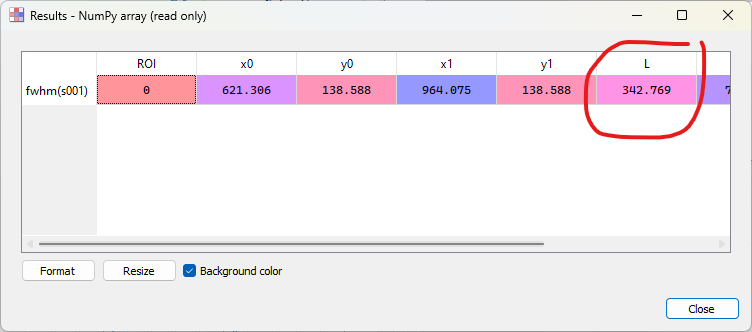

:octicon:`book;1em;sd-text-info` Measuring Laser Beam Size
==========================================================

.. meta::
    :description: Tutorial on how to measure the size of a laser beam using DataLab, the open-source scientific analysis and visualization platform
    :keywords: DataLab, tutorial, laser beam, size, FWHM, Gaussian fit, radial profile, line profile, thresholding, centroid, image statistics, linear calibration, HDF5, workspace

This example shows how to measure the size of a laser beam along the propagation
axis using DataLab:

- Load all the images in a folder
- Apply a threshold to the images
- Extract the intensity profile along an horizontal line
- Fit the intensity profile to a Gaussian function
- Compute the full width at half maximum (FWHM) of intensity profile
- Try another method: extract the radial intensity profile
- Compute the FWHM of the radial intensity profile
- Perform the same analysis on a stack of images and on the resulting profiles
- Plot the beam size as a function of the position along the propagation axis

Load the images
---------------
.. note::
    The images used in this tutorial "TEM00_z_*.jpg" are available in the tutorial data
    folder of DataLab's installation directory (``<DataLab installation directory>/data/tutorials/``). Alternatively, you can download them from
    :download:`here </_download/laser_beam.zip>` and extract to the folder of
    your choice.

First, we open DataLab and load the images: there are several ways to do so, but the most
convenient to use with several images is to use the "Open from directory..." feature
in the "File" menu (or the |fileopen_dir| button in the toolbar): this will open
all the images in a selected directory.

.. figure:: ../../images/tutorials/laser_beam/00.png

   The "File > Open Image..." menu

.. |fileopen_dir| image:: ../../../datalab/data/icons/io/fileopen_directory.svg
    :width: 24px
    :height: 24px
    :class: dark-light no-scaled-link

.. figure:: ../../images/tutorials/laser_beam/01.png

    Select the folder containing the images and click "Choose".

The selected images are loaded in the "Images" panel. On each image,
we can zoom in and out by pressing the right
mouse button and dragging the mouse up and down. We can also pan the image by
pressing the middle mouse button and dragging the mouse.

.. figure:: ../../images/tutorials/laser_beam/02.png

   Zoom in and out with the right mouse button. Pan the image with the middle mouse
   button.

.. note::

    If we want to display the images side by side, we can select the group of images
    and select "view images side by side" in the "view" window.

    .. figure:: ../../images/tutorials/laser_beam/03b.png

        Images side by side.

    .. warning::
        In the "Operations" menu, there is a "Distribute on a grid" entry
        |distribute_on_grid|. This will change the position of the images
        adding an offset to their X and Y coordinates, so that they are displayed
        side by side in a grid layout. This will modify your images.

        .. figure:: ../../images/tutorials/laser_beam/03.png

        Images distributed on 4 columns grid.

        You can usually go back to the initial position by selecting the
        "Reset image positions" entry |reset_positions| in the "Operations" menu.
        Anyway, this set the origin of the images to the first image origin,
        so if the images had at the beginning different origins, this information
        will be lost.

.. |distribute_on_grid| image:: ../../../datalab/data/icons/operations/distribute_on_grid.svg
    :width: 24px
    :height: 24px
    :class: dark-light no-scaled-link

.. |reset_positions| image:: ../../../datalab/data/icons/operations/reset_positions.svg
    :width: 24px
    :height: 24px
    :class: dark-light no-scaled-link

Remove background noise
-----------------------

If we select one of the images, we can see that there is background noise, so it
might be useful to apply a threshold to the images.
There are several ways to estimate the background noise level.

The first one takes advantage of the "Cross section" tool, that is provided by the
`PlotPy <https://github.com/PlotPyStack/plotpy>` library used by DataLab for signal and image visualization.
We select one of the images in the "Images" panel, select the associated image
in the visualization panel, and enable the "Cross section" tool |cross_section| in
the vertical toolbar on the left of the visualization panel. We
can see that the background noise is around 30 lsb.

.. |cross_section| image:: ../../images/tutorials/csection.png

.. figure:: ../../images/tutorials/laser_beam/04.png

    One of the images in the "Images" panel. To show the curve marker,
    select the profile curve and right-click on it to display the context
    menu, and select "Markers > Bound to active item".

Another way to measure the background noise, still provided by `PlotPy <https://github.com/PlotPyStack/plotpy>`, is to use the "Image statistics" tool
|imagestats| in the vertical toolbar on the left of the visualization panel.
It displays statistics on a the rectangular area defined by dragging the mouse
on the image. This confirms that the background noise is around 30 lsb.

.. figure:: ../../images/tutorials/laser_beam/05.png

    The "Image statistics" tool
    |imagestats| in the vertical toolbar.

.. |imagestats| image:: ../../images/tutorials/imagestats.png

Note that these tools are not persistent: the analysis results disappear when you select
another image, they are intended to provide a fast insight on the image data.

Now we can
clip the image at 35 lsb to remove the background noise using the "Processing > Level Adjustment > Clipping..." menu.

.. figure:: ../../images/tutorials/laser_beam/05b.png

    The two original and the clipped images are displayed side by side in the
    visualization panel (using the "Distribute on a grid" feature seen previously).

Beam size measurement
----------------------

We can now compute the centroid of the beam, that is the position of its center of mass.
To do that, we use the "Analysis > Centroid" menu.

.. figure:: ../../images/tutorials/laser_beam/06.png

    The centroid position is displayed on the image.

Then we can extract a line profile along the horizontal axis with
"Operations > Intensity profiles > Line profile". We set the row position to the
centroid position computed previously (i.e. 668), using the "Set Parameters" button.
See :ref:`tutorial_fabry_perot` for details on intensity profile extraction.

The intensity profile is displayed in the "Signals" panel. We can fit the profile
to a Gaussian function with "Processing > Fitting > Gaussian fit". Here we have
selected both signals.

.. figure:: ../../images/tutorials/laser_beam/08.png

    The intensity profile fitted to a Gaussian function. Here both signals are
    selected.

Now let's see another method to compute the FWHM. If we go back to the first signal, the intensity profile, we can also directly compute the FWHM with "Analysis > Full width
at half maximum". We can choose the method to estimate the FWHM, depending on our
curve and, eventually, the interval to consider for this computation: once done,
the result window will show the FWHM, stored in the metadata and it will be
displayed also on the curve.

    The popup that allows to choose the method to estimate the FWHM.

.. figure:: ../../images/tutorials/laser_beam/10.png

    The FWHM result shown in the popup and over the curve.

.. |show_titles| image:: ../../../datalab/data/icons/view/show_titles.svg
    :width: 24px
    :height: 24px
    :class: dark-light no-scaled-link

We can also try another method to measure the beam size. Let's go back to the image.

From the "Images" panel, we can extract the radial intensity profile with
"Operations > Intensity profiles > Radial profile". The radial intensity profile may be computed around the centroid position, or around the center of the image, or around a user-defined position: this depends on the data.
For our data, that appears to have a radial symmetry with a center not necessarily
identical to the center of the image, the best option is the centroid position.

.. figure:: ../../images/tutorials/laser_beam/11.png

    The options available for the Radial Profile computation.

.. figure:: ../../images/tutorials/laser_beam/12.png

    The radial intensity profile displayed in the "Signals" panel. It is smoother
    than the line profile, because it is computed from a larger number of pixels,
    thus averaging the noise.

Apply these operations to all the images
----------------------------------------

All these operations and computations that we have performed on a single image can
be applied to all the images in the "Images" panel.

To do that, we begin by cleaning the "Signals" panel (with "Edit > Delete all" or
the |delete_all| button in the toolbar). We also clean the intermediate results
in the "Images" panel by selecting the images obtained during our prototyping
and deleting them individually (with "Edit > Remove" or the |delete| button).

.. |delete_all| image:: ../../../datalab/data/icons/edit/delete_all.svg
    :width: 24px
    :height: 24px
    :class: dark-light no-scaled-link

.. |delete| image:: ../../../datalab/data/icons/edit/delete.svg
    :width: 24px
    :height: 24px
    :class: dark-light no-scaled-link

Then, we select all the images in the "Images" panel (individually, or by selecting
the whole group "g001").

We apply the clip to all the images, and then we extract the radial intensity
profile for all the images (after selecting the whole group "g002" - it should be
automatically selected if you had selected "g001" before applying the threshold).

.. figure:: ../../images/tutorials/laser_beam/13.png

    The clipping applies to all images of the group.

.. figure:: ../../images/tutorials/laser_beam/14.png

    The "Signals" panel now contains all the radial intensity profiles.

We can now compute the FWHM of all the radial intensity profiles: the "Results" dialog
displays the FWHM values for all the profiles.

.. figure:: ../../images/tutorials/laser_beam/15.png

    The "Results" dialog displays the FWHM values for all the profiles.

.. note::

    If you want to show the analysis results again, you can select the "Show results"
    |show_results| entry in the "Analysis" menu, or the "Show results" |show_results|
    button, below the image list:

    .. image:: ../../images/tutorials/fabry_perot/12.png

.. |show_results| image:: ../../../datalab/data/icons/analysis/show_results.svg
    :width: 24px
    :height: 24px
    :class: dark-light no-scaled-link

Finally, we can plot the beam size as a function of the position along the
propagation axis. To do that, we use the "Plot results" feature |plot_results|
in the "Analysis" menu. This feature allows to plot result data sets by
choosing the x and y axes among the result columns. Here, we choose the
to plot the FWHM values (`L`) as a function of the image index (`Indices`).

.. figure:: ../../images/tutorials/laser_beam/16.png

    The "Plot results" feature |plot_results|
    in the "Analysis" menu.

.. |plot_results| image:: ../../../datalab/data/icons/analysis/plot_results.svg
    :width: 24px
    :height: 24px
    :class: dark-light no-scaled-link

    The beam size as a function of the position along the
    propagation axis (the position is
    here in arbitrary units, the image index).

We can also calibrate the X and Y axis using "Processing > Linear calibration".
Here we have set the X axis to the position in mm (and entered the title and
unit in the "Properties" group box) using the formula:
:math:`X[\textrm{mm}] = 0.5 \cdot i + 10` where :math:`i` is the image index.

.. figure:: ../../images/tutorials/laser_beam/18.png

    The calibrated beam size as a function of the position along the
    propagation axis (the position is now in mm).

Finally, we can save the workspace to a file |filesave_h5|. The workspace contains
all the images and signals that were loaded or processed in DataLab. It also contains
the analysis results, the visualization settings (colormaps, contrast, etc.), the
metadata, and the annotations.

.. |filesave_h5| image:: ../../../datalab/data/icons/io/filesave_h5.svg
    :width: 24px
    :height: 24px
    :class: dark-light no-scaled-link

If you want to load the workspace again, you can use the "File > Open HDF5 file..."
(or the |fileopen_h5| button in the toolbar) to load the whole workspace, or the
"File > Browse HDF5 file..." (or the |h5browser| button in the toolbar) to load
only a selection of data sets from the workspace.

.. |fileopen_h5| image:: ../../../datalab/data/icons/io/fileopen_h5.svg
    :width: 24px
    :height: 24px
    :class: dark-light no-scaled-link

.. |h5browser| image:: ../../../datalab/data/icons/h5/h5browser.svg
    :width: 24px
    :height: 24px
    :class: dark-light no-scaled-link
