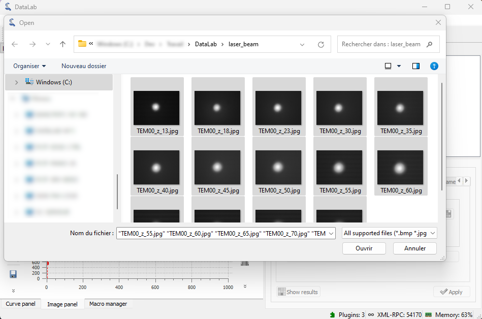
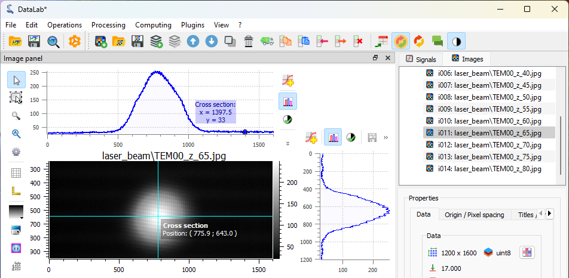
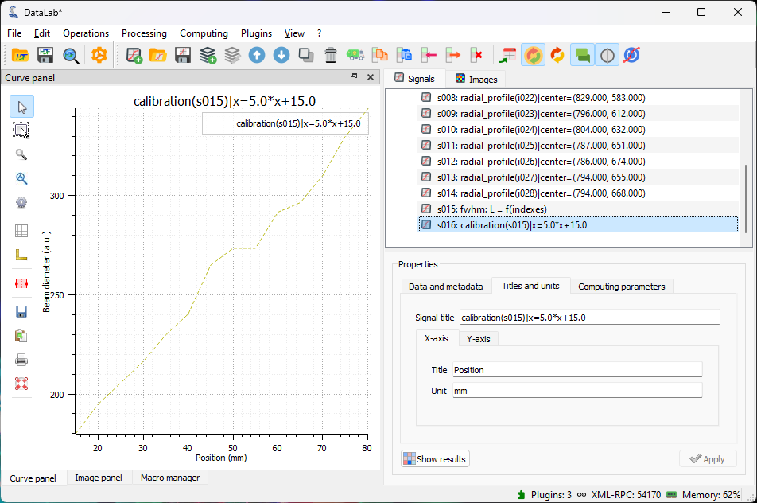

:octicon:`book;1em;sd-text-info` Measuring Laser Beam Size
==========================================================

.. meta::
    :description: Tutorial on how to measure the size of a laser beam using DataLab, the open-source scientific analysis and visualization platform
    :keywords: DataLab, tutorial, laser beam, size, FWHM, Gaussian fit, radial profile, line profile, thresholding, centroid, image statistics, linear calibration, HDF5, workspace

This example shows how to measure the size of a laser beam along the propagation
axis using DataLab:

- Load all the images in a folder
- Apply a threshold to the images
- Extract the intensity profile along an horizontal line
- Fit the intensity profile to a Gaussian function
- Compute the full width at half maximum (FWHM) of intensity profile
- Try another method: extract the radial intensity profile
- Compute the FWHM of the radial intensity profile
- Perform the same analysis on a stack of images and on the resulting profiles
- Plot the beam size as a function of the position along the propagation axis

Load the images
---------------

.. note::

    The images used in this tutorial "TEM00_z_*.jpg" are available in the tutorial data
    folder of DataLab's installation directory
    (``<DataLab installation directory>/data/tutorials/``).

    .. only:: html

       Alternatively, you can download them from :download:`here </_download/laser_beam.zip>`
       and extract to the folder of your choice.

    .. only:: latex

       Alternatively, they can be downloaded from the online documentation at
       https://datalab-platform.com.

First, we open DataLab and load the images. When working with multiple images, the most
efficient approach is to use the "Open from directory..." option
from the "File" menu (or click the |fileopen_dir| button in the toolbar). This feature
loads all images from a selected directory at once.

.. figure:: ../../images/tutorials/laser_beam/00.png

   The "File > Open Image..." menu

    Select the folder containing the images and click "Choose".

The images are now loaded in the "Image panel". You can zoom in and out by
right-clicking and dragging the mouse vertically.
To pan the image, use the middle mouse button while dragging.

.. figure:: ../../images/tutorials/laser_beam/02.png

   Zoom in and out with the right mouse button. Pan the image with the middle mouse
   button.

.. note::

    To view multiple images simultaneously, select the image group and choose
    "View images side-by-side" from the "View" menu.

    .. figure:: ../../images/tutorials/laser_beam/03b.png

        Viewing images side by side.

    .. warning::

        The "Processing > Geometry" menu includes a "Distribute on a grid" option
        |distribute_on_grid|. This feature repositions the images by applying
        offsets to their X and Y coordinates, arranging them in a grid layout
        for side-by-side viewing. Note that this operation modifies the image
        coordinates.

        .. figure:: ../../images/tutorials/laser_beam/03.png

        Images distributed on 4 columns grid.

        To restore the original image positions, use the "Reset image positions"
        option |reset_positions| from the "Processing > Geometry" menu. Note that this
        operation sets all image origins to match the first image's origin,
        which means any initial differences in image origins will be lost.

.. |distribute_on_grid| image:: ../../../datalab/data/icons/processing/distribute_on_grid.svg
    :width: 24px
    :height: 24px
    :class: dark-light no-scaled-link

.. |reset_positions| image:: ../../../datalab/data/icons/processing/reset_positions.svg
    :width: 24px
    :height: 24px
    :class: dark-light no-scaled-link

Remove background noise
-----------------------

When we select one of the images, we notice the presence of background noise, making
it beneficial to apply a threshold to the images.
Several methods are available to estimate the background noise level.

One approach utilizes the "Cross section" tool, which is provided by the
`PlotPy <https://github.com/PlotPyStack/plotpy>` library that DataLab uses for signal and image visualization.
Select an image from the "Image panel", choose the corresponding image
in the visualization panel, and activate the "Cross section" tool |cross_section| from
the vertical toolbar on the left side of the visualization panel. This
reveals that the background noise level is approximately 30 lsb.

.. |cross_section| image:: ../../images/tutorials/csection.png

    An image from the "Image panel". To display the curve marker,
    select the profile curve and right-click to open the context
    menu, then choose "Markers > Bound to active item".

Another method for measuring background noise, also provided by `PlotPy <https://github.com/PlotPyStack/plotpy>`, involves using the "Image statistics" tool
|imagestats| from the vertical toolbar on the left side of the visualization panel.
This tool displays statistical information for a rectangular region that you define by dragging the mouse
across the image. This analysis confirms that the background noise level is approximately 30 lsb.

.. figure:: ../../images/tutorials/laser_beam/05.png

    The "Image statistics" tool
    |imagestats| in the vertical toolbar.

.. |imagestats| image:: ../../images/tutorials/imagestats.png

Note that these tools are not persistent: the analysis results disappear when you select
another image, they are intended to provide a fast insight on the image data.

Now we can clip the image at 35 lsb to remove the background noise
using the "Processing > Level Adjustment > Clipping..." menu.

.. figure:: ../../images/tutorials/laser_beam/05b.png

    The two original and the clipped images are displayed side by side in the
    "Image view" (using the "Distribute on a grid" feature seen previously).

Beam size measurement
---------------------

We can now compute the centroid of the beam—that is, the position of its center of mass.
To do this, select "Analysis > Centroid" from the menu.

.. figure:: ../../images/tutorials/laser_beam/06.png

    The centroid position is displayed on the image.

Next, we can extract a line profile along the horizontal axis using
"Analysis > Intensity profiles > Line profile". Set the row position to the
previously computed centroid position (i.e., 668) using the "Set Parameters" button.
See :ref:`tutorial_fabry_perot` for more details on intensity profile extraction.

The intensity profile will be displayed in the "Signal panel". We can then fit the profile
to a Gaussian function using "Processing > Fitting > Gaussian fit". Here we have
selected both signals for comparison.

.. figure:: ../../images/tutorials/laser_beam/08.png

    The intensity profile fitted to a Gaussian function. Here both signals are
    selected.

Now let's explore another method to compute the FWHM. Returning to the intensity profile signal,
we can directly compute the FWHM using "Analysis > Full width at half maximum".
You can choose the estimation method based on your curve characteristics
and optionally specify the interval to consider for this computation. Once complete,
the results window will display the FWHM value, which is stored in the metadata and
shown on the curve.

.. figure:: ../../images/tutorials/laser_beam/09.png

    The popup that allows to choose the method to estimate the FWHM.

.. figure:: ../../images/tutorials/laser_beam/10.png

    The FWHM result shown in the popup and over the curve.

.. |show_titles| image:: ../../../datalab/data/icons/view/show_titles.svg
    :width: 24px
    :height: 24px
    :class: dark-light no-scaled-link

Let's also try another method to measure the beam size by returning to the image.

From the "Image panel", we can extract the radial intensity profile using
"Analysis > Intensity profiles > Radial profile". The radial intensity profile
can be computed around the centroid position, the center of the image,
or a user-defined position, depending on your data.
For our data, which appears to have radial symmetry with a center not necessarily
identical to the image center, the best option is the centroid position.

.. figure:: ../../images/tutorials/laser_beam/11.png

    The options available for the Radial Profile computation.

.. figure:: ../../images/tutorials/laser_beam/12.png

    The radial intensity profile displayed in the "Signal panel". It is smoother
    than the line profile, because it is computed from a larger number of pixels,
    thus averaging the noise.

Apply these operations to all the images
----------------------------------------

All the operations and computations performed on a single image can
be applied to all images in the "Image panel".

To begin, clean the "Signal panel" using "Edit > Delete all" or
the |delete_all| button in the toolbar. Also remove intermediate results
from the "Image panel" by selecting the images created during prototyping
and deleting them individually using "Edit > Remove" or the |delete| button.

.. |delete_all| image:: ../../../datalab/data/icons/edit/delete_all.svg
    :width: 24px
    :height: 24px
    :class: dark-light no-scaled-link

.. |delete| image:: ../../../datalab/data/icons/edit/delete.svg
    :width: 24px
    :height: 24px
    :class: dark-light no-scaled-link

Next, select all images in the "Image panel" (individually or by selecting
the entire group "g001").

Apply the clipping operation to all images, then extract the radial intensity
profiles for all images (after selecting the entire group "g002"—it should be
automatically selected if you had "g001" selected before applying the threshold).

.. figure:: ../../images/tutorials/laser_beam/13.png

    The clipping applies to all images of the group.

.. figure:: ../../images/tutorials/laser_beam/14.png

    The "Signal panel" now contains all the radial intensity profiles.

We can now compute the FWHM for all radial intensity profiles. The "Results" dialog
will display the FWHM values for all profiles.

.. figure:: ../../images/tutorials/laser_beam/15.png

    The "Results" dialog displays the FWHM values for all the profiles.

.. note::

    To display the analysis results again, select "Show results"
    |show_results| from the "Analysis" menu, or click the "Show results" |show_results|
    button below the image list:

    .. image:: ../../images/tutorials/fabry_perot/12.png

.. |show_results| image:: ../../../datalab/data/icons/analysis/show_results.svg
    :width: 24px
    :height: 24px
    :class: dark-light no-scaled-link

Finally, we can plot the beam size as a function of position along the
propagation axis using the "Plot results" feature |plot_results|
from the "Analysis" menu. This feature allows you to plot result datasets by
selecting the x and y axes from the available result columns. Here, we will
plot the FWHM values (`L`) as a function of the image index (`Indices`).

.. figure:: ../../images/tutorials/laser_beam/16.png

    The "Plot results" feature |plot_results|
    in the "Analysis" menu.

.. |plot_results| image:: ../../../datalab/data/icons/analysis/plot_results.svg
    :width: 24px
    :height: 24px
    :class: dark-light no-scaled-link

.. figure:: ../../images/tutorials/laser_beam/17.png

    The beam size as a function of position along the
    propagation axis (the position is in arbitrary units—the image index).

We can also calibrate the X and Y axes using "Processing > Linear calibration".
Here we set the X axis to the position in mm (entering the title and
unit in the "Properties" group box) using the formula:
:math:`X[\textrm{mm}] = 0.5 \cdot i + 10` where :math:`i` is the image index.

    The calibrated beam size as a function of the position along the
    propagation axis (the position is now in mm).

Finally, we can save the workspace to a file |filesave_h5|. The workspace contains
all the images and signals that were loaded or processed in DataLab. It also contains
the analysis results, the visualization settings (colormaps, contrast, etc.), the
metadata, and the annotations.

.. |filesave_h5| image:: ../../../datalab/data/icons/io/filesave_h5.svg
    :width: 24px
    :height: 24px
    :class: dark-light no-scaled-link

If you want to load the workspace again, you can use the "File > Open HDF5 file..."
(or the |fileopen_h5| button in the toolbar) to load the whole workspace, or the
"File > Browse HDF5 file..." (or the |h5browser| button in the toolbar) to load
only a selection of data sets from the workspace.

.. |fileopen_h5| image:: ../../../datalab/data/icons/io/fileopen_h5.svg
    :width: 24px
    :height: 24px
    :class: dark-light no-scaled-link

.. |h5browser| image:: ../../../datalab/data/icons/h5/h5browser.svg
    :width: 24px
    :height: 24px
    :class: dark-light no-scaled-link
