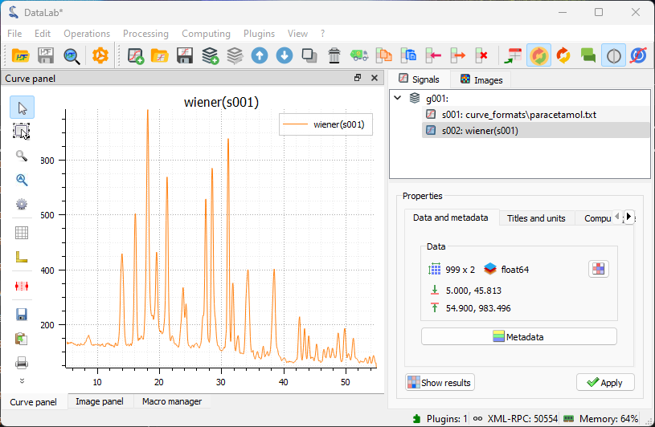

:octicon:`book;1em;sd-text-info` Processing a spectrum
======================================================

.. meta::
    :description: Tutorial on how to process a spectrum with DataLab, the open-source scientific data analysis and visualization platform
    :keywords: spectrum, signal processing, data analysis, scientific data, visualization, open-source, software, DataLab, tutorial

This example shows how to process a spectrum with DataLab:

-   Read the spectrum from a file
-   Apply a filter to the spectrum
-   Extract a region of interest
-   Fit a model to the spectrum
-   Save the workspace to a file

DataLab menus change depending on the context. Since we are going to work with a
spectrum, a 1D signal, we need to select the Signal Panel before proceeding.

In a typical workflow, we would open DataLab and read the spectrum from a file using
"File > Open...", the |fileopen_sig| button in the toolbar, or by dragging and
dropping the file into the panel on the right. However, for this tutorial,
we will use the "Plugins > Test data > Load spectrum of paracetamol" feature to
generate a test spectrum, which is convenient for demonstration purposes.

.. |fileopen_sig| image:: ../../../datalab/data/icons/io/fileopen_sig.svg
    :width: 24px
    :height: 24px
    :class: dark-light no-scaled-link

.. figure:: ../../images/tutorials/spectrum/01.png

   The "File > Open..." menu to open a spectrum file.

.. figure:: ../../images/tutorials/spectrum/02.png

    The "Plugins > Test data > Load spectrum of paracetamol" plugin to generate the
    test spectrum for this tutorial.

Once opened, the spectrum is displayed in the main window. It is a 1D signal, so it is
displayed as a curve. The horizontal axis is the energy axis, and the vertical axis
is the intensity axis.

   The spectrum displayed on the "Signal View" panel.

The signal is quite clean. However, to demonstrate DataLab's filtering capabilities,
we will apply a Wiener filter to reduce any residual noise while
preserving the spectral features. This is available under
"Processing > Noise Reduction > Wiener filter".

.. figure:: ../../images/tutorials/spectrum/04.png

    The "Processing > Noise Reduction > Wiener filter" menu option.

    The result displayed in the main window.

Let's focus our analysis on one of the peaks of interest. To do that,
we define a region of interest (ROI) around the feature we want to analyze
and use the "ROI > Extract..." menu to extract it.
The "Regions of interest" dialog box will be displayed. Select an area and click "OK".
A confirmation window will appear—click "Yes" to extract the region of interest.
A new signal containing the ROI will be created and displayed in the main window.

.. figure:: ../../images/tutorials/spectrum/06.png

    The "Operations > ROI extraction" menu.

    The "Regions of interest" dialog box displayed.

.. figure:: ../../images/tutorials/spectrum/08.png

    The region of interest displayed in the main window.

.. figure:: ../../images/tutorials/spectrum/09.png

    Open the model fitting window with "Processing > Fitting > Gaussian fit".

.. figure:: ../../images/tutorials/spectrum/11.png

    The result of the fit displayed in the main window.

    Both the full spectrum and the fit are selected in the "Signals" panel, so that
    both are displayed in the visualization panel on the left. This allows for easy
    visual comparison if needed for the analysis.

Linear detrending
-----------------

After fitting the main peak, we may want to remove any baseline drift
present in the entire spectrum.
The detrending function in DataLab performs a linear fit across the entire signal,
including the peaks. In our signal, the peaks occupy a large portion of the data,
which is acceptable for signals where peaks are symmetrically distributed around the
center with similar amplitudes. However, this is not the case here, so we cannot
expect this function to work well. Nevertheless, this example illustrates
how DataLab functions can be combined to perform more advanced analyses.

To visualize the limitation mentioned above, we will apply the detrending
function directly to the filtered signal. It's important to remember that we previously set
a ROI on the signal to focus on the main peak. We need to remove
this ROI constraint to perform detrending on the full signal.
To execute the detrending, we use "Processing > Detrending", choose
the linear detrending method, and click "OK". The result will be
displayed in the main window.

.. figure:: ../../images/tutorials/spectrum/13.png

    The "Processing > Detrending" feature.

.. figure:: ../../images/tutorials/spectrum/14.png

    We choose a linear detrending method, and we click on "OK".

.. figure:: ../../images/tutorials/spectrum/15.png

    The result of the detrending displayed in the main window.

Comparing the filtered and detrended signals shows, as expected,
that the detrending function does not work well on this signal.
As explained earlier, this is because the algorithm performs a linear fit
across the entire signal, including the peaks. The effect is clearly visible in the plot:
the higher peaks on the left start at an intensity value lower than those on the right
after detrending, and all peaks have a baseline below zero.

Improved detrending with peak exclusion
-----------------------------------------

To overcome the detrending function's limitation, we can draw inspiration from the
behavior of the detrended signal. We've already identified the problem: the
linear fit includes both the baseline and the peaks.

For better detrending, we can first exclude the peaks and then perform
a linear fit only on the non-peak regions. We can reasonably expect this approach to
provide a more accurate baseline estimation and a better detrended signal.

This is illustrated in the following steps:

.. figure:: ../../images/tutorials/spectrum/15b.png

    We select the regions corresponding to the regions without peaks.

.. figure:: ../../images/tutorials/spectrum/15c.png

    A linear fit is performed only on the selected regions.

.. figure:: ../../images/tutorials/spectrum/15d.png

    The linear baseline obtained from the fit is shown.

.. figure:: ../../images/tutorials/spectrum/15e.png

    We delete the rois to apply the detrending on the whole signal.

.. figure:: ../../images/tutorials/spectrum/15f.png

    We use the "difference" operation to subtract the baseline from the original signal.

.. figure:: ../../images/tutorials/spectrum/15g.png

    We select the linear baseline to perform the subtraction.

.. figure:: ../../images/tutorials/spectrum/15h.png

    The resulting detrended signal is shown, now with a correct baseline.

Automatic peak detection
-------------------------

We can use DataLab's "Multi-Gaussian fit" function to automatically identify
and fit multiple peaks in the spectrum by selecting
"Processing > Fitting > Multi-Gaussian fit" from the menu.

.. figure:: ../../images/tutorials/spectrum/16.png

    First, the "Signal peak detection" dialog box appears. You can adjust
    the vertical cursor position to set the threshold for peak detection
    and specify the minimum distance between peaks. Then click "OK".

.. figure:: ../../images/tutorials/spectrum/17.png

    The "Multi-Gaussian fit" dialog box appears. An automatic fit is performed
    by default. Click "OK" (or optionally adjust the parameters manually using
    the sliders, or modify the automatic fitting parameters).

.. figure:: ../../images/tutorials/spectrum/18.png

    The result of the fit is displayed in the main window. Here we selected both the
    spectrum and the fit in the "Signals" panel on the right, so both are displayed
    in the visualization panel on the left.

Alternatively, we could use the "Peak detection" feature from the "Analysis" menu to
detect peaks in the spectrum. This is the first step of the "Multi-Gaussian fit"
function and can be used independently to detect peaks without performing a fit,
creating a signal with a delta function at each detected peak position.

.. figure:: ../../images/tutorials/spectrum/19.png

    Open the "Peak detection" window with "Analysis > Peak detection".

.. figure:: ../../images/tutorials/spectrum/21.png

    After adjusting the peak detection parameters (using the same dialog as
    for the multi-Gaussian fit), click "OK". Then select both the
    "peak_detection" result and the original spectrum in the "Signals" panel
    to display them together in the visualization panel on the left.

Saving the workspace
--------------------

Finally, we can save the workspace to a file. The workspace contains all signals
loaded or created in DataLab, along with processing results and
visualization settings (such as curve colors).

.. figure:: ../../images/tutorials/spectrum/21.png

    Save the workspace to a file with "File > Save to HDF5 file...",
    or the |filesave_h5| button in the toolbar.

.. |filesave_h5| image:: ../../../datalab/data/icons/io/filesave_h5.svg
    :width: 24px
    :height: 24px
    :class: dark-light no-scaled-link

If you want to load the workspace again, you can use the "File > Open HDF5 file..."
(or the |fileopen_h5| button in the toolbar) to load the whole workspace, or the
"File > Browse HDF5 file..." (or the |h5browser| button in the toolbar) to load
only a selection of data sets from the workspace.

.. |fileopen_h5| image:: ../../../datalab/data/icons/io/fileopen_h5.svg
    :width: 24px
    :height: 24px
    :class: dark-light no-scaled-link

.. |h5browser| image:: ../../../datalab/data/icons/h5/h5browser.svg
    :width: 24px
    :height: 24px
    :class: dark-light no-scaled-link
