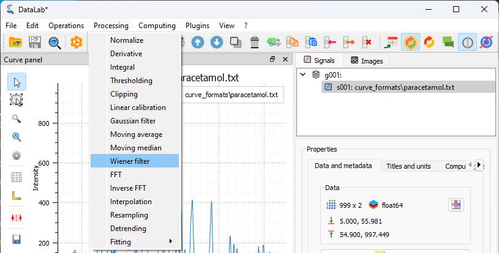
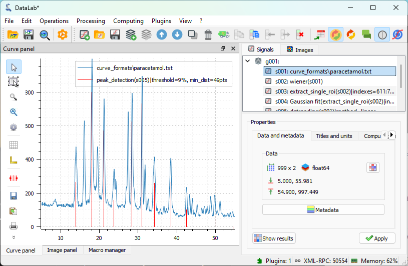

:octicon:`book;1em;sd-text-info` Processing a spectrum
======================================================

.. meta::
    :description: Tutorial on how to process a spectrum with DataLab, the open-source scientific data analysis and visualization platform
    :keywords: spectrum, signal processing, data analysis, scientific data, visualization, open-source, software, DataLab, tutorial

This example shows how to process a spectrum with DataLab:

-   Read the spectrum from a file
-   Apply a filter to the spectrum
-   Extract a region of interest
-   Fit a model to the spectrum
-   Save the workspace to a file

First, we open DataLab and read the spectrum from a file.

   Open the spectrum file with "File > Open..." , or with the |fileopen_sig| button in
   the toolbar, or by dragging and dropping the file into DataLab (on the panel on
   the right).

.. |fileopen_sig| image:: ../../../cdl/data/icons/fileopen_sig.svg
    :width: 24px
    :height: 24px

Here, we are actually generating the signal from a test data file
(using "Plugins > Test data > Load spectrum of paracetamol"), but the
principle is the same.

.. figure:: ../../images/tutorials/spectrum/02.png

    Using the "Test data" plugin is a convenient way to generate test
    data for tutorials, but you can use any file containing a spectrum,
    such as a spectrum from a real experiment.

The spectrum is displayed in the main window.

.. figure:: ../../images/tutorials/spectrum/03.png

   The spectrum is a 1D signal, so it is displayed as a curve. The horizontal axis is
   the energy axis, and the vertical axis is the intensity axis.

Now, let's process this spectrum by applying a filter to it. We will use a Wiener
filter, which is a filter that can be used to remove noise from a signal, even if
this is not absolutely necessary in this case.

    Open the filter window with "Processing > Wiener filter".

.. figure:: ../../images/tutorials/spectrum/05.png

    The result of the filter is displayed in the main window.

If we want to analyze a specific region of the spectrum, we can extract it from the
spectrum using the "ROI extraction" feature from the "Operations" menu.

.. figure:: ../../images/tutorials/spectrum/06.png

    Open the ROI extraction window with "Operations > ROI extraction".

.. figure:: ../../images/tutorials/spectrum/07.png

    The "Regions of interest" dialog box is displayed. Click on "Add region of interest"
    and resize the horizontal window to select the area. Then, click on "OK".

    The region of interest is displayed in the main window.

Let's try to fit a model to the spectrum. We will use a Gaussian model, which is a model
that can be used to fit a peak in a spectrum.

.. figure:: ../../images/tutorials/spectrum/09.png

    Open the model fitting window with "Processing > Fitting > Gaussian fit".

.. figure:: ../../images/tutorials/spectrum/10.png

    The "Gaussian fit" dialog box is displayed. An automatic fit is performed by
    default. Click on "OK" (or eventually try to fit the model manually by adjusting
    the parameters or the sliders, or try to change the automatic fitting parameters).

.. figure:: ../../images/tutorials/spectrum/11.png

    The result of the fit is displayed in the main window. Here we selected both the
    spectrum and the fit in the "Signals" panel on the right, so both are displayed
    in the visualization panel on the left.

.. figure:: ../../images/tutorials/spectrum/12.png

    We may also select the full spectrum and the fit in the "Signals" panel on the
    right, so that both are displayed in the visualization panel on the left, if this
    has a sense for the analysis we want to perform. Note that the full spectrum
    visualization also contains the region of interest we extracted previously.

To demonstrate another processing feature, we can also try to detrend the spectrum.

.. figure:: ../../images/tutorials/spectrum/13.png

    Execute the "Processing > Detrending" feature.

.. figure:: ../../images/tutorials/spectrum/14.png

    We choose a linear detrending method, and we click on "OK".

.. figure:: ../../images/tutorials/spectrum/15.png

    The result of the detrending is displayed in the main window (in that specific
    case, the detrending may not be appropriate, but it is just to demonstrate the
    feature).

When analyzing a spectrum, it can be useful to try to identify the peaks in the
spectrum. We can do this by fitting a multi-Gaussian model to the spectrum, using
the "Processing > Fitting > Multi-Gaussian fit" feature.

.. figure:: ../../images/tutorials/spectrum/16.png

    First, a "Signal peak detection" dialog box is displayed. We can adjust the
    the vertical cursor position to select the threshold for the peak detection,
    as well as the minimum distance between two peaks. Then, we click on "OK".

.. figure:: ../../images/tutorials/spectrum/17.png

    The "Multi-Gaussian fit" dialog box is displayed. An automatic fit is performed
    by default. Click on "OK" (or eventually try to fit the model manually by
    adjusting the parameters or the sliders, or try to change the automatic fitting
    parameters).

.. figure:: ../../images/tutorials/spectrum/18.png

    The result of the fit is displayed in the main window. Here we selected both the
    spectrum and the fit in the "Signals" panel on the right, so both are displayed
    in the visualization panel on the left.

We also could have used the "Peak detection" feature from the "Operations" menu to
detect the peaks in the spectrum.

.. figure:: ../../images/tutorials/spectrum/19.png

    Open the "Peak detection" window with "Operations > Peak detection".

    After having adjusted the parameters of the peak detection dialog (same dialog as
    the one used for the multi-Gaussian fit), click on "OK". Then, we select the
    "peak_detection" and the original spectrum in the "Signals" panel on the right,
    so that both are displayed in the visualization panel on the left.

Finally, we can save the workspace to a file. The workspace contains all the signals
that were loaded in DataLab, as well as the processing results. It also contains the
visualization settings (curve colors, etc.).

.. figure:: ../../images/tutorials/spectrum/21.png

    Save the workspace to a file with "File > Save to HDF5 file...",
    or the |filesave_h5| button in the toolbar.

.. |filesave_h5| image:: ../../../cdl/data/icons/filesave_h5.svg
    :width: 24px
    :height: 24px

If you want to load the workspace again, you can use the "File > Open HDF5 file..."
(or the |fileopen_h5| button in the toolbar) to load the whole workspace, or the
"File > Browse HDF5 file..." (or the |h5browser| button in the toolbar) to load
only a selection of data sets from the workspace.

.. |fileopen_h5| image:: ../../../cdl/data/icons/fileopen_h5.svg
    :width: 24px
    :height: 24px

.. |h5browser| image:: ../../../cdl/data/icons/h5browser.svg
    :width: 24px
    :height: 24px