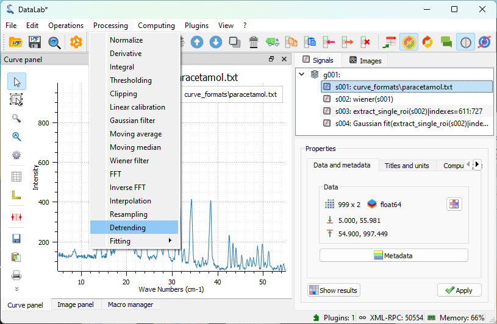
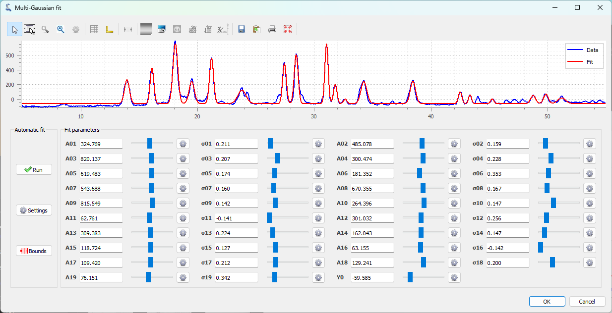

:octicon:`book;1em;sd-text-info` Processing a spectrum
======================================================

.. meta::
    :description: Tutorial on how to process a spectrum with DataLab, the open-source scientific data analysis and visualization platform
    :keywords: spectrum, signal processing, data analysis, scientific data, visualization, open-source, software, DataLab, tutorial

This example shows how to process a spectrum with DataLab:

-   Read the spectrum from a file
-   Apply a filter to the spectrum
-   Extract a region of interest
-   Fit a model to the spectrum
-   Save the workspace to a file

DataLab menus change depending on the context.
A spectrum is a 1D signal that represents the intensity of a signal as a function
of energy (or wavelength, frequency, etc.): in order to open it we need firstly to
select the Signal Panel.

In standard application we first open DataLab and read the spectrum from a file, with
"File > Open..." , or with the |fileopen_sig| button in the toolbar, or by dragging and
dropping the file into DataLab (on the panel on the right). Anyway, for this tutorial,
we will use the "Plugins > Test data > Load spectrum of paracetamol" feature to
generate a test spectrum. This is convenient to generate test data for this tutorial.

.. figure:: ../../images/tutorials/spectrum/01.png

   The "File > Open..." menu to open a spectrum file.

.. figure:: ../../images/tutorials/spectrum/02.png

    The "Plugins > Test data > Load spectrum of paracetamol" plugin to generate the
    test spectrum for this tutorial.

Once opened, the spectrum is displayed in the main window. It is a 1D signal, so it is
displayed as a curve. The horizontal axis is the energy axis, and the vertical axis
is the intensity axis.

.. figure:: ../../images/tutorials/spectrum/03.png

   The spectrum displayed on the "Signal View" panel.

The signal is quite clean. Anyway, to illustrate the filtering capabilities
of DataLab, we apply a Wiener filter to reduce any residual noise while
preserving the spectral features: this is available under
"Processing > Noise Reduction > Wiener filter".

.. figure:: ../../images/tutorials/spectrum/04.png

    The "Processing > Noise Reduction > Wiener filter" menu option.

.. figure:: ../../images/tutorials/spectrum/05.png

    The result displayed in the main window.

We firstly focus our analysis on one of the peaks of interest. To do that,
we define a region of interest (ROI) around the feature we want to analyze.
We use the "ROI > Extract..." menu to define the region of interest and extract it.
The "Regions of interest" dialog box is displayed. Select an area and click on "OK":
a confirmation window is displayed, click on "Yes" to extract the region of interest.
The signal containing the ROI is created and displayed in the main window.

.. figure:: ../../images/tutorials/spectrum/06.png

    The "Operations > ROI extraction" menu.

.. figure:: ../../images/tutorials/spectrum/07.png

    The "Regions of interest" dialog box displayed.

.. figure:: ../../images/tutorials/spectrum/08.png

    The region of interest displayed in the main window.

.. figure:: ../../images/tutorials/spectrum/09.png

    Open the model fitting window with "Processing > Fitting > Gaussian fit".

.. figure:: ../../images/tutorials/spectrum/11.png

    The result of the fit displayed in the main window.

.. figure:: ../../images/tutorials/spectrum/12.png

    Both the full spectrum and the fit in the "Signals" panel selected, so that both are displayed in the visualization panel on the left, if this
    has a sense for the analysis we want to perform.

Linear detrending
-----------------

After fitting the main peak, we may want to remove any baseline drift
present in the entire spectrum.
The detrending function of DataLab performs a linear fit on the whole signal,
including the peaks. In our signal, peaks take a large part of the signal itself,
which is enough for signals where the peaks are symmetrically distributed around the
center, with more or less the same amplitude. This is not the case here, and we cannot
expect this function to work well. It is however an interesting example to illustrate
how DataLab functions can be combined to perform a more advanced analysis.

In order to visualize the limitation cited above, we apply the detrending
function directly on the filtered signal. It's important to remember that we set
a ROI on the signal to focus the analysis on the main peak. We need to remove
this ROI constraint to perform the detrending on the full signal.
We execute the "Processing > Detrending" feature to perform the detrending, we choose
a linear detrending method, and we click on "OK". The result of the detrending is
displayed in the main window.

    The "Processing > Detrending" feature.

.. figure:: ../../images/tutorials/spectrum/14.png

    We choose a linear detrending method, and we click on "OK".

.. figure:: ../../images/tutorials/spectrum/15.png

    The result of the detrending displayed in the main window.

The comparison between the filtered and the detrended signal shows, as expected,
that the detrending function does not work well on this signal.
This, as explained before, is due to the algorithm used, which performs a linear fit
on the whole signal, including the peaks. This effect is clearly visible on the plot:
the peaks on the left, that are higher than the ones on the right, start after the
detrending at an intensity value lower than the ones on the right, and all peaks have
a baseline under the zero.

Improved detrending with peak exclusion
-----------------------------------------

An idea to overcome the limitation of the detrending function is suggested by the
behavior of the detrended signal: we already identified the problem, which is that the
linear fit is not performed on the baseline only, but also on the peaks.

To perform a better detrending, we can thus first exclude the peaks and then perform
a linear fit only on the non-peak regions. We reasonably expect this approach to
provide a more accurate baseline estimation and a better detrended signal.

This is illustrated in the following steps:

.. figure:: ../../images/tutorials/spectrum/15b.png

    We select the regions corresponding to the regions without peaks.

.. figure:: ../../images/tutorials/spectrum/15c.png

    A linear fit is performed only on the selected regions.

.. figure:: ../../images/tutorials/spectrum/15d.png

    The linear baseline obtained from the fit is shown.

.. figure:: ../../images/tutorials/spectrum/15e.png

    We delete the rois to apply the detrending on the whole signal.

.. figure:: ../../images/tutorials/spectrum/15f.png

    We use the "difference" operation to subtract the baseline from the original signal.

.. figure:: ../../images/tutorials/spectrum/15g.png

    We select the linear baseline to perform the subtraction.

.. figure:: ../../images/tutorials/spectrum/15h.png

    The resulting detrended signal is shown, now with a correct baseline.

Automatic peak detection
-------------------------
We can use the "Multi-Gaussian fit" function of DataLab to automatically identify
and fit multiple peaks in the spectrum.
We can do this using
the "Processing > Fitting > Multi-Gaussian fit" entry in the menu.

.. figure:: ../../images/tutorials/spectrum/16.png

    First, a "Signal peak detection" dialog box is displayed. We can adjust the
    the vertical cursor position to select the threshold for the peak detection,
    as well as the minimum distance between two peaks. Then, we click on "OK".

    The "Multi-Gaussian fit" dialog box is displayed. An automatic fit is performed
    by default. Click on "OK" (or eventually try to fit the model manually by
    adjusting the parameters or the sliders, or try to change the automatic fitting
    parameters).

.. figure:: ../../images/tutorials/spectrum/18.png

    The result of the fit is displayed in the main window. Here we selected both the
    spectrum and the fit in the "Signals" panel on the right, so both are displayed
    in the visualization panel on the left.

We also could have used the "Peak detection" feature from the "Analysis" menu to
detect the peaks in the spectrum. This is the first step of the "Multi-Gaussian fit"
function, and it can be used alone to detect the peaks without performing any fit, and
create a signal with a delta for each detected peak.

.. figure:: ../../images/tutorials/spectrum/19.png

    Open the "Peak detection" window with "Analysis > Peak detection".

    After having adjusted the parameters of the peak detection dialog (same dialog as
    the one used for the multi-Gaussian fit), click on "OK". Then, we select the
    "peak_detection" and the original spectrum in the "Signals" panel on the right,
    so that both are displayed in the visualization panel on the left.

Saving the workspace
--------------------

Finally, we can save the workspace to a file. The workspace contains all the signals
that were loaded in DataLab, as well as the processing results. It also contains the
visualization settings (curve colors, etc.).

    Save the workspace to a file with "File > Save to HDF5 file...",
    or the |filesave_h5| button in the toolbar.

.. |filesave_h5| image:: ../../../datalab/data/icons/io/filesave_h5.svg
    :width: 24px
    :height: 24px
    :class: dark-light no-scaled-link

If you want to load the workspace again, you can use the "File > Open HDF5 file..."
(or the |fileopen_h5| button in the toolbar) to load the whole workspace, or the
"File > Browse HDF5 file..." (or the |h5browser| button in the toolbar) to load
only a selection of data sets from the workspace.

.. |fileopen_h5| image:: ../../../datalab/data/icons/io/fileopen_h5.svg
    :width: 24px
    :height: 24px
    :class: dark-light no-scaled-link

.. |h5browser| image:: ../../../datalab/data/icons/h5/h5browser.svg
    :width: 24px
    :height: 24px
    :class: dark-light no-scaled-link
