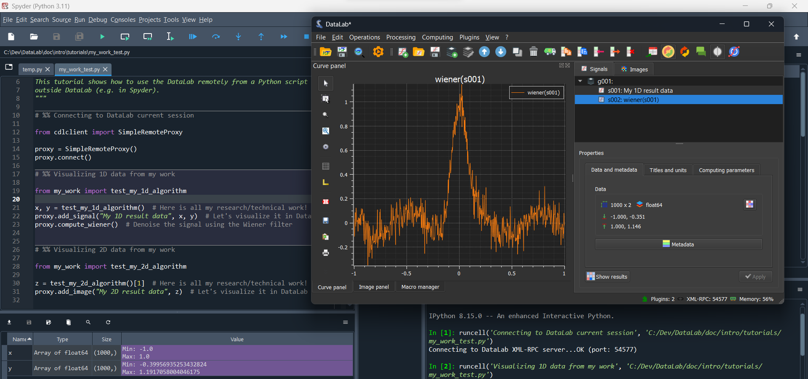
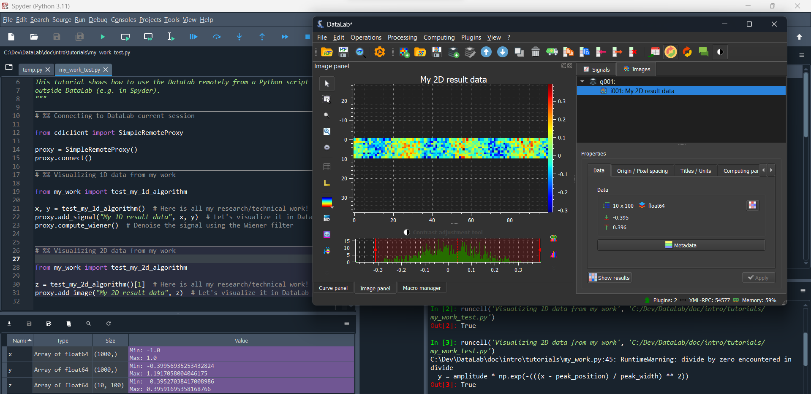
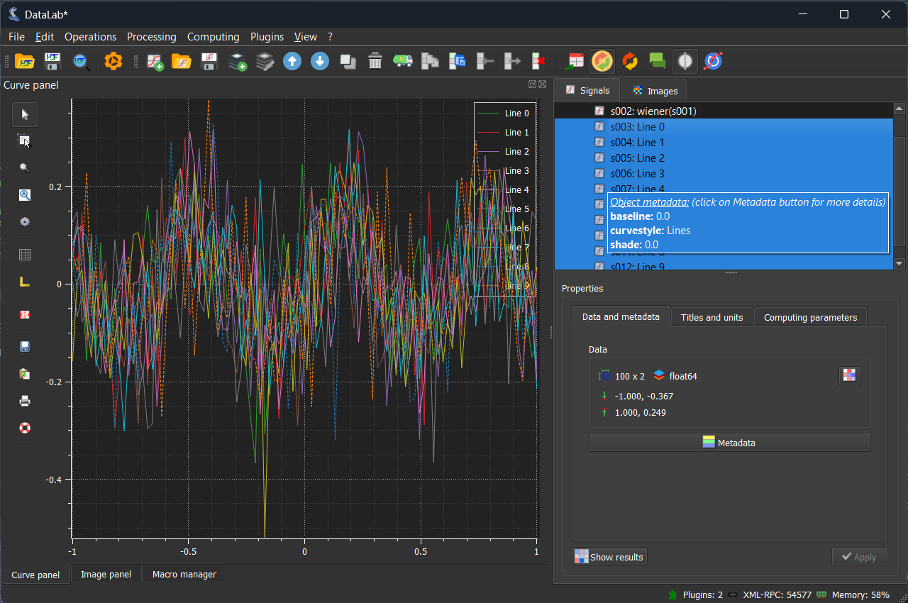

.. _tutorial_spyder:

:octicon:`book;1em;sd-text-info` DataLab and Spyder: a perfect match
====================================================================

This tutorial shows how to use `Spyder`_ to work with DataLab through an example,
using fake algorithms and data that represent an hypothetical research/technical
work. The goal is to illustrate how to use DataLab to test your algorithms with
some data, and how to debug them if necessary.

The example is quite simple, but it illustrates the basic concepts of working
with DataLab *and* `Spyder`_.

.. note::

    DataLab and `Spyder`_ are **complementary** tools. While `Spyder`_ is a powerful
    development environment with interactive scientific computing capabilities,
    DataLab is a versatile data analysis tool that may be used to perform a wide
    range of tasks, from simple data visualization to complex data analysis and
    processing. In other words, `Spyder`_ is a **development** tool, while
    DataLab is a **data analysis** tool. You can use `Spyder`_ to develop
    algorithms and then use DataLab to analyze data with those algorithms.

Basic concepts
--------------

In the context of your research or technical work, we assume that you are developing
a software to process data (signals or images): this software may either be
a stand-alone application or a library that you will use in other applications,
or even a simple script that you will run from the command line. In any case, you
will need to follow a development process that will include the following steps:

0.  Prototype the algorithm in a development environment, such as `Spyder`_.
1.  Develop the algorithm in a development environment, such as `Spyder`_.
2.  Test the algorithm with some data.
3.  Debug the algorithm if necessary.
4.  Repeat steps 2 and 3 until the algorithm works as expected.
5.  Use the algorithm in your application.

.. note::

    DataLab can help you with step 0 because it provides all the processing primitives
    that you need to prototype your algorithm: you can load data, visualize it, and
    perform basic processing operations. We won't cover this step in the following
    paragraphs because the DataLab documentation already provides a lot of information
    about it.

In this tutorial, we will see how to use DataLab to perform steps 2 and 3. We assume
that you already have prototyped (preferably in DataLab!) and developed your algorithm
in `Spyder`_. Now, you want to test it with some data, but without quitting `Spyder`_
because you may need to do some changes to your algorithm and re-test it. Besides,
your workflow is already set up in `Spyder`_ and you don't want to change it.

.. note::

    In this tutorial, we assume that you have already installed DataLab and that
    you have started it. If you haven't done it yet, please refer to the
    :ref:`installation` section of the documentation.

    Besides, we assume that you have already installed `Spyder`_ and that you have
    started it. If you haven't done it yet, please refer to the `Spyder`_
    documentation. **Note that you don't need to install DataLab in the same
    environment as Spyder.**: that's the whole point of DataLab, it is a
    stand-alone application that can be used from any environment. For this
    tutorial, you only need to install the DataLab Simple Client
    (``pip install cdlclient``) in the same environment as `Spyder`_.

Testing your algorithm with DataLab
-----------------------------------

Let's assume that you have developed algorithms in the ``my_work`` module of your
project. You have already prototyped them in DataLab, and you have developed them
in `Spyder`_ by writing functions that take some data as input and return some
processed data as output. Now, you want to test these algorithms with some data.

To test these algorithms, you have written two functions in the ``my_work`` module:

* ``test_my_1d_algorithm``: this function returns some 1D data that will allow you
  to validate your first algorithm which works on 1D data.

* ``test_my_2d_algorithm``: this function returns some 2D data that will allow you
  to validate your second algorithm which works on 2D data.

You can now use DataLab to visualize the data returned by these functions directly
from `Spyder`_:

-  First, you need to start both DataLab and `Spyder`_.
-  Remember that DataLab is a stand-alone application that can be used from any
   environment, so you don't need to install it in the same environment as `Spyder`_
   because the connection between these two applications is done through a
   communication protocol.

Here is how to do it:

.. literalinclude:: my_work_test.py
    :language: python
    :start-after: # ---- Begin of the example code ----

If we execute the first two cells, we will see the following output in the `Spyder`_
console:

.. code-block:: python

    Python 3.11.5 (tags/v3.11.5:cce6ba9, Aug 24 2023, 14:38:34) [MSC v.1936 64 bit (AMD64)]
    Type "copyright", "credits" or "license" for more information.

    IPython 8.15.0 -- An enhanced Interactive Python.

    In [1]: runcell('Connecting to DataLab current session', 'my_work_test.py')
    Connecting to DataLab XML-RPC server...OK (port: 54577)

    In [2]: runcell('Visualizing 1D data from my work', 'my_work_test.py')
    Out[2]: True

    On this screenshot, we can see the result of evaluating the first two cells: the
    first cell connects to DataLab, and the second cell visualizes the 1D data returned
    by the ``test_my_1d_algorithm`` function.

    On this screenshot, we can see the result of evaluating the third cell: the
    ``test_my_2d_algorithm`` function returns a 2D array, and we can visualize it
    directly in DataLab.

.. _debug_spyder:

Debugging your algorithm with DataLab
-------------------------------------

Now that you have tested your algorithms with some data, you may want to debug them
if necessary. To do so, you can combine the `Spyder`_ debugging capabilities with
DataLab.

Here is the code of the fake algorithm that we want to debug, in which we have
introduced an optional ``debug_with_datalab`` parameter that - if set to ``True`` -
will create a proxy object allowing to visualize the data step-by-step in DataLab:

.. literalinclude:: my_work.py
    :language: python
    :pyobject: generate_2d_data

The corresponding ``test_my_2d_algorithm`` function also has an optional
``debug_with_datalab`` parameter that is simply passed to the ``generate_2d_data``
function.

Now, we can use `Spyder`_ to debug the ``test_my_2d_algorithm`` function:

.. literalinclude:: my_work_debug.py
    :language: python
    :start-after: # ---- Begin of the example code ----

In this simple example, the algorithm is just iterating 10 times and generating
a 1D array at each iteration. Each 1D array is then stacked in a 2D array that
is returned by the ``generate_2d_data`` function. With the ``debug_with_datalab``
parameter set to ``True``, we can visualize each 1D array in DataLab: that way,
we can check that the algorithm is working as expected.

    On this screenshot, we can see the result of evaluating the first cell: the
    ``test_my_2d_algorithm`` function is called with the ``debug_with_datalab``
    parameter set to ``True``: 10 1D arrays are generated and visualized in DataLab.

.. note::

    If we had executed the script using `Spyder`_ debugger and set a breakpoint in
    the ``generate_2d_data`` function, we would have seen the generated 1D arrays
    in DataLab at each iteration: since DataLab is executed in a separate process,
    we would have been able to manipulate the data in DataLab while the algorithm
    is paused in `Spyder`_.

.. _Spyder: https://www.spyder-ide.org/