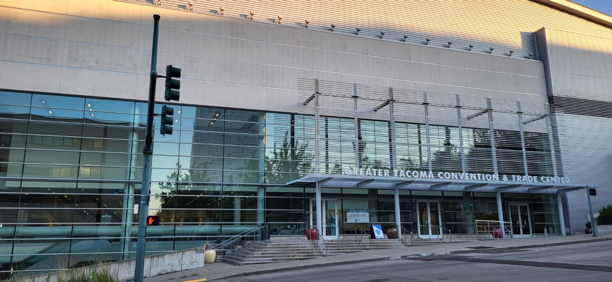
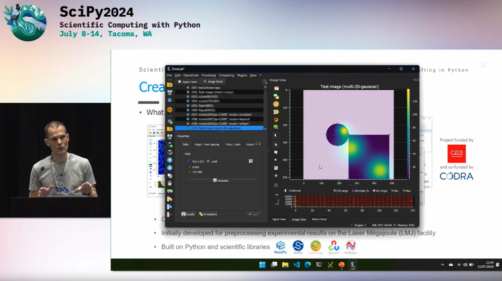
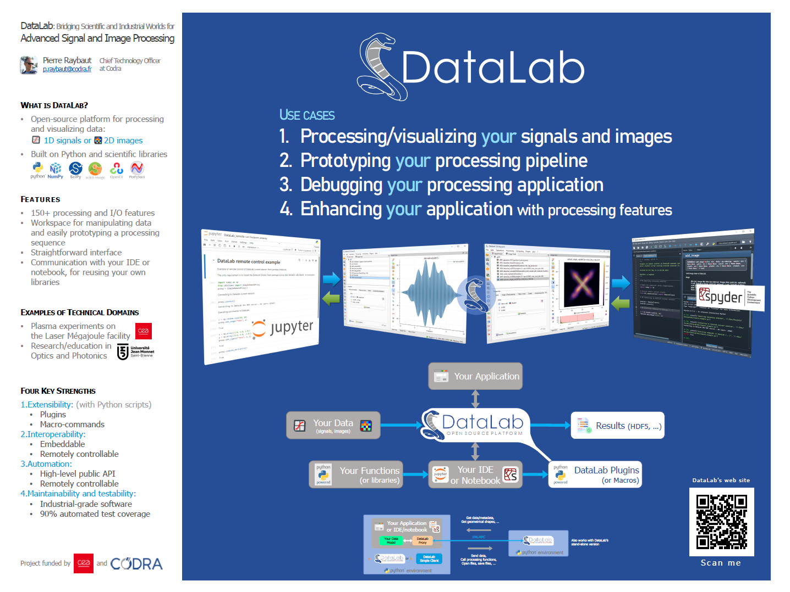

SciPy 2024 - Tacoma, Washington
===============================

.. meta::
    :description: DataLab presentation at SciPy 2024 conference in Tacoma, Washington
    :keywords: DataLab, SciPy, SciPy 2024, scientific Python, conference, Tacoma

   Greater Tacoma Convention Center, where SciPy 2024 was held

Conference Overview
-------------------

In July 2024, DataLab made its international debut at `SciPy 2024 <https://www.scipy2024.scipy.org/>`_, the largest conference in the world dedicated to the scientific Python ecosystem. Held in Tacoma, Washington (near Seattle), the conference gathered about 800 participants from industry, academia, and government.

SciPy is organized by the `NumFOCUS <https://numfocus.org/>`_ foundation and has been held annually for more than 20 years, bringing together people from diverse fields who share a common interest in Python and scientific computing.

DataLab Presentation
--------------------

   Introducing DataLab at SciPy 2024

**Talk Title:** *From Spyder to DataLab: 15 years of scientific software crafting in Python*

**Presenter:** Pierre Raybaut (Executive VP, Engineering, CODRA)

The presentation introduced DataLab as part of a broader narrative about 15 years of scientific Python software development, including the creation of Spyder (the Scientific Python IDE) and other projects like Python(x,y) and WinPython.

Key Points Presented
^^^^^^^^^^^^^^^^^^^^

**DataLab's Unique Position**
    A platform that bridges the gap between customizable scientific processing software and industrial-grade applications.

**Three Operating Modes**
    - Standalone application for data analysis
    - Python library for integration into scripts and notebooks
    - Remote-controlled platform for automation

**Integration with Scientific Ecosystem**
    DataLab works seamlessly with IDEs (particularly Spyder) and Jupyter notebooks, requiring only two lines of code to connect.

**Validation Approach**
    - Functional validation: 200+ automated tests
    - Scientific validation: ensuring users can trust the results
    - Multi-platform testing: Windows, Linux, and macOS

**Industrial Adoption**
    DataLab is used in production environments and has a `Debian package <https://tracker.debian.org/pkg/datalab>`_.

Watch the Full Presentation
---------------------------

.. raw:: html

   

   

   <iframe src="https://www.youtube.com/embed/MKPUuV1LEqk"
   style="position: absolute; top: 0; left: 0; width: 100%; height: 100%;"
   frameborder="0" allowfullscreen></iframe>
   

   

Resources
---------

- `Talk page on SciPy website <https://cfp.scipy.org/2024/talk/G3MC9L/>`_
- `DataLab Poster (PDF) <https://github.com/user-attachments/files/16123893/DataLab-Poster_SciPy2024-V6.pdf>`_
- `Video recording on YouTube <https://www.youtube.com/watch?v=MKPUuV1LEqk>`_

   DataLab poster presented at SciPy 2024

Impact on DataLab Development
-----------------------------

The feedback and discussions at SciPy 2024 influenced several aspects of DataLab's development:

- Enhanced focus on documentation and tutorials for new users
- Increased priority on API stability for library usage
- Validation that the three-mode approach (standalone/library/remote) resonates with users
- Confirmation of the importance of maintaining both scientific flexibility and industrial robustness
- Perspectives on potential collaborations with the Spyder IDE team for deeper integration

The conference confirmed that DataLab fills a real need in the scientific Python ecosystem as a bridge between rapid prototyping and production-ready data processing, even if it concerns a niche audience.
