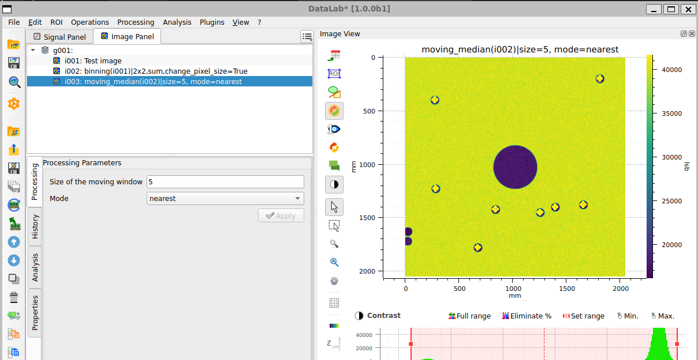

.. _use_case_ndt:

DataLab for non-destructive testing
===================================

.. meta::
    :description: Automatically detect defects, particles or indications on inspection images (radiography, thermography, C-scan): denoising, blob detection, regions of interest and batch processing -- with DataLab, the open-source signal and image analysis platform, extensible with your own algorithms.
    :keywords: non-destructive testing software, NDT image analysis, defect detection, automated inspection, blob detection, radiography, thermography, C-scan, image denoising, plugin, open-source, DataLab

The problem
-----------

Inspection produces images -- radiographs, thermograms, ultrasonic C-scans,
surface pictures -- on which defects or indications must be found, counted and
measured, often on whole series of parts. Manual review does not scale and is
hard to make reproducible; fully custom software is expensive to build and
maintain for each inspection bench.

What DataLab does
-----------------

DataLab provides the image-analysis building blocks and keeps the whole chain
traceable:

- **denoise** inspection images (median, binning, and other filters),
- **detect blob-like features** -- defects, particles, spots -- automatically,
  with several detection algorithms,
- restrict the analysis to **regions of interest**, get measurable results
  (positions, sizes) exportable to your reports,
- **save the workspace** (images + processing history + results) to a single
  HDF5 file for traceability,
- and when the built-in algorithms are not enough, **plug in your own
  Python processing** with the plugin system -- your operators get a new menu
  entry, not a new software.

    Automatic blob detection on a denoised test image in DataLab.

Proof in production
-------------------

In the field of non-destructive testing, `CEA <https://www.cea.fr>`_ entrusted
`CODRA <https://codra.net/>`_ with X-GRID, a software for the automatic
reconstruction of radiographic scenes from partial X-ray images -- with no
prior metadata on position, orientation or magnification. Its processing
pipeline (denoising, robust blob detection, homography estimation, image
fusion) was prototyped interactively with DataLab before being integrated into
the production tool. This work was presented at
:doc:`EuroSciPy 2026 <../outreach/euroscipy2026>`.

Try it
------

- :octicon:`rocket;1em;sd-text-info` **No install:** open
  `DataLab-Web with a demo inspection image already loaded
  <https://datalab-platform.com/web/?preload=demos/ndt.h5>`_ in your
  browser -- your data never leaves your machine.
- :octicon:`book;1em;sd-text-info` **Step-by-step tutorial:**
  :doc:`Automated detection of defects and particles on images <../intro/tutorials/blobs>`.
- :octicon:`download;1em;sd-text-info` Or :ref:`install the desktop application <installation>`.
