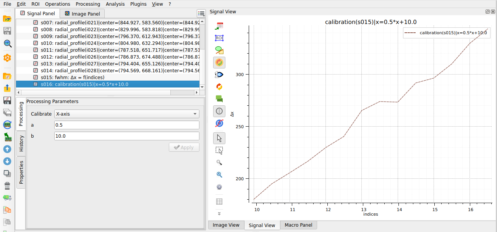

.. _use_case_photonics:

DataLab for photonics and lasers
================================

.. meta::
    :description: Measure laser beam size along the propagation axis and analyze Fabry-Perot interferograms from camera images: thresholding, intensity profiles, Gaussian fit, contour detection and circle fitting, batch processing of image stacks -- with DataLab, the open-source signal and image analysis platform.
    :keywords: laser beam profiling software, beam size measurement, FWHM, beam waist, Fabry-Perot, interferogram analysis, circle fitting, optical metrology, camera image analysis, batch processing, open-source, DataLab

The problem
-----------

Aligning a laser bench or characterizing an optical setup means extracting
quantitative measurements from camera images: beam size at several positions
along the propagation axis, fringe radii on an interferogram, intensity
profiles. Doing this with vendor beam-profiling software locks you to one
camera; doing it with scripts means rebuilding ROI handling, calibration and
visualization from scratch.

What DataLab does
-----------------

DataLab works on images and the signals extracted from them, in the same
workspace:

- **load a whole folder of camera images** at once,
- **threshold**, define **regions of interest**, apply **linear calibration**,
- extract **line or radial intensity profiles** and **fit** them (Gaussian and
  other models) to get FWHM and beam size,
- detect **contours** and fit them to **circles** to measure interferogram
  fringe radii,
- repeat the same analysis on a **stack of images** and plot, e.g., the beam
  size as a function of the position along the propagation axis.

    Beam size along the propagation axis, computed from a stack of camera
    images in DataLab.

Proof in production
-------------------

DataLab was created for the plasma diagnostics of `CEA <https://www.cea.fr>`_'s
Laser Megajoule facility -- one of the world's largest laser facilities -- where
it processes images and signals from cameras and digitizers, and is also used
for laser alignment and metrology R&D activities around the facility.

Try it
------

- :octicon:`rocket;1em;sd-text-info` **No install:** open
  `DataLab-Web with demo beam and interferogram images already loaded
  <https://datalab-platform.com/web/?preload=demos/photonics.h5>`_ in your
  browser -- your data never leaves your machine.
- :octicon:`book;1em;sd-text-info` **Step-by-step tutorials:**
  :doc:`Laser beam profiling <../intro/tutorials/laser_beam>` and
  :doc:`Analyzing Fabry-Perot interferograms <../intro/tutorials/fabry_perot>`.
- :octicon:`download;1em;sd-text-info` Or :ref:`install the desktop application <installation>`.
