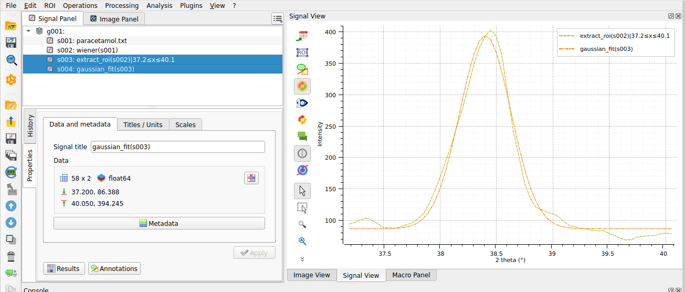

.. _use_case_spectroscopy:

DataLab for spectroscopy
========================

.. meta::
    :description: Analyze spectra without writing an application: noise filtering, baseline correction with peak exclusion, region of interest selection and Gaussian peak fitting, then replay the same processing on a whole series -- with DataLab, the open-source signal and image analysis platform.
    :keywords: spectrum analysis software, spectroscopy software, peak fitting, baseline correction, detrending, Gaussian fit, Raman, FTIR, XRF, batch processing, open-source, DataLab

The problem
-----------

Spectra coming out of an instrument -- Raman, FTIR, XRF, or any energy/wavelength
scan -- rarely come clean: noise, baseline drift, overlapping peaks. The usual
options are vendor software (closed, one instrument), spreadsheets (error-prone,
no traceability), or custom scripts (weeks of work, hard to share with
non-programmers).

What DataLab does
-----------------

DataLab lets you chain the whole analysis interactively, and keeps every
processing step recorded with its parameters:

- **filter noise** (Wiener, moving average, and more),
- **correct the baseline**, including linear detrending restricted to
  peak-free regions -- a robust approach when peaks dominate the signal,
- **select a region of interest** and **fit a model** (Gaussian, Lorentzian,
  Voigt, multi-peak...),
- **save the whole workspace** (data + processing history + metadata) to a
  single HDF5 file that colleagues can reopen -- in the desktop app or in
  the browser.

    A Gaussian fit on a region of interest of a spectrum in DataLab.

Every operation is also available from Python (scripts, Jupyter, macros), so an
interactive analysis can be turned into an automated pipeline processing a whole
series of spectra.

Proof in production
-------------------

DataLab was built for and is used in production at `CEA <https://www.cea.fr>`_'s
Laser Megajoule facility, where spectrometer data are processed and visualized
as part of the plasma diagnostics workflows.

Try it
------

- :octicon:`rocket;1em;sd-text-info` **No install:** open
  `DataLab-Web with a demo spectrum already loaded
  <https://datalab-platform.com/web/?preload=demos/spectroscopy.h5>`_ in your
  browser -- your data never leaves your machine.
- :octicon:`book;1em;sd-text-info` **Step-by-step tutorial:**
  :doc:`Spectrum analysis: denoising, baseline correction and peak fitting <../intro/tutorials/spectrum>`.
- :octicon:`download;1em;sd-text-info` Or :ref:`install the desktop application <installation>`.
